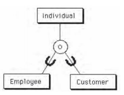

## 104. Na koje se sve načine u logičkom modelu može predstaviti hijerarhijski odnos (generalizacija, specijalizacija, ...)? ##

### Generalizacija ###

Hijerarhijski odnos se u logičkom modelu može predstaviti na više načina:

- Cela hijerarhija u jednu relaciju
- Svaki entitet u posebnu relaciju, tj. kao da se radi o "običnom" odnosu entiteta
- Svaki entitet-list u posebnu relaciju, ali tako da uključi sve nasleđene atribute

Primer - Osoba može da bude službenik ili mušterija

## 105. Šta je fizički model baze podataka? ##

- Fizički model baze podataka je najniži model
- Opisuje konkretnu implementaciju
- Uzima u obzir mnoge aspekte implementacije
	- U drugom planu su aspekti važni za konceptualni i logički model
	- Potrebna su drugačija znanja i veštine - više tehnička nego poslovna
- Često se naziva i "modeliranje podataka" (*data modeling*)

## 106. Šta čini fizički model baze podataka? ##

Elementi fizičkog modela:

-  Strukture podataka 
	- Uobičajeno je da se na fizičkom nivou govori o tabelama i kolonama, a ne relacijama i atributima
- Interna (fizička) organizacija podataka
	- Prostori za tabele, kontejneri, stranice, baferi, ...
- Pomoćne komponente
	- Indeksi

## 107. Kako se procenjuje opterećenje baze podataka? Koji podaci su potrebni? ##

Da bismo mogli da procenimo opterećenje i preformanse, moramo da imamo:

- Model obrade podataka (process model)
- Nestrukturne zahteve 
- Matricu entiteta i procesa (PČMB)
- Zahtevane performanse
- Prepoznate ciljne implementacije SUBP
- Prepoznata eventualna ograničenja prostora
- Prepoznati eventualni razvojni problemi

## 108. Šta obuhvata model obrade podataka, koji se koristi radi procene opterećenja pri pravljenju fizičkog modela? ##

- Okolnosti dodavanja novih redova
	- Koliko redova u proseku (npr. dnevno)
	- Koliko redova pri najvećem opterećenju (npr. u sekundi)
	- Da li su primarni ključevi slični i da li zavise od vremena
- Okolnosti ažuriranja postojećih redova
	- Koliko redova u proseku (npr. dnevno)
	- Koliko redova pri najvećem opterećenju (npr. u sekundi)
	- Kolika je verovatnoća da se redovi sa sličnim primarnim ključem istovremeno koriste (zbog zaključavanja)
- Okolnosti brisanja redova
	- Koliko redova u proseku (npr. dnevno)
	- Koliko redova pri najvećem opterećenju (npr. u sekundi)
	- Da li se brišu pojedinačno ili u grupama
- Okolnosti čitanja redova
	- Učestalost čitanja
	- Koliko redova se čita jednim upitom
	- Koje kolone se koriste za odabir redova
	- Koje druge tabele se često koriste zajedno sa posmatranom

## 109. Koji nestrukturni zahtevi se razmatraju pri pravljenju fizičkog modela baze podataka? ##

- Trajanje podataka
	- Koliko se dugo podaci zadržavaju u tabeli pre brisanja ili arhiviranja 
- Obim podataka
	- Koliko će redova biti u tabeli prilikom puštanja u rad i koliko će se broj redova menjati tokom vremana
- Raspoloživost podataka
	- Da li su podaci potrebni stalno ili povremeno, koliko često i dugo podaci mogu da budu nedostupni korisnicima
- Ažurnost podataka
	- Koliko ažurni moraju da budu podaci koji se koriste
	- Da li mogu da se razvoje kopije za menjanje i čitanje
- Bezbedonosni zahtevi

## 110. Koji su osnovni metodi optimizacije baze podataka? Objasniti ukratko. ##

- Optimizacija na nivou interne organizacije podataka
	- Ne utiče se na logički model podataka, ne menja se skup tabela i kolona
	- Ostvaruje se kroz upravljanje internom organizacijom podataka, pomoćnim komponentama i resursima:
		- Fizička organizacija podataka (prostori za tabele, stranice, baferi stranica)
		- Upravljanje resursima (pre svega upravljanje memorijom)
		- Pomoćne komponente (indeksi)
- Optimizacija na nivou upita
	- Vrši se optimizacija upita na način koji omogućava njihovo efikasnije izvršavanje 
	- Ne menja se logički model
- Optimizacija na nivou strukture podataka
	- Fizička struktura podataka se menja u odnosu na logički model 

## 111. Koji su osnovni elementi fizičke organizacije podataka (na primeru SUBP DB2)? ##

- Logička organizacija kao osnovno mesto čuvanja podataka vidi relaciju, tj. tabelu
- Fizička organizacija ide i dalje od toga
- Ozbiljni sistemi omogućavaju veoma precizno upravljanje elementima fizičke organizacije podataka
- Osnovni elementi fizičke organizacije:
	- Prostori za tabele
	- Stranice
	- Baferi stranica
- Drugi važni koncepti fizičke organizacije:
	- Particionisane tabele
	- Kompresija podataka
	- Katanci 
	- Različiti drugi koncepti, često specifični za implementacije

## 112. Šta je prostor za tabele? Čemu služi? ##

- Osnovni skladišni prostor se obično naziva prostor za tabele (table space)
- Jedan prostor za tabele može da sadrži više tabela
- U nekim sistemima jedna tabela može da bude i u više prostora za tabele
- Na nivou prostora za tabele definišu se:
	- Veličina fizičke stranice
	- Način i uslovi baferisanja stranica
	- Fizički uređaji (diskovi, particije, direktorijumi, fajlovi) koji čine taj prostor za tabele (tzv. kontejneri)

## 113. Šta je stranica baze podataka? Čemu služi? ##

- Stranica je osnovni element fizičkog zapisa tabele
- Svaka tabela, kao i svaki indeks, sastoji se od stranica
- Veličina stranice je određena prostorom za tabele
- Ako su stranice velike
	- mogu da sadrže više redova
	- manje se traži po disku
	- manja je dubina indeksa
	- redovi tabele mogu da budu veći (obično jedan red mora da stane u stranicu)
- Ako su stranice male
	- veća je iskorišćenost prostora na disku
	- manje je nepotrebnog čitanja sa diska

## 114. Šta je bafer za stranice? Čemu služi? ##

- Bafer za stranice je memorijski prostor (*buffer pool*) predviđen za čuvanje kopije dela stranica jednog prostora za tabele, radi omogućavanja bržeg pristupa podacima
- Što je bafer stranice veći, to je broj pristupa disku manji
	- U idealnom slučaju cela baza podataka je u memoriji
	- Ako to nije moguće, teži se da bar indeksi budu u memoriji (ili bar prvih nekoliko nivoa indeksa) i manje tabele (šifarnici)
- Zato što nije potrebno sve delove baze podataka jednako baferisati, tabele i indeksi se dele u više prostora za tabele, čak i kada fizički cela baza staje na jedan fizički disk
- Dobro konfigurisanje prostora za tabele i bafera stranica može da bude od presudnog uticaja na performanse

## 115. Šta su katanci? Kako se i kada koriste? Šta je eskalacija katanaca? ##

- Mehanizam katanaca je uobičajen način ostvarivanja izolovanosti transakcija
- Svaki katanac ima:
	- objekat koji se zaključava
	- trajanje
	- vrstu katanca
- Objekat može biti 
	- vrednost (atribut)
	- red tabele
	- stranica tabele
	- cela tabela
	- prostor za tabele
	- indeks
- Veličina katanca
	- Katanac može da zaključava jedan red ili više redova, jednu stranicu ili više stranica
- Veliki broj katanaca može značajno da uspori rad 
	- Zato je broj katanaca ograničen (bilo brojem bilo količinom memorije koja je rezervisana za katance)
- Kada se prevaziđe dopušten broj katanaca, dolazi do **eskalacije katanaca**
	- Više manjih katanaca se zamenjuje jednim većim 
	- Npr. više katanaca na redovima se zamenjuje samo jednim katancem na stranici
	- Ili, više katanaca na stranicama se zamenjuje jednim katancem na tabeli

## 116. Šta su indeksi? Kada se i kako koriste? ##

- Indeksi su pomoćne strukture podataka koje omogućavaju brže pristupanje podacima, tj. brže pretraživanje po unapred izabranom ključu
- Svaka tabela može da ima više indeksa sa različitim ključevima
- Definicija indeksa obuhvata:
	- kolone koje čine uslov uređivanja, tj. ključ pristupanja
	- da li je jedinstven ili nije
	- da li je uređujući (grupišući) ili ne
	- vrstu (strukturu indeksa)

