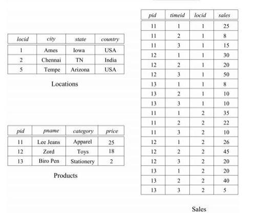
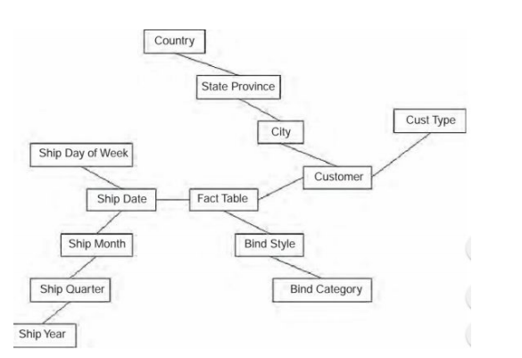

## 208. Objasniti optimizaciju baze podataka na nivou strukture podataka

- Ako imamo **uzorak upita** i njihove **planove izvršavanja**, onda možemo da sprovedemo optimizaciju strukture baze podataka u cilju **povećavanja performansi** uzorka upita.
- Optimizacija **fizičkog dizajna** menjanjem fizičke strukture baze
podataka
- **Uzorak upita** je skup tipičnih upita (i promena baze podataka) za koje se zna da će činiti najčešći oblik **pristupanja** bazi podataka
- **Dobar uzorak** se sastoji od
    - skupa upita i promena baze podataka
    - za svaki upit i promenu postoji procenjena učestalost izvršavanja i          posebno vršno opterećenje
    - formulisanih ciljnih performansi
- Na osnovu uzorka
    - za upite prepoznaje se 
        - koje se **relacije** (tabele, indeksi) koriste
        - koji **atributi** se **izdvajaju**
        - koji **atributi** učestvuju u **uslovima spajanja** i **restrikcije**
    - za promene baze, pored toga
        - **vrsta promene**
        - **atributi** koji se **menjaju** (za ažuriranje)
- **Cilj** strukturne optimizacije je
    - **prepoznavanje indeksa** koje moramo da napravimo
    - prepoznavanje potrebnih **promena** u **fizičkoj shemi**
        - **alternativna normalizacija**
        - **denormalizacija**
        - **uvođenje pogleda** da bi se sakrile načinjene promene

## 209. Šta je „alternativna normalizacija“? Kada se i zašto koristi?
- Pri normalizovanju **ne postoji samo jedno** moguće **rešenje**
    - normalizacija do **3NF ili BKNF**
    - normalizacija do **3NF** različitim putevima
- Ako jedno rešenje ne daje zadovoljavajuće rezultate, možda drugo daje

Primer:
- Relacija P opisuje projekte:
    - P(BrProjekta, Grad, Naziv)
- Imamo sledeće f. zavisnosti:
    - fd1: BrProjekta -> Grad
    - fd2: BrProjekta -> Naziv
- Ako u jednom gradu postoji najviše jedan projekat i svi projekti imaju različite nazive, onda možemo da smatramo da postoji i:
    - fd3: Grad -> Naziv   
    - fd4: Naziv -> Grad   
    - fd5: Naziv -> BrProjekta
- Odatle sledi da imamo i alternativne normalizacije:
    - Normalizacija 1:
        - P(BrProjekta, Grad)
        - PN(Grad, Naziv)
    - Normalizacija 2:
        - P(BrProjekta, Naziv)
        - PG(Naziv, Grad)
    - Noramlizaciju 3:
        - P(BrProjekta, Grad)
        - PN(BrProjekta, Naziv)
## 210. Uloga denormalizacije u optimizaciji baze podataka?
- Obično se radi o vidu denormalizacije
- **Denormalizacija** je postupak poboljšanja performansi baze podataka dodavanjem redundantnih podataka, uz narušavanje normalnih formi. 
- Neke **tehnike**
    - **podela tabele** (dekompozicija)
    - **spajanje tabela** (kompozicija)
    - **dupliranje podataka**
- Svi vidovi denormalizacije imaju za posledicu uvođenje **redundantnosti** i svega što iz toga sledi
- Uvrežen je stav da je normalizovana baza podataka neefikasna, međutim to važi samo za specifične okolonosti i nije opšte pravilo.
- Na primer, baza podataka (ili njen deo) može da bude neefikasna ako je :
    - normalizovana
    - veoma velika
    - češći upiti nego transkacije
    - upiti zahtevaju velika spajanja nad velikim skupom podataka
- Denormarlizacija **vrlo često** doprinosi efikasnosti ili **sasvim malo** ili **nimalo** i predstavlja samo jedan od mogućih koraka.

## 211. Dekompozicija tabela u optimizaciji baze podataka?
- Ako imamo tabelu sa mnogo redova i kolona - koja se često menja, onda to
može da bude neefikasno
    - indeksi postaju duboki i često se čita sa diska
    - upiti koji ne koriste indekse su tim pre neefikasni
- Jedan način da se rad ubrza je da se **tabela podeli** na dve ili više
- Imamo dve vrste podele, horizontalnu i vertikalnu
- **Horizontalna** podela:
    - redovi tabele se podele u dve tabele sa istom strukturom 
        - obično jedna sadrži nove ili aktivne redove, a druga tzv. stare ili arhivske podatke 
    - **dobre strane**:
        - ubrzavaju se neke operacije (pre svega dodavanje i menjanje
novih podataka)
    - **loše strane**:
        - dodatno se komplikuju neke operacije, pre svega analitički
upiti nad svim podacima
- **Vertikalna** podela:
    - ako se većina kolona ne koristi u svim upitima, već samo
relativno retko, onda se česte operacije mogu ubrzati
vertikalnom podelom
    - prave se dve ili više tabela
        - svaka sadrži kolone primarnog ključa
        - sve ostale kolone se grupišu prema upotrebi
    - **dobre strane**:
        - ubrzavaju se neke česte operacije
    - **loše strane**:
        - dodatno se komplikuju neke operacije, pre svega analitički
upiti nad svim podacima

## 212. Spajanje tabela u optimizaciji baze podataka?
- Tabele koje se često spajaju u upitima, može da bude korisno spojiti u
jednu tabelu
    - **Dobre strane**:
        - spajanje je jako **skupa** operacija i ovakva promena može da ima
značajne efekte
    - **Loše strane**:
        - dobijena tabela obično **narušava normalne forme** i sadrži neke
**redundantnosti**
        - to dodatno otežava održavanje podataka i staranje o integritetu
        - može da se značajno poveća broj redova i ukupno zauzeće prostora

## 213. Optimizacija hijerarhija entiteta?
- Pri pravljenju logičkog modela, hijerarhija može da se prevede u
relacije na bar tri osnovna načina:
    1) jedna **integralna tabela**
    2) za **svaki tip zasebna tabela** koja ima samo kolone ključa i kolone
novih atributa
    3) za **svaki neapstraktan tip zasebna tabela** koja ima sve potrebne
kolone
    4) različite **kombinacije**
- Čest je **problem** sa hijerarhijama
    - pri pravljenju **logičkog modela** se razmatraju kriterijumi
**logičkih veza** među podacima
    - pri pravljenju **fizičkog modela** zbog efikasnosti može da bude
bolje da se primeni drugo rešenje
- **Stabilno rešenje** za hijerarhije
    - da se sve **operacije čitanja odvijaju kroz poglede** koji zaokružuju
sve potrebne podatke o elementima hijerarhije
    - da se **zabrane direktne operacije menjanja podataka** u tabelama
koje pripadaju hijerarhiji
    - da se **sva pisanja izvode kroz okidače nad pogledima ili
predefinisane procedure**

## 214. Šta su sistemi za podršku odlučivanju?
- Sistemi koji služe za **pružanje informacija od strateškog značaja**
    - Još se zovu i:
        - podrška odlučivanju (engl. „decision support“)
        - podrška planiranju (engl. „planning support“)
        - poslovno obaveštavanje (engl. „business intelligence“)
        - poslovna inteligencija
- Obuhvataju **tri velike celine**
    - **Skladišta podataka**
    - **Onlajn analitička obrada**
    - **Istraživanje podataka**
- Imaju sledeće specifičnosti:
    - Pravljenje složenih izveštaja
    - Istraživanje podataka
    - Složena obrada zahteva da podaci budu na jednom mestu 
        - relativno retko se koriste distribuirane baze
        - obično se prave skladišta podataka

## 215. Šta su skladišta podataka? Po čemu se razlikuju od uobičajenih baza podataka za obradu transakcija?
- **Skladište podataka** je veliki prostor za
prikupljanje (odlaganje) istorijskih podataka, koji se integrisano
upotrebljavaju radi pružanja podrške odlučivanju.
- Skladišta podataka su:
    - Specifične baze podataka
    - Osnovna namena je **analitička obrada** podataka tzv „oflajn
    analitička obrada“
    - Obično se **podaci** prikupljaju iz **različitih izvora**
    - Projektuju se u skladu sa specifičnostima
- Produkcioni sistemi sadrže i koriste podatke koji su neophodni za
svakodnevni rad i u obliku koji je za to pogodan.
- Razlike u odnosu na uobičajene baze podataka za obradu transakcija:

| OLTP baze podataka        | Skladišta podataka           |
| :-------------: |:-------------:| 
| transakciono orijentisane     | orijentisane prema temi | 
| hiljade korisnika      | nekolicina korisnika      |
| male (do nekoliko GB) | velike (od nekoliko GB do na stotine TB)     | 
| tekući podaci |  istorijski podaci | 
| normalizovani podaci (više tabela sa po malo kolona) | denormalizovani (malo tabela sa po malo kolona) | 
| neprekidno pojedinačno ažuriranje |  periodično paketno ažuriranje | 
| jednostavni i složeni upiti |  veoma složeni upiti |  | 

## 216.  Navesti i objasniti specifične zahteve pri projektovanju skladišta podataka.
- Podaci se **organizuju tematski**
    - Teme odgovaraju grupama i vrstama podataka prema funkcijama
IS (npr. prodaja, vođenje projekata, kadrovi i sl.)
    - Obično su **međusobno nezavisne u odnosu na transakcije** (tj. retko
se jednom transakcijom menjaju podaci u više oblasti )
    - Svaka tematska oblast ima svoju **posebnu konceptualnu shemu** u
produkcionoj BP
    - Svaka tematska oblast se **posebno projektuje i implementira** u SP
(mada mogu da imaju preseke)
- Mogućnosti **integrisanja podataka**
    - Iako se svaka tematska celina projektuje i implementira
nezavisno, korisno je da postoji mogućnost integrisanja
    - Ili su sve celine u jednoj BP koja sadrži SP, ili se za
integrisanje primenjuju tehnike federativnih baza podataka
- **Podaci su nepromenljivi** (tokom obrade)
    - Podaci se ažuriraju periodično i masovno
        - u velikim paketima
        - između dva paketa ažuriranja su nepromenljivi
- **Ažuriranje** se odvija u **masovnim paketima**
    - Ažuriranje se obično svodi na dodavanje novih pripremljenih
podataka
        - podaci se prečišćavaju da bi se izbacili nepouzdani i
nerelevantni podaci
        - transformišu se da bi se čuvali u odgovarajućem obliku,
lakom za efikasno pretraživanje i analiziranje
        - SP se puni tako pripremljenim podacima
        - mehanizmi za osvežavanje prate izmene i po potrebi (na
osnovu predefinisanih kriterijuma) iniciraju novi ciklus
ažuriranja
- **Podaci** su često potrebni na **različitim nivoima granularnosti**
    - Analize podataka se vrše na različitim nivoima granularnosti
    - Analize su efikasnije ako podaci već postoje pripremljeni na
svim tim različitim nivoima
        - npr. odvojeno se vode numerički podaci koji opisuju tačno
vreme, sat u danu, deo dana, dan u nedelji, mesec i sl.
         - ili podaci o lokaciji, tako da se redundantno za svaki
događaj osim tačne adrese vode i oznake mesne zajednice,
opštine, grada, regiona i sl.
    - Svi viši nivoi se mogu izvesti iz nižih, ali to zahteva vreme,
pa je ovako efikasnije
- **Fleksibilnost** u odnosu na zahteve i ciljeve
    - Poslovno okruženje je veoma dinamično
    - SP mora da bude dovoljno fleksibilno
        - da omogući dovoljno jednostavno proširivanje skupa
posmatranih podataka
        - dodavanje novih kolona u tabele činjenica dodavanje
novih dimenzionih tabela
        - dodavanje novih tipova podataka i operacija za rad sa
njima
- Mogućnost **menjanja istorije** i **buduće istorije** radi analiza tipa
**šta ako**
    - Veoma često su potrebne analize tipa **šta ako?**
    - Takve analize zahtevaju **menjanje istorije** i **buduće istorije**
    - Za te namene može da se koristi horizontalno particionisanje
(na primer, **dopisivanje**, **odbacivanje** ili **zamenjivanje**
velikog broja redova može da se ostvari relativno jednostavno,
zamenjivanjem aktivnih particija )
- **Specifične korisničke aplikacije** sa odgovarajućim korisničkim
interfejsom

## 217. Objasniti osnovnu arhitekturu skladišta podataka.

## 218 Opisati i objasniti životni ciklus skladišta podataka.
- **Prikupljanje i analiza zahteva**
    - Analiza krajnjih zahteva i ciljeva
    - Pravljenje specifikacija zahteva
    - Definisanje arhitekture i okvirno planiranje kapaciteta,
uređaja i alata
- **Logičko projektovanje**
    - Projektovanje tabela i pogleda skladišta podataka
    - Često se kao osnova koristi „dimenziono modeliranje“ (
zvezdasta shema ili shema pahiljice )
- **Fizičko projektovanje**
    - Projektovanje indeksa
        - indeksi spajanja za efikasno povezivanje tabele
činjenica i dimenzionih tabela
        - bit-mapirani indeksi za efikasno pretraživanje tabele
činjenica
        - često se prave tabele sa mnogo indeksa
    - Materijalizovani pogledi
        - nakon prvog izračunavanja rezultati se čuvaju sve dok se
podaci ne promene
    - Projektovanje particija
        - horizontalno, po grupama redova
    -    vertikalno, po grupama kolona
- **Distribuiranje podataka**
    - Obično se teži da SP budu centralizovana ( ali ako je neophodno
onda se distribuiraju )
    - Projektuju se particionisanje, replikacija i raspoređivanje
podataka
- **Implementacija, praćenje i menjanje**
    - Pravljenje tabela, pogleda, skriptova i drugih metapodataka
    - Procedure i skriptovi za ažuriranje podataka:
        - izdvajanje podataka
        - prečišćavanje podataka
        - transformisanje podataka
        - punjenje podataka
        - osvežavanje indeksa
        - razvoj korisničkih aplikacija
- Praćenje i unapređivanje rada performanse sadržaj i kvalitet
izveštaja

## 219. Šta je zvezdasta shema? Kada se, zašto i kako koristi?
- Jedna **velika tabela činjenica** (podataka, stavki,…)
    - sadrži **denormalizovane** osnovne posmatrane podatke:
        - ključeve u odnosu na dimenzione tabele
        - podatke koji se obično upoređuju
    - obrada se uglavnom odvija nad tabelom činjenica
- **Više dimenzionih tabela**
    - veći broj manjih tabela
    - sadrže uglavnom opisne atribute
    - povezuje se sa tabelom činjenica radi pravljenja „čitljivih“
izveštaja
    - nisu normalizovane

## 220. Šta je shema pahuljice? Kada se, zašto i kako koristi?
- Slično kao zvezdasta shema
- Dimenzione tabele su normalizovane

