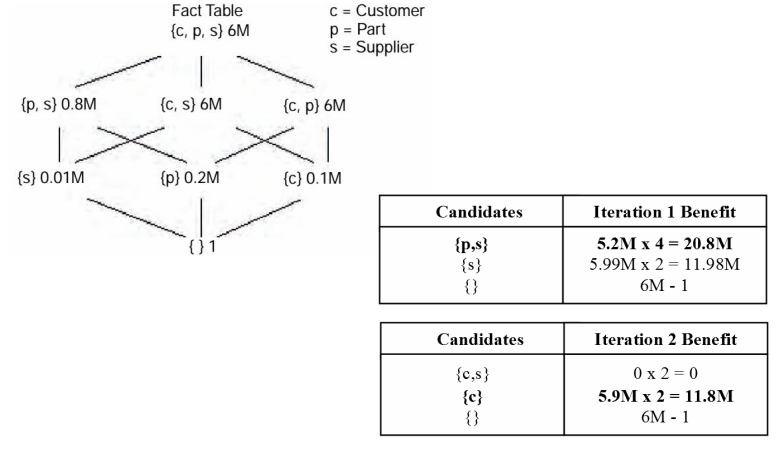

## 221. Objasniti specifičnosti fizičkog modeliranja skladišta podataka.

-  **Projektovanje indeksa**
       - Indeksi spajanja - Za efikasno povezivanje tabele činjenica i dimenzionih tabela.
       - Bit-mapirani indeksi - Za efikasno pretraživanje tabela činjenica.
       - Često se prave tabele sa mnogo indeksa
         - Ubrzavaju se upiti.
         - Ne postoje transakcije kojima bi to smetalo.
         - Paketno ažuriranje se obično izvodi sa odloženim/naknadnim osvežavanjem indeksa.
- **Materijalizovani pogledi** - Nakon prvog izračunavanje rezultati se čuvaju dok se podaci ne promene.
- **Projektovanje particija**
       - **horizontalno** - po grupama redova. Obično po lokacijama ili vremenskim periodima.
       - **vertikalno** - po grupama kolona. Obično po različitim karakteristikama. Slično kao da se pravi tabela činjenica, ali 1-1.

## 222. Šta je onlajn analitička obrada? Objasniti specifičnosti.
- **Online analytical processing - OLAP**
- Alternativa skladištima podataka.
- Izvođenje analitičke obrade nad 'živim' podacima.
- Domeni primene onlajn analitičke obrade podataka i skladišta podataka se delimično preklapaju. Razlika je u neophodnosti da se koriste **'živi podaci'**. Skladišta podataka ne doprinose obradi koja zahteva sveže informacije.
- Često se radi o ad-hok obradama.

## 223. Šta su 'automatske zbirne tabele'? Objasniti namenu i način funkcionisanja.
Automatske zbirne tabele su **karakteristika OLAP sistema**.

Koriste se za **ubzavanje izračunavanja često upotrebljavanih statistika**. Svaki put kada nastupaju promene podataka, AZT se označava kao neažurna, a pri prvoj narednoj upotrebi se ažurira. Ažuriraju se samo podaci koji se odnose na menjane podatke.

Obično se implementiraju kao **materijalizovani pogledi**, a često se nazivaju samo pogledi.

## 224. Objasniti eksploziju broja pogleda kod OLAP sistema.
Agregirani materijalizovani pogledi grade **hijerarhije** u odnosu na dimenzije i nivoe granularnosti.

Primer.

- Ako je T vremenska dimenzija:
       - Tabela činjenica ima u odnosu na T nivo agregacije 0
       - Prvi pogled, koji agregira po satima, ima nivo agregacije 1
       - Sledeći, koji agregira po danima, ima nivo agregacije 2
       - itd.

- Ako neka dimenzija ima samo jedan nivo agregiranja, onda osnovni nivo podataka predstavlja nivo 0, a agregacija po svim vrednostima dimenzije je nivo 1.
- Ako dve dimenzije imaju m i n nivoa, onda postoji **m x n** pogleda koji pokrivaju sve kombinacije za ove dimenzije.

 Ukupan broj mogućih pogleda u tom slučaju je:

 **N = \prod\limits_{n=1}^{d}h_i**

 gde je:
       - **d ** broj dimenzija,
       - **hi** brojevi nivoa po dimenzijama.

Ako je **g** geometrijska sredina broja nivoa po dimenzijama, onda je ukupan broj mogućih pogleda:
**N = g^d**

Nemoguće je napraviti i održavati sve ove poglede. Jedan od najvažnijih koraka pri projektovanju je odabir onih pogleda koji će biti napravljeni i održavani.

## 225.  Algoritam HRU odabira materijalizovanih pogleda?
**Algoritam HRU** (Harinarayan, 1996) je **iterativni algoritam praćenja lokalnih minimuma**.

Ne garantuje globalni optimum ali u prksi daje dobre rezultate za malo dimenzija.
Veliki je porast složenosti u slučaju mnogo dimenzija reda **O(k * 2 ^ (2d))**, gde je k broj pogleda koji se biraju, a **d** broj dimenzija.

Koraci:

- Pravi se struktura rešetke **hiperkocke**.
       - Ekstremni suprotni čvorovi su:
          - tabela činjenica (sve dimenzije)
          - puna agregacija (jedan red, bez dimenzija)
       - Unutrašnji čvorovi su svi različiti pogledi po dimenzijama. Povezuju se čvorovi koji se razlikuju za po jednu agregaciju.
       - Uprošćenji pogled je bez hijerarhije, ali je slično i sa njima.

- Svaki čvor se označava procenjenim brojem redova.

- Polazi se od tabele činjenica. Traži se put koji najviše smanjuje broj redova koji se obrađuju. U obzir se uzima taj čvor, ali i svi koji su 'ispod' njega.

Primer:

## 226. Algoritam PGA odabira materijalizovanih pogleda?
**PGA (Polynomial Greedy Algorithm)** (Nadeau, Teorey, 2002)

Kao i HRU algoritam, bira jedan pogled u koraku, ali uz manje računanja.

Deli svaki korak na:

- **fazu nominacije** - Traži 'dobre kandidate': Nominuje najmanji pogled (ili jedan od njih) koji je jedan nivo ispod tabele činjenica. Zatim najmanji koji je jedan nivo ispod nominovanog; i tako do pune agregacije.
- **fazu izbora** - Izračunava dobit samo za dobre kandidate. Odabira se onaj koji daje najveću dobit.

U narednom ciklusu se ponavlja postupak, ali se nominuju samo kandidati koji nisu prethodno bili nominovani.

Primer:

## 227. Šta je istraživanje podataka?

Istraživanje podataka (Data Mining) je proces automatskog otkrivanja korisnih informacija u velikom skladištu podataka.

Zbog količine i prostorno-vremenske prirode podataka tradicionalne metode za analizu nisu pogodne za
upotrebu.

Primenom nekih od metoda istraživanja podataka, veliki deo podataka nikada i ne stiže do analize, pogotovo ako su u pitanju tzv. sirovi podaci (engl. raw data).
