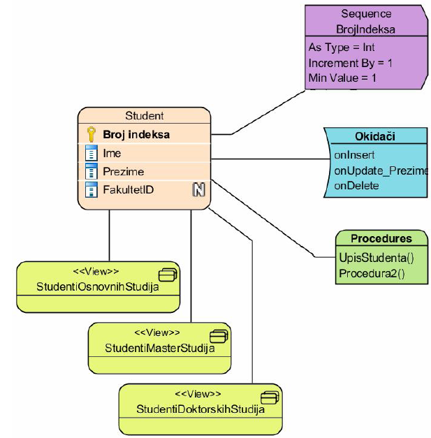

## 61. Kako se oznacavaju razlicite vrste odnosa i kardinalnosti odnosa u dijagramima tabela?

Odnosi izmedju tabela u dijagramima tabela se oznacavaju:
  - isprekidanim linijama
  - punim linijama se oznacavaju odnos slabog i maticnog entiteta (Ovako pise, ali posto su ovo oni dijagrami iz mwb-a, puna linija je ako primarni kljuc jednog entiteta ulazi u primarni kljuc drugog, inace isprekidana)

Kardinalnosti se oznacavaju na kraju linija u duhu UML-a. Koriste se graficke oznake:
  - 0 - kruzic
  - 1 - uspravna linija ( | )
  - \* - linija koja se grana u 3 kratke linije prema tabeli
  - 0 - 1, 0 - \*, 1 - \* se predstavljaju kombinovanjem prethodnih slucajeva

## 62. Objasniti potencijalne razlike u dijagramima tabela na konceptualnom / logickom / fizickom nivou.

#### - Konceptualni nivo -

Na ovom nivou dijagram sadrzi samo strukturu podataka i odnose. Dijagrami na ovom nivou ne sadrze:
  - dodatne kolone surogat kljuceva (primarni kljucevi koje generise sam sistem)
  - dodatne kolone stranih kljuceva
  - oznake kljuceva (osim mozda jednog kandidat-kljuca)
  - tipove kolona

#### - Fizicki nivo -
Za razliku od konceptualnog nivoa dijagramu se dodaju i ostali podaci koji su neophodni za preslikavanja u relacioni model:
  - kolone surogat kljucevi (ako su potrebne)
  - kolone vezanih tabela koji cine strane kljuceve
  - oznake kljuceva i vrsta kljuceva
  - tipovi kolona
  - odnosi vise - vise se cesto zamenjuju tabelama koje ih modeliraju

## 63. Kako se na dijagramu tabela oznacavaju pogledi, okidaci i ostali elementi?

Svi elementi se oznacavju u vidu "modifikovanih pravougaonika":
  - pogledi imaju zaobljene ivice
  - okidaci polukruznu levu stranicu
  - procedure zaobljene gornje ivice

  

## 64.Kako se dijagrami klasa UML-a koriste u projektovanju baza podataka? Objasniti razlike u odnosu na uobicajene dijagrame klasa.

UML dijagrami klasa vec opisuju strukturu podataka klasa.
Ideja je da se to iskoristi i za modeliranje podataka:
  - bolje predstavlja semantiku odnosa od dijagrama tabela
  - bolje predstavlja semantiku odnosa cak i od pravih ER dijagrama

Modeli klasa i relacija se razlikuju. Klase predstavljaju tipove podataka, a relacije skupove podataka.

U praksi se to resava na 3 nacina:
  - ako je potrebno vise skupova istog tipa, uvodimo vise naslednika klase koja odredjuje tip
    * bazna klasa koja sluzi samo kao tip moze da se oznaci
      - npr kao "apstraktna"

  - jedan pristup je da se svaka "klasa" oznaci kao "<< type >>" ili "<< persistent >>"
    * tipovi/klase se oznacavaju sa << type >>
    * skupovi entiteta se oznacavaju sa << persistent >>

  - ignorise se razlika i smatra se da je klasa skup

Za razliku od obicnog dijagrama klasa akcenat je na atributima i odnosima, ponasanje se skoro potpuno zanemaruje i enkapsulacija je u drugom planu.

## 65. Objasniti dopune UML dijagrama koje se koriste u specificnim oblastima primene.

UML sadrzi standardizovane koncepte koji omogucavaju uvodjenje novih nacina oznacavanja:
  - stereotipovi (sledece pitanje opsirnije)
  - oznacene vrednosti
  - prosirenja

#### - oznacene vrednosti -
  - predstavljaju opstiji slucaj stereotipova

  - navode se kao lista parova ime-vrednost unutar viticastih zagrada
    * {isPersistent = true, minCount = 5}

  - nacelno stereotipovi su ekvivalentni oznacenoj tacnoj vrednosti
    * << abstract >> <==> {isAbstract = true}

#### - prosirenja -
  - prosirenje je element koji se povezuje sa osnovnim elementom strelicom sa popunjenim trouglom
    * strelica je usmerena od osnovnog elementa ka prosirenju

  - moze da se koristi za dodatno opisivanje osnovnog elementa ili za dodavanje osobina

  - obicno je opiciono ali moze da bude i obavezno, sto se oznacava sa {required} iznad strelice

### 66. Sta su stereotipovi UML-a i kako se oznacavaju?

Stereotipovi predstavljaju vrste sablona:
  - apstrakcija opsteg slucaja neceg
  - neki predefinisani skup osobina
  - neko predefinisano ponasanje

Koristi se za navodjenje dodatnih deklaracija ili napomena

Podrazumevano oznacavanje je navodjenjem naziva izmedju dvostrukih izlomenjenih zagrada:  
  - << actor >>
  - << entity >>
  - << abstract >>
  - << persistent >>

Obicno se navodi ispod ili iznad naziva klasa
  - moze i ispred

### 67. Objasniti osnovne odnose u dijagramima klasa podataka.

#### - asocijacija -
  - predstavlja odnos izmedu 2 klase

  - oznacava da bar jedna klasa "zna" za neke objekte druge klase i na neki nacin upravlja njima

  - moze da bude
    * funkcionalna - "uradi nesto za mene"
    * strukturalna - "budi nesto za mene"

  - u kontekstu modela podataka **strukturalna** je vaznija

#### - agregacija -
  - posebna vrsta asocijacije
  - implicira da se jedna klasa "sastoji" od (jednog ili vise) objekata druge klase

  - slabiji oblik strukturalne asocijacije:
    * isti deo moze da bude "sadrzan" u vise slozenih objekata
    * ako se slozeni objekat obrise, delovi mogu da nastave da postoje

  - prakticno svaka strukturalna asocijacija kardinalnosti 1-\* moze da se posmatra kao forma agregacije

#### - kompozicija -
  - jaci vid agregacije

  - predstavlja jaci oblik strukturalne asocijacije:
    * uvek je binarni odnosi
    * odnos celina/deo
    * jedan deo moze da pripada samo jednom slozenom objektu
    * ako se obrise slozeni objekat uobicajeno ponasanje je da se obrisu i svi delovi

#### - nasledjivanje -
  - osnovna klasa predstavlja opstiji slucaj izvedenih klasa - generalizacija

  - izvedene klase predstavljaju posebne slucajeve bazne klase - specijalizacija

### 68. Kako se dijagrami klasa podataka koriste na razlicitim nivoima modeliranja?

Slicno kao i kod dijagrama tabela:

#### - konceptualni nivo-
  - ne mora da sadrzi (a najcesce i ne sadrzi):
      * dodatne kolone surogat kljuca
      * dodatne kolone stranih kljuceva
      * oznake kljuceva (osim mozda za jedan kandidat-kljuc)
      * tipove kolona

#### - fizicki nivo -
  - fizicki dijagram sadrzi i:
    * kolone surogat kljuceva (ako su potrebne)
    * kolone vezanih tabela koji cine strane kljuceve
    * oznake kljuceva i vrsta kljuceva
    * tipove kolona

Logicki dijagram moze i "ovako" i "onako"

### 69. Kako se u dijagramima klasa oznacavaju kljucevi?

Kljucevi se oznacavaju simbolima ili tekstom.

### 70. Kako se u dijagramima klasa oznacavaju uslovi integriteta?

Uslovi integriteta mogu da se navode u okviru klasa u odeljku ponasanja ili kao povezane "klase" ili komentari

