## 91. Šta je logički model baze podataka?
Logički model uzima u obzir dodatne nefunkcionalne zahteve koji su u fazi konceptualnog projektovanja možda mogli da ostanu zanemareni. 

Vodi se računa o:
* Fleksibilnosti
* Proširivosti

Logički model tačno određuje koji se podaci čuvaju i kako se njima rukuje. 

## 92. U čemu je osnovna razlika između konceptualnog i logičkog modelirana?
Konceptualni model je fokusiran na semantiku i odnose a logički silazi bliže izabranom implementacionom modelu.

Apstraktni koncepti konceptualnog modela se prevode u konkretne logičke modele:
  
  * Npr. hijerarhije klasa se zamenjuju odgovarajućim skupovima relacija
  
## 93. Šta je očekivani rezultat logičkog modeliranja? 
Ulaz:
  * Konceptualni model
Izlaz:
  * Detaljan (npr. relacioni) model
    
    * Logička shema trajnih objekata - relacija
    * Specifikacija svih uslova i ograničenja - constraints
    * Poznati su svi ključevi i odgovarajući surogat-atributi
    * Poznaz je način implementacije svih odnosa
    
## 94. Zašto nije dobro preskočti logički model i praviti fizički model na osnovu konceptualnog?
Mogu se izgubiti neke poželjne karakteristike baze podataka:
  * kompletnost
  * integritet
  * fleksibilnost
  * efikasnost
  * upotrebljivost
  
pri čemu se najpre gube kompletnost i integritet.

Dobar konceptualni model je važan za dostizanje ovih karakteristika ali nije dovoljan.

## 95. Kako teče postupak pravljenja logičkog modela?
Pravi se iterativno:
* Prva iteracija se pravi na osnovu konceptualnog modela
* Svaka naredna se pravi menjanjem (flexing) prethodne
 
## 96. Na osnovu kojih kriterijuma se pristupa menjaju logičkog modela?
Kriterijumi za menjanje su željene karakteristike:
* Da li model ispunjava funkcionalne zahteve?
* Da li model ispunjava nefunkcionalne zahteve?
* Da li je model kompletan?
* Da li model garantuje integritet podataka?
* Da li model pruža potrebnu fleksibilnost?
* Da li model omogućava efikasan rad?
* Da li je model upotrebljiv?

## 97. Kako se konceptualni model prevodi u logički?
Oba modela mogu da se predstave na ER-u ili UML-u, pa se prevođenje često svodi na *transformisanje* ili *dopunjavanje i nadograđivanje*

1. Entiteti postaju relacije 
2. Prosti atributi postaju atributi relacija
3. Složeni atributi se prevode u relacije sa stranim ključem prema roditelju
4. Odnosi 1-\* i 1-1 moraju da se povežu parovima stranih i primarnih ključeva
5. Odnosi \*-\* se prevode u vezne relacije koje imaju dva odnosa 1-\* prema polaznim relacijama
6. Odnosi sa više od 2 učesnika se prevode u vezne relacije koje imaju odgovarajuče odnose prema svim polaznim relacijama
7. Hijerarhija na ranije opisan način (cela u jednu relaciju, svaki entitet u posebnu, svaki entitet-list u posebnu..)
8. Na kraju obavezno prečistiti shemu - normalizacija.

## 98. Kakva je izražajnost logičkog modela u odnosu na konceptualni? Šta može da se vidi u konceptualnom ali obično ne može u logičkom?

Ne znam, dopuniću kasnije :c

Možda nešto oko semantike ili odnosa

## 99. Kako se u logičkom modelu modeliraju odnosi 0..1 - 0..\*, 1 - 0..\*, 0..1 - 1, 0..1 - 0..1?
* 0..1 - 0..\*: odnos celina - deo, ako celina **može** da bude bez delova i ako deo **može** da bude bez celine. ***Relacija koja je deo dobija strani ključ prema relaciji koja je celina i strani ključ može biti nedefinisan***

  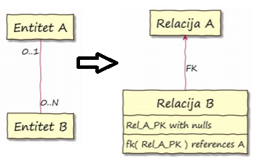

* 1 - 0..\*: odnos celina - deo, ako celina **može** da bude bez delova a deo **ne može** da bude bez celine. ***Relacija koja je deo dobija strani ključ prema relaciji koja je celina i on ne sme biti nedefinisan***

  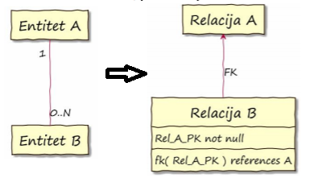
  
* 0..1 - 1: odnosi celina - opcioni deo. ***Relacija koja je opcioni deo dobija strani ključ prema relaciji koja je celina, ne sme da bude nedefinisan i vrednost mora biti jedinstvena***

  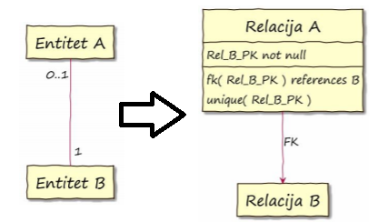
  
* 0..1 - 0..1: dvosmerni opcioni odnosi. ***Pravi se nova vezna relacija koja sadrži strane ključeve prema obe vezane relacije, oni ne smeju biti nedefinisani, njihove vrednosti moraju biti jedinstvene i zajedno čine primarni ključ***

  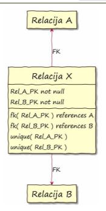
  
  
## 100. Kako se u logičkom modelu modeliraju odnosi 0..1 - 1..\*, 1 - 1..\*, 1-1?
* 0..1 - 1..\*: odnosi agregacije sa obaveznim delovima. ***Relacija koja je deo dobija strani ključ prema celini. Može da bude nedefinisan, dodaje se uslov bazi da za svaki A mora postojati bar jedan B***
  
  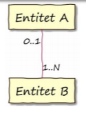 -> 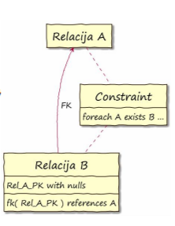

* 1 - 1..\*: odnosi kompozicije sa obaveznim delovima. ***Relacija koja je deo dobija strani ključ prema celini. On ne sme biti nedefinisan, dodaje se uslov bazi da za svaki A mora postojati bar jedan B***

  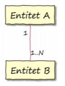 -> 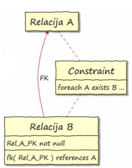

* 1-1: odnosi obostranog ekskluzivnog pridruživanja. ***Jednoj od relacija se dodaje strani ključ prema drugoj, ne sme biti nedefinisan, vrednost mora biti jedinstvena i dodaje se uslov bazi da za svaki B mora postojati bar jedan A*** ILI ***U svakoj od relacija se dodaje strani ključ prema drugoj, ne smeju biti nedefinisani, dodaje se uslov za proveru uzajamnosti veze***

  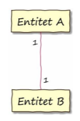 -> 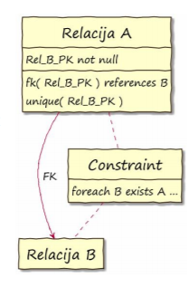 ILI 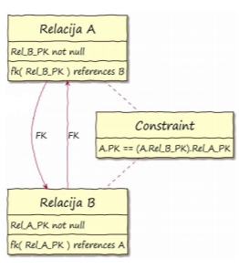  
  
## 101. Kako se u logičkom modelu modeliraju odnosi 0..\* - 0..\*, 0..\* - 1..\*, 1..\* - 1..\*?
* 0..\* - 0..\*: odnosi asocijacije bez posebnih ograničenja. ***Pravi se vezna relacija, sadrži samo strane ključeve prema obe vezane relacije, ne smeju biti nedefinisani, zajedno čine primarni ključ***

  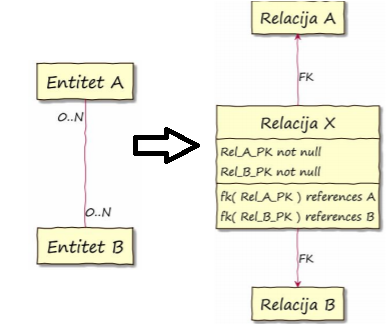
  
* 0..\* - 1..\*: odnosi slabih i jakih entiteta. ***Pravi se vezna relacija, sadrži samo strane ključeve prema obe vezane relacije, ne smeju biti nedefinisani, zajedno čine primarni ključ i dodaje se uslov bazi da za svaki A mora postojati bar jedan B***

  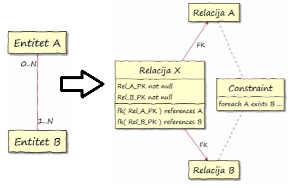

* 1..\* - 1..\*: odnosi gde celina ne može da postoji bez delova i deo ne može bez celine. ***Pravi se vezna relacija, sadrži samo strane ključeve prema obe vezane relacije, ne smeju biti nedefinisani, zajedno čine primarni ključ i dodaje se uslov bazi da za svaki A mora postojati bar jedan B i obrnuto***

  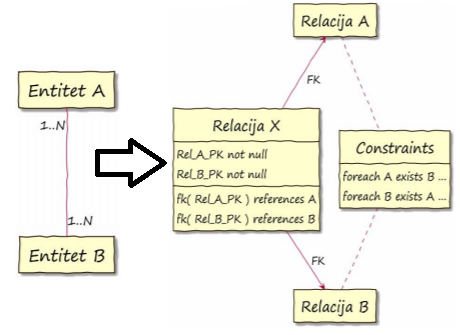

## 102. Kako se u logičkom modelu modeliraju binarni ciklični odnosi?

* 1 - 1: Predstavljaju se dodatnim atributima stranog ključa. Ako je odnost opcioni, sme da bude NULL

  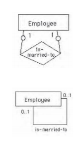

* 1 - \*: Strani ključ se uvodi na strani \*.

  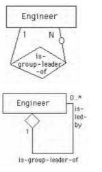

* \* - \*: Predstavlja se novom relacijom. Kao i obični \* - \* odnosi.

  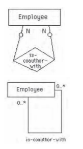

## 103. Kako se u logičkom modelu modeliraju odnosi sa više učesnika?
* 1 - 1 - 1: Nova relacija sa stranim ključevima. Zavisnosti se uređuju dopuštanjem NULL i jedinstvenim ključevima.

  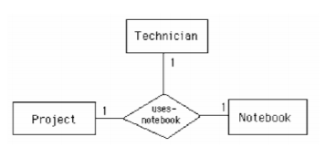

* 1 - 1 - \*: Nova relacija sa stranim ključevima. Zavisnosti se uređuju dopuštanjem NULL i jedinstvenim ključevima.

  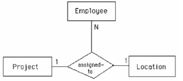
  
* 1 - \* - \*: Nova relacija sa stranim ključevima. Zavisnosti se uređuju izborom primarnog ključa.

  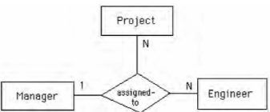  
  
* \* - \* - \*: Nova relacija sa stranim ključevima. Svi zajedno čine primarni ključ te relacije.

  