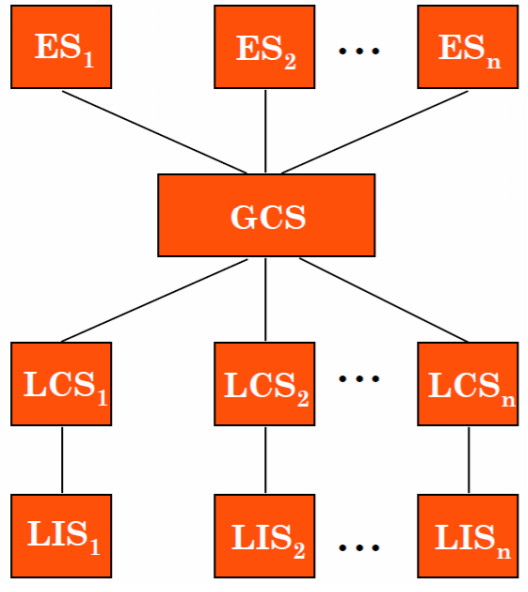
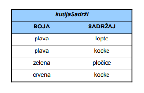
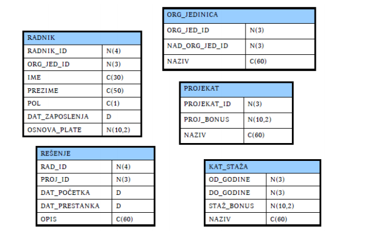
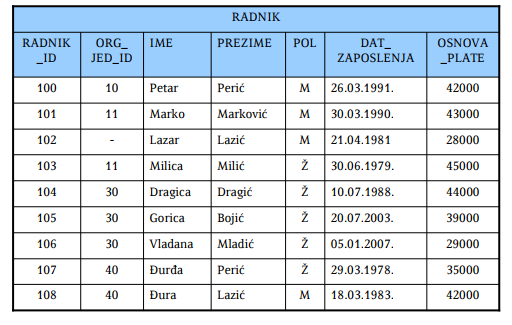
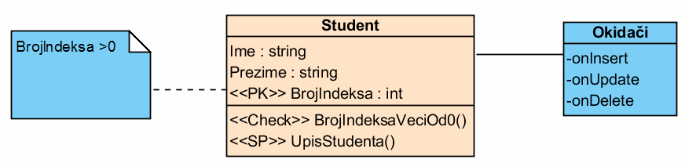

## 1. Navesti najvažnije modele podataka kroz istoriju računarstva do danas.

Reprezentacija koja se nalazi na konceptualnom nivou apstrakcije naziva se ***model podataka***.
Njime se predstavlja logička struktura svih podataka u bazi kao i skup operacija koje se mogu izvršiti nad njima.

Najvažniji modeli podataka su:
- **mrežni model** - IDS ('prvi' SUBP, 1960te), Associate PL/I (kraj 1960ih), CODASYL (grupa za standardizaciju)
- **hijerarhijski model** - IMS (1968., IBM), System2000
- **relacioni model** - Peter Chen, 1976.
- **model entiteta i odnosa**
- **prošireni relacioni model**
- **objektni 'model'**
- **objektno-relacioni model**

## 2. Objasniti osnovne koncepte mrežnog modela podataka.

***Strukture podataka*** su nalik na slogove u programskim jezicima. Slog sadrži podatke jedne pojave entiteta i sastoji se od polja koja odgovaraju atributima. Svako polje sadrži jednu vrendnost atributa. Označavaju se pravougaonicima

Strukture podataka se povezuju ***vezama*** koje su slične pokazivačima u programskim jezicima.

***Tipovi veza*** su:
- više - više
- jedan - više
- jedan - jedan

Za implementaciju u računaru koriste se usmereni grafovi.

## 3. Objasniti osnovne koncepte hijerarhijskog modela podataka.

U osnovi slično mrežnom modelu, s tim da se zahteva hijerarhija. Skup slogova povezanih vezama tako da grade hijerarhiju.

Nije dozvoljeno višestruko vezivanje čvorova (tj. do svakog čvora vodi tačno jedan put od korena) i posledica ovoga je redudantnost.

Skup slogova u kolekciji počinje 'praznim' (dummy) čvorom.

Složeni odnosi zahtevaju više hijerarhija.

## 4. Objasniti ukratko osnovne nivoe apstrakcije kod savremenih baza podataka.

Razlikujemo četiri osnovna nivoa:
- ***spoljašnja shema*** - šta korisnik vidi
- ***konceptualna (logička) shema*** - sve ono što čini logički model podataka
- ***fizička shema*** - fizička organizacija podataka u sistemu. Opisuje datoteke i indekse koji su korišćeni pri implementaciji na fizičkom uređaju.
- ***fizički uređaj*** - fizička organizacija podataka na fizičkim uređajima

Korisnik svoje zahteve nad bazom definiše na konceptualnom i spoljašnjem nivou.

## 5. Objasniti uglove posmatranja arhitekture baze podataka.

Postoje tri ugla posmatranja arhitekture:
- ***ugao komponenti***

  Komponente sistema se definišu zajedno sa njihovim međusobnim odnosima. SUBP se sastoji od skupa komponenti koje obavljaju neke funkcije.

  Posmatranje komponenti je **neophodno** pri implementaciji ali **nije dozvoljeno** da bi se odredila funkcionalnost sistema

  Osnovne komponente su:
  - podaci (integrisani i deljivi)
  - hardver (procesor, glavna memorija, spoljašnje memorije)
  - softver (SUBP, alati za razvoj, pomoćni programi)
  - korisnici (programeri, administratori, krajnji korisnici)

- ***ugao funkcija***

  Prepoznaju se različite klase korisnika i funkcije koje sistem izvšrava za njih. Najčešće se prave hijerarhije korisnika.

  **Prednost** pristupa je u jasnoći predstavljanja funkcija i cilja sistema. **Slabost** je u nedovoljnom uvidu u način ostvarivanja funkcija i ciljeva.  

- ***ugao podataka***

  Prepoznaju se različite vrste podataka. Arhitektura se određuje tako da definiše funkcionalne jedinice koje koriste podatke na različite načine. Kako su podaci centralna tema SUBPa, ovaj pristup se preporučuje kao najpoželjniji

  **Prednost** je u isticanju centralne pozicije podataka u sistem. **Slabost** je u nemogućnosti da se arhitektura u potpunosti odredi ako nisu opisane i funkcionalne celine.

Pristupi se moraju objediniti kako bi se dobio model arhitekture koji u svakoj posmatranoj tački daje dovoljno informacija o odgovarajućim aspektima.

## 6. Objasniti standardizovanu arhitekturu ASNI/SPARC.

Jedan od najvažnijih standarda baza podataka, nastao 1977. godine. Načelno počiva na podacima, ali zapravo je objedinjen pogled.

Prepoznaju se tri nivoa podataka:
- ***spoljašnji nivo*** - kako korisnici i programeri vide podatke. Može postojati više domena, gde svaki obuhvata samo podatke značajne jednoj klasi korisnika.
- ***konceptualni nivo*** - kako podaci čine celinu iz ugla poslovnog okruženja. Apstraktna definicija baze podataka.
- ***interni nivo*** - kako su podaci implementirani na računaru / računarima. Obuhvata elemente fizičke implementacije.

## 7. Kakav je odnos relacionih baza podataka i standardizovane arhitekture ANSI/SPARC?

Za razliku od gore navedene podele nivoa u ANSI/SPARC arhitekturi, u relacionom modelu nivoi se mogu predstaviti na sledeći način:

- ***Konceptualni nivo***, koji čini shema baze podataka. Obuhvata opise atributa, ključeva (primarnih i stranih) i ograničenja.
- ***Interni nivo***, koji čine fizički aspekti - indeksi, prostori tabela i razne optimizacije.
- ***Eksterni nivo***, koji čine pogledi, koji pružaju denormalizovanu sliku dela domena.

## 8. Objasniti primer arhitekture klijent - server.

Osnovna ideja je razdvajanje funkcionalnosti servera i klijenta. Server pruža usluge koje klijent koristi.

**Server** je zadužen za definisanje podataka i upravljanje podacima, tj. za obradu upita, optimizaciju, izvođenje transakcija, zatim bezbednost, integritet, oporavak.

**Klijent** je zadužen za ostvarivanje komunikacije između aplikacije i servera i upravljanje podacima koji su keširani na njegovoj strani (podaci, katanci, provera konzistentnosti podataka)

## 9. Objasniti koncept distribuiranih arhitektura na primeru arhitekture ravnopravnih čvorova.

Imaju više servera, koji imaju različite ili deljene uloge. Primer: arhitekutra ravnopravnih čvorova i federativne baze podataka.

**Arhitektura ravnopravnih čvorova**

Svaki čvor može imati svoju sopstvenu fizičku organizaciju podataka - ***lokalna interna shema (LIS)*** .

Poslovno vođenje tih podataka na konceptualnom nivou je opisano ***globalnom konceptualnom shemom (GCS)*** .

Zbog fragmentacije i replikacije podataka, na svakom čvoru je potrebno da postoji logički opis podataka - ***Lokalna konceptualna shema (LCS)*** . Može se reći da je GCS unija svih LCSa.

Korisnici na spoljašnjem nivou imaju odgovarajuće ***spoljašnje shema (ES)***

Ova arhitektura je prirodno proširenje ANSI/SPARC modela:
- transparentnost podataka je praktično nasleđena
- transparentnosti lokacije i replikacije podataka su podržane na osnovu definicije GCSa i LCSa i njihovog odnosa i preslikavanja.
- transparentnost mreže počiva na GCSu

## 10. Objasniti osnovne koncepte relacionog modela podataka.

Relacioni model čine:
- ***Strukturni deo relacionog modela*** - način modeliranja podataka
- ***Manipulativni deo relacionog modela*** - način rukovanja modeliranim podacima
- ***Integritetni deo relacionog modela*** - način obezbeđivanja valjanosti podataka

*Sve* se modelira tabelama - i entiteti i odnosi.

Relacioni model je u potpunosti formalno matematički zasnovan.

## 11. Sta je "strukturni deo relacionog modela"? Objasniti ukratko. ##

Strukturni deo relacionog modela opisuje nacin modeliranja podataka.
Dva osnovna tipa objekata koji karakterisu strukturu relacionog modela su:

- domen
- relacija

Domen predstavlja skup vrednosti istog tipa (na primer, skup naslova knjiga,
skup imena gradova ili skup datuma nekih dogadjaja).

Neka je *D1 × D2 × ... × Dn* Dekartov proizvod domena *D1, D2, . . . , Dn*. Tada relacija R stepena *n* (n-arna relacija), definisana na domenima *D1, D2, . . . , Dn* predstavlja proizvoljni konacni podskup navedenog Dekartovog proizvoda.

Za razliku od matematickog pojma relacije, ova relacija je dinamickog sadrzaja jer se neke njene n-torke tokom "zivota" relacije brisu, neke se dodaju a neke se menjaju.

### Model relacije ###

Svakoj matematickoj relaciji odgovara tacno jedan skup objekata koji zadovoljavaju relaciju. Taj skup se cesto upotrebljava kao matematicki model relacije.
Ako je *ρ* n-arna relacija i njen domen oznacen sa *Dom(ρ)*, onda je jedan model relacije *ρ* skup:

*model(ρ) = {(a1, a2, ..., an)|(a1, a2, ..., an) ∈ Dom(ρ) ∧ ρ(a1, a2, ..., an)}*

Primetimo da vazi:

*model(ρ) ⊂ Dom(ρ)*.

## 12. Sta je "manipulativni deo relacionog modela"? Objasniti ukratko. ##

Manipulativni deo relacionog modela opisuje nacin rukovanja modeliranim podacima.

## 13. Sta je "integritetni deo relacionog modela"? Objasniti ukratko. ##

Integritetni deo relacionog modela koji opisuje nacin obezbedjivanja valjanosti podataka.

## 14. Navesti primer modeliranja skupa iz posmatranog domena odgovarajucom relacijom. ##

### Predstavljanje relacija skupovima ###

Za sve n-torke iz *Dom(ρ)* vazi:

*ρ(a1, a2, ..., an) ⇐⇒ (a1, a2, ..., an) ∈ model(ρ)*

Zbog navedene ekvivalencije cesto se umesto oznake *model(ρ)* upotrebljava samo
relacija ρ u istom kontekstu:

*ρ = {(a1, a2, . . . , an)|(a1, a2, . . . , an) ∈ Dom(ρ) ∧ ρ(a1, a2, . . . , an)}*

Relacije cesto predstavljamo upravo pomocu njihovog modela.

### Predstavljanje relacije skupovima - primer ###

Neka imamo:

- crvenu, plavu, belu i zelenu kutiju
- i u njima lopte, kocke i plocice.

Neka je data binarna relacija *kutijaSadrzi(K, P)* koja je zadovoljena ako kutija
*K* sadrzi *P*. Njen domen je tada definisan na sledeci nacin:

*Dom(kutijaSadrzi) = {crvena, plava, bela, zelena} × {lopte, kocke, plocice}*

Neka naredni model relacije opisuje sta se nalazi u kojoj kutiji:

*kutijaSadrzi = {(plava, lopte),(plava, kocke),(zelena, plocice),(crvena, kocke)}*

Tada:

- iskaz *kutijaSadrzi(plava, kocke)* je tacan,
- iskaz *kutijaSadrzi(zelena, lopte)* nije tacan,
- iskazi *kutijaSadrzi(zuta, kocke)* i *kutijaSadrzi(zelena, knjige)* nisu definisani, zato sto argumenti nisu u domenu relacije.

Relacije (odnosno njihovi modeli) sa konacnim brojem elemenata mogu da se
predstave i pomocu tabela:

## 15. Sta su entiteti? Kako se formalno definisu atributi i relacije? ##

Entitetima nazivamo neke objekte "stvarnog" sveta koje modeliramo i opisujemo nekim skupom podataka.  

Def: Neka je *E* neki skup entiteta. Tada kazemo da se skup entiteta karakterise konacnim skupom atributa *A1, A2, . . . An*, u oznaci
*E(A1, A2, . . . An)*, akko:

- Svaki atribut *Ai* predstavlja funkciju koja slika entitete u odgovarajuci domen atributa *Di*:

*Ai : E → Di*

- Svaki atribut *Ai* ima jedinstven naziv *ti*

Za svaki entitet *e ∈ E*, vrednost funkcije *Ai(e) ∈ Di* predstavlja njegovu vrednost atributa *Ai*.

Def: Neka je *D1 × D2 × ... × Dn* Dekartov proizvod domena *D1, D2, . . . , Dn*. Tada relacija R stepena *n* (n-arna relacija), definisana na domenima *D1, D2, . . . , Dn* predstavlja proizvoljni konacni podskup navedenog Dekartovog proizvoda.

## 16. Sta je relaciona baza podataka? Sta je relaciona shema? ##

*Relaciona baza podataka* je skup relacija. Opis relacije cine domen relacije i
nazivi atributa. Oznaka *R(A1 : D1, A2 : D2, . . . , An : Dn)* koristi se za predstavljanje relacije R ciji atribut *Ai* uzima vrednost iz domena *Di*, za
*i = 1, . . . , n*, i zove se *relacijska shema relacije R*. Skup relacijskih shema relacione baze podataka je *shema relacione baze podataka*.

### Primer baze podataka - tipovi ###

Uvedimo opisno sledece skupove:

- *N(a)* = skup svih celih brojeva sa najvise a dekadnih cifara
- *N(a, b)* = skup svih brojeva koji u dekadnom zapisu sa leve strane decimalne
zapete imaju najvise *a*, a sa desne strane najvise *b* cifara
- *C(a)* = skup svih niski duzine do *a* znakova
- *D* = skup svih datuma (u nekom podrazumevanom opsegu)

Navedeni skupovi se najcesce upotrebljavaju kao domeni (tj. tipovi) atributa
relacija. Svi atributi u narednom primeru relacione baze podataka imaju za
domen neki od navedenih skupova.

### Primer baze podataka - shema ###

*Kol(ORG_JEDINICA) = ('org_jed_id', 'nad_org_jed_id', 'naziv')*

*Dom(ORG_JEDINICA) = N(3) × N(3) × C(60)*

*Kol(RADNIK) = ('radnik_id', 'org_jed_id', 'ime', 'prezime', 'pol', 'dat_zaposlenja', 'osnova plate')*

*Dom(RADNIK) = N(4) × N(3) × C(30) × C(50) × C(1) × D × N(10, 2)*

*Kol(PROJEKAT) = ('projekat_id', 'proj_bonus', 'naziv')*

*Dom(RADNIK) =  N(3) × N(10, 2) × C(60)*

## 17. Kako se modeliraju entiteti posmatranog domena u relacionom modelu? ##

### Modeliranje entiteta relacijama ###

U opstem slucaju, skup svih atributa *A1, . . . An* entiteta *e ∈ E* odredjuje funkciju *α* na sledeci nacin:

*α(e) = (A1(e), . . . An(e))*

Slika skupa entiteta funkcijom *α* je skup:

*R = α(E)*

Podsetimo se, funkcija *α* je injektivna akko za sve razlicite originale daje razlicite slike, tj. akko vazi:

*α(e) = α(u) akko e = u*.

Kazemo da skup atributa dobro karakterise skup entiteta ako, pored navedenih
uslova, funkcija predstavlja injektivno preslikavanje.
Ako je *α* injektivna funkcija, tada kazemo da je slika *R = α(E)*:

- relacija *R* sa atributima *A1, . . . An*,
- domenom relacije *Dom(R) = D1 × · · · × Dn*,
- i nazivima atributa *Kol(R) = (t1, . . . tn).*

Tada skup entiteta *E* sa atributima *A1, . . . An* modeliramo relacijom *R* i relacija *R* je dobra karakterizacija skupa entiteta *E*. Formalno, definisemo *R* tako da je *model(R) = α(E).*

### Zapisivanje ###

Ako je *α(e) = (a1, . . . an)*, tada n-torku *(a1, . . . an)*, koja formalno predstavlja "model entiteta e", ˇcesto nazivamo i "entitetom ". Atribut *Ai(e)* zapisujemo i kao e.ti. Namerno ne pravimo razliku izmedju relacije *R* i odgovarajucih relacija dobijenih permutovanjem njenih atributa.

### Predstavljanje relacije tabelom ###

Relaciju *R = α(E)* cesto predstavljamo, pa i nazivamo, tabelom. Pri tome:

- Kolone tabele odgovaraju atributima *A1, . . . An*;
- Nazivi kolona odgovaraju nazivima atributa *t1, . . . tn*;
- Vrste tabele odgovaraju n-torkama relacije, tj. entitetima.

### Predstavljanje entiteta - primer ###

Relacija ne sme da ima jednake elemente:

Ako je

*α(x) = (ime(x), prezime(x), osnova plate(x))*

onda cemo n-torku *(ime(x), prezime(x), osnova plate(x))* u zapisima obicno da
izjednacavamo sa *x*. Pri tome cemo *ime(x)* da zapisujemo kao *x.ime* (i slicno
za ostale atribute). Necemo razlikovati relaciju *RADNIK* od relacija dobijenih
permutovanjem atributa ove relacije.

## 18. Kako se modeliraju odnosi u posmatranom domenu u relacionom modelu? ##

U relacionom modelu, odnosi se modeliraju na isti nacin kao i entiteti – relacijama. Bez mnogo formalizovanja, pogledajmo prethodni primer i videcemo da
vec imamo neke odnose:

- Svaki *RADNIK* ima dodeljen tacno jednan entitet *ORG_JEDINICA*.
- Svako *RESENJE* predstavlja odnos tacno jednog entiteta *RADNIK* i tacno jednog entiteta *P ROJEKAT*, uz jos neke dodatne atribute.

Osnovna ideja je sasvim jednostavna:

- Ako su dva entiteta *e ∈ E* i *f ∈ F* u nekom odnosu, onda to mozemo opisati novom relacijom *ρ(e, f)*, ciji je domen *Dom(ρ)*
- Ako su entiteti *e ∈ E* i *f ∈ F* modelirani kao *e = (x1, . . . , xn)*, *f = (y1, . . . ym)* onda njihov odnos moze da se modelira kao *ρ(e, f) = (x1, . . . , xn, y1, . . . ym)*

Ako postoji podskup atributa *Ai1, . . . , Aink* takav da postoji preslikavanje *k*, koje za svaki entitet *e* iz *E* jednoznacno preslikava izabrani podskup atributa *xi1, . . . xink* entiteta *e* u kompletan model entiteta *e(x1, . . . , xn)*, onda u modelu relacije *ρ* taj skup atributa moze da se koristi umesto punog skupa atributa *A1, . . . , An*.

## 19. Sta cini manipulativni deo relacionog modela? ##

Kljucno mesto u manipulativnom delu modela imaju pojam upita i azuriranje baze podataka. Upit se moze
definisati kao definicija nove relacije na osnovu vec postojecih i poznatih relacija baze podataka. Azuriranje baze podataka je zamenjivanje vrednosti promenljive baze podataka
novom vrednoscu baze podataka.

### Formalni upitni jezici ###

Definicija relacionog modela ukljucuje dva formalna jezika za rad sa relacijama:

- Relaciona algebra i
- Relacioni racun

Po pitanju izrazajne moci, dokazana je ekvivalentnost ovih formalizama.

Relaciona algebra daje skup eksplicitnih operacija za izgradnju relacije rezultata, a relacioni racun pruza notaciju za opisivanje svojstva relacije rezultata. Tako relaciona algebra predstavlja recepturni procedularni pristup, a relacioni racun deskriptivni neprocedularni pristup.

### Optimizacija upita i baze podataka ###

Iz ugla teorije, kljucno je da se utvrdi da je upitni jezik dovoljno dobar da se
njime moze iskazati bilo koji upit. U praksi je potrebna i efikasnost. Optimizacija upita obuhvata poslove analize upita i pronalazenja najefikasnijeg
puta za njegovo izracunavanje. Relacioni upitni jezici omogucavaju relativno
jednostavno automatsko modifikovanje, pa time i optimizaciju, imajuci u vidu
formalnu zasnovanost.

Optimizacija baze podataka obuhvata poslove analize (stvarne ili procenjene)
upotrebe i projektovanja fizickog modela baze podataka u cilju omogucavanja
sveukupno efikasnijeg rada sistema. Pored azuriranja upita, vazno mesto zauzima
azuriranje baze podataka. Ima vise pristupa, ali sustina je da zahteva prosirenja i nove pojmove:

- relaciona promenljiva
- relacija  
= relaciona vrednost  
= sadrzaj relacione promenljive
- promenljiva baze podataka
- vrednost baze podataka

## 20. Objasniti ukratko relacioni racun. ##

Relacioni racun je zasnovan na predikatskom racunu prvog reda.

### Primeri upita ###

**Primer 1**: Naredni upit izdvaja muskarce koji imaju osnovu plate manju od
32000:

*{x|x ∈ RADNIK ∧ x.pol = 'M' ∧ x.osnova_plate < 32000}*

**Primer 2**: Ako nas zanimaju imena, prezimena i datumi zaposlenja radnika koji
zaradjuju bar 40000, onda je resenje naredni upit:

*{(x.ime, x.prezime, x.dat_zaposlenja)|x ∈ RADNIK ∧ x.osnova_plate ≥ 40000}*

**Primer 3**: Imena i prezimena zaposlenih u "Planiranju", ciji staz ulazi u kategoriju "Srednja":

*{(x.ime, x.prezime)| 
x ∈ RADNIK 
∧ (∃y ∈ ORG_JEDINICA) 
(y.naziv = 'Planiranje' 
∧ x.org_jed_id = y.org_jed_id) 
∧ (∃z ∈ KAT_STAZA) 
(z.naziv = 'Srednja' 
∧ z.od_godine ≤ staz(x) ≤ z.do_godine) 
}*

## 21. Objasniti ukratko relacionu algebru.

Relaciona algebra je prosirenje skupovne algebre (koju cine uobicajene skupovne operacije).

Ta prosirenja su:
- *Projekcija* - izdvajanje podskupa atributa
- *Restrikcija* - izdvajanje podskupa redova
- *Proizvod* - Dekartov proizvod dve relacije

Kombinovanjem ovih operacija nastaju slozenije:
- *Prirodno spajanje* - proizvod, pa restrikcija po uslovu jednakosti atributa sa istim imenom pa projekcija na specificne atribute
- *Slobodno spajanje* - spajanje sa restrikcijom po slobodnom uslovu

## 22. Sta cini integritetni deo relacionog modela?

Integritetni deo relacionog modela cine koncepti i mehanizmi koji omogucavaju da se automatizuje proveravanje zadovoljenosti odredjenih uslova.

Stanje baze je *konzistentno* ili *ispravno* ako sadrzaj baze zadovoljava sve uslove integriteta.

Promena sadrzaja vrednosti baze je dozvoljena akko vodi bazu iz jednog u drugo konzistetno stanje.

Uslovi integriteta u relacionom modelu se predstavljaju predikatima nad relacijom ili bazom podataka.

## 23. Navesti osnovne uslove integriteta u relacionoj bazi podataka.

- *Opsti (implicitni)*:

    Oni koji moraju da vaze za svaku bazu podataka i podrazumevaju se na nivou modela baze podataka ili SUBP. Stoga se ne definisu eksplicitno za svaku relaciju.

- *Specificni (eksplicitni)*:

    Oni koji se odnose na pojedinu relaciju.

    Dele se na:
    - *integritet domena*
    - *integritet kljuca*
    - *integritet jedinstvenosti*
    - *referencijalni integritet*
    - *integritet stranog kljuca*
    - *drugi (opsti) uslovi integriteta*
    - *aktivno odrzavanje entiteta*

## 24. Objasniti integritet domena u relacionom modelu.

Odredjuje da svaki atribut moze da ima vrednosti iz definisanog domena

Domen je neki od tipova podataka, a moze i da obuhvata:
- duzinu podatka
- opcionu deklaraciju jedinstvenosti
- opcionu deklaraciju podrazumevane vrednosti
- opcionu deklaraciju nedefinisane vrednosti (vecina implementacija omogucava)

## 25. Objasniti integritet kljuca u relacionom modelu.

Odnosi se na jednu relaciju. Odredjuje se uslovom kljuca.

Podskup atributa relacije je primarni kljuc ako su ispunjeni sledeci uslovi:
- Taj podskup funkcionalno odrejuje sve atribute relacije
- Ne podstoji podskup tog podskupa sa istim svojstvom iznad

Podskup atributa relacije je nadkljuc ako je ispunjen prvi od ova dva uslova.

Svaka relacija mora da ima primarni kljuc.

Torke relacije se referisu preko PK.

## 26. Objasniti integritet jedinstvenosti u relacionom modelu.

Naziva se i *integritet entiteta*.

Primarni kljuc relacije ne sme imati nedefinisane vrednosti, niti dve torke relacije smeju imati dve iste vrednosti primarnih kljuceva.

U doslednim relacionim modelima integritet jedinstvenosti i integritet kljuca su jednaki.

U praksi je integritet jedinstvenosti jaci od integriteta kljuca (zato sto postoje NULL vrednosti)

Pored primarnih, mogu da se definisu i jedinstveni kljucevi.

## 27. Objasniti referencijalni integritet u  relacionom modelu.

Predstavlja uslove o medjusobnim odnosima izmedju dve relacije:
- ne sme se obrisati torka na koju se odnosi neka druga torka, niti se ne sme izmeniti tako da ta referenca postane neispravna
- ne sme se dodati torka sa neispravnom referencom (koja ne postoji u relaciji na koju se referise)

U praksi se ostvaruje kroz integritet stranog kljuca.

U slucaju nedoslednih implementacija, u uslove se dodaje i:
- referenca koja sadrzi nedefinisane vrednosti je ispravna akko je u potpunosti nedefinisana

## 28. Objasniti integritet stranog kljuca u relacionom modelu.

Skup atributa FK bazne relacije B je njen strani kljuc koji se odnosi na relaciju P akko:
- P ima primarni kljuc PK
- domeni FK i PK su identicni
- svaka vrednost kljuca FK u torkama relacije B je idenicna kljucu PK bar jedne torke relacije P

Za relaciju B kaze se da je zavisna od relacije P.

Postovanje integriteta stranog kljuca pri menjaju sadrzaja baze se odredjuje pravilima azuriranja koja mogu biti:
- pravila brisanja
- pravila azuriranja

## 29. Objasniti pravila brisanja i azuriranja kod integriteta stranog kljuca u relacionom modelu.

Postovanje integriteta stranog kljuca se ostvaruje pravilima brisanja i azuriranja. Za oba se bira tacno jedno.

Pravila brisanja: *Ako se pokusa brisanje torke relacije P za koju postoji zavisna torka relacije B, onda ...*:
- aktivna zabrana brisanja (RESTRICT) - *... se zabranjuje brisanje torke iz P.*
- pasivna zabrana brisanja (NO ACTION) - slicno kao i aktivna, s tim sto se provera odlaze do samog kraja brisanja jer mozda postoji linija kaskadnih pravila koja ce obrisati zavisnu torku.
- kaskadno brisanje (CASCADE) - *... se brisu se zavisne torke.*
- postavljanje nedefinisanih vrednosti - *... se u svim zavisnim torkama atributi stranog kljuca postavljaju na nedefinisane vrednosti*
- postavljanje podrazumevanih vrednosti - *... se u svim zavisnim torkama atributi stranog kljuca postavljaju na podrazumevane vrednosti*

Pravila azuriranja: *Ako se pokusa menjanje primarnog kljuca torke relacije P za koju postoji zavisna torka relacije B, onda ...*:
- aktivna zabrana menjanja (RESTRICT) - *... se zabranjuje menjanje torke iz P.*
- pasivna zabrana menjanja (NO ACTION) - slicno kao i aktivna, s tim sto se provera odlaze do samog kraja menjanja jer mozda postoji linija kaskadnih pravila koja ce promeniti zavisnu torku.
- kaskadno menjanje (CASCADE) - *... se menjaju atributi stranog kljuca svim zavisnim torke.*
- postavljanje nedefinisanih vrednosti - *... se u svim zavisnim torkama atributi stranog kljuca postavljaju na nedefinisane vrednosti*
- postavljanje podrazumevanih vrednosti - *... se u svim zavisnim torkama atributi stranog kljuca postavljaju na podrazumevane vrednosti*

## 30. Objasniti opste uslove integriteta relacionog modela.

Postoje i drugi (opsti) uslovi integriteta:
- uslovi nad atributom relacije - moze da se koristi za dodatno suzavanje domena
- uslovi nad torkom relacije - provera ispravnosti slozenijih saglasnosti atributa jedne torke relacije
- uslovi nad relacijom - globalnog karaktera, provera ispravnosti slozenijih saglasnosti torki u okviru jedne relacije
- uslovi nad bazom podataka - globalnog karaktera, provera slozenijih uslova integriteta

## 31. Objasniti aktivno odrzavanje integriteta u relacionim bazama podataka

Kod aktivnog odrzavanja integriteta RBP sami definisemo na koji cemo nacin odrzavati integritet (za razliku od recimo primarnog kljuca, kome je definisano pravilo da je jedinstven i nece dopustiti unosenje vec postojece vrednosti)
Osnovno sredstvo aktivnog odrzavanja integriteta su ***okidaci***.

## 32. Objasniti ulogu i princip rada okidaca na tabelama relacione baze podataka

Okidaci na tabelama RBP su zapamceni programi koji se izvrsavaju kada se desi neki dogadjaj. (definicija nadjena na netu).

Oni su osnovno sredstvo aktivnog odrzavanja integriteta. Izvrasavaju se pre ili posle naredbe za dodavanje, menjanje ili brisanje torki. Na jednoj relaciji moze postojati vise okidaca.

## 33. Objasniti ulogu i princip rada okidaca na pogledima relacione baze podataka

Okidaci nad pogledima se izvrsavaju ***umesto naredbe*** za dodavanje, menjanje ili brisanje torki iz pogleda. Oni omogucavaju preusmeravanje izmena na relacije na kojima pociva pogled, ali i vise od toga, na bilo koju relaciju.

Okidaci na pogledima omogucavaju skrivanje veoma slozenih operacija kojima se spoljasnja shema razdvaja od konceptualne, ili konceptualna od interne.

## 34. Objasniti motivaciju za pravljenje modela entiteta i odnosa

Model entiteta i odnosa nastaje zato sto u dosadasnjem mreznom, hierarhijskom i relacionom modelu ne cuvamo meta informacije o entitetima i njihovim odnosima. ER (Entity-Relation) model tezi da ocuva sve bitne ***semanticke informacije*** o domenu koji modelira (za razliku od prethodnika).

## 35. Objasniti osnovne koncepte i pretpostavke modela entiteta i odnosa

ER(entity-relationship) model prepoznaje dva razlicita osnovna koncepta: - entitet i relaciju.
- **Entitet** je stvar koja mzoe da se jednoznacno identifikuje
- **Odnos** je neko medjusobno pridruzivanje entiteta

Tezi da u samom modelu sacuva sve bitne semanticke informacije o domenu koji modelira.
Bavi se konceptualnim i logickim modelom prvenstveno. TODO???

## 36. Objasniti kako se ER model uklapa u nivoe 1 i 2 pogleda na podatke

1. nivo pogleda na podatke je konceptualni nivo, tj. apstraktne semanticke informacije. "Informacije koje se ticu entiteta i odnosa, koje postoje u nasem umu".

Konceptualni model se cesto zapisuje primenom ER modeliranja, samim tim kao izlaz ovog nivoa imamo ER model.

2. nivo pogleda na podatke je logicki model, tj. strukture podataka koje cuvamo u BP. "Strukturu informacija, tj. nacin organizovanja informacija u kome se entiteti i odnosi predstavljaju podacima"

U logickom modelu prevodimo ER model, koji smo dobili pri konceptualnom modeliranju, u (najcesce relacioni) model.

## 37. Objasniti razliku izmedju entiteta i odnosa u ER modelu

- **Entitet** je stvar koja moze da se jednoznacno identifikuje (osoba, preduzece, događaj)
- **Odnos** je neko međusobno pridruzivanje entiteta (otac-sin, radnik-preduzece)

Veliki konceptualni problem ER-modela je sto pociva na pretpostavci da su entitet i odnos razliciti koncepti a ne nudi objektivne kriterijume za njihovo razlikovanje.

## 38. Sta su slabi i jaki entiteti?

***Slabi***: U identifikovanju entiteta ucestuju odnosi sa drugim entitetima tj. u praksi u primarnom kljucu ucestvuje referenca na drugi entitet
- identifikuju se samo kroz odnos sa nekim drugim entitetom
- uglavnom ne postoje samostalno, bez nekih drugih entiteta
- obicno predstavljaju sastavni deo ili opis nekog drugog entiteta

***Jaki***: U identifikovanju entiteta ne ucestuju odnosi sa drugim entitetima tj. u primarnom kljucu ne ucestvuje referenca na drugi entitet mada nekada to moze da bude slucaj u modelu
- identifikuju se sami za sebe
- uglavnom nezavisni od drugih entiteta u bazi
- njihovo postojanje nije uslovljeno postojanjem drugih entiteta

## 39. Nacrtati primer ER dijagrama i objasniti njegove osnovne elemente

 http://poincare.matf.bg.ac.rs/~smalkov/files/pbp.r3## 71.2017/public/predavanja/PBP.cas.20## 17.## 03.Model%20entiteta%20i%20odnosa.p4.pdf TODO dodaj sliku

## 40. Sta su i kako se na ER dijagramima oznacavaju uslov kljuca, uslov ucesca i puno ucesce?

Uslov kljuca:
Ako na osnovu entiteta moze da se jednoznacno odredi odnos u kome ucestvuje
Oznacava se strelicom od entiteta prema odnosu

Uslov ucesca: TODO

Puno ucesce:
Ako svaki entitet skupa ucestvuje u bar jednom odnosu, onda je to puno ucesca u odnosu, a inace je parcijalna
Puno ucesce u odnosu se oznacava debljom linijom

## 41. Kako se na ER dijagramima oznacava kardinalnost i sta tacno oznacava?

**Kardinalnost** odnosa opisuje u koliko razlicitih odnosa tog tipa moze  da ucestvuje svaki od entiteta.

Ima vise notacija:
- Oznacava se brojem na svakoj od linija koje vode od entiteta prema
odnosu. Pri tom broj oznacava sa koliko razlicitih entiteta tog tipa mogu
biti u odnosu ostali ucesnici.

- Umesto broja moze da stoji opseg vrednosti u oznaci A..B, gde je A ≤ B

- Umesto broja moze da stoji i ∗ koja oznacava ,,*neki prirodan broj*“.

Ispravne oznake kardinalnosti u ovoj notaciji su npr:  1, 4, 0..1, 2..5, 1..\*,
0..\*.

## 42. Kako se na ER dijagramima oznacavaju slabi entiteti?

Oznacavaju se debljim(ili dvostrukim linijama)

## 43. Kako se na ER dijagramima oznacavaju hijerarhije?

## 44. Sta je i kako se na ER dijagramima oznacava "agregacija"?

*Agregacija* je apstrakcija u kojoj se odnos izmedju dva ili vise tipova entiteta definise kao entitet nove vrste.

## 45. Objasniti osnovne slabosti ER modela.

U ovom modelu postoje odredjne nedoslednosti. Pociva na pretpostavci da postoje dva razlicita koncepta entiteta i odnosa, ali ne nudi objektivne kriterijume za njihovo razlikovanje. Nacin predstavljanja agregacija na dijagramima dodatno potvrdjuje da odnosi mogu da imaju neke karakteristike entiteta. Slozeni atributi su dodatni problem. Postavlja se pitanje da li slozeni atributi imaju osobine entiteta?

## 46. Navesti i ukratko objasniti osnovne korake u projektovanju baze podataka.

- **Analiza zahteva** podrazumeva razumevanje podataka i razumevanje aplikacije.

- **Konceptualno projektovanje** podrazumeva pravljenje modela podataka visokog nivoa i opisivanje struktura podataka, odnosa medju strukturama podataka i uslova integriteta.

- **Logicko projektovanje** ako se koristi relacioni SUBP kljucni posao je prevodjenje konceptualnog modela na relacioni model.

- **Preciscavanje sheme** podrazumeva analizu logickog modela i prepoznavanje i resavanje problema u implementaciji.

- **Fizicko projektovanje** razmatra ocekivano opterecenje i dodatno se popravlja model BP tako da zadovolji postavljene kriterijume vezane za performanse.

- **Projektovanje bezbednosti** definisu se i implementiraju odgovarajuci bezbednosni mehanizmi.

## 47. Objasniti korake Analiza zahteva i Konceptualno projektovanje pri projektovanju baze podataka.

**Analiza zahteva** podrazumeva pre svega razumevanje podataka i to strukture podataka, obima podataka i odnosa  medju podacima. Analiza  zahteva podrazumeva i razumevanje aplikacija, i to potrebe aplikacije za  podacima, ucestalost upita i transakcija i performanse.

**Konceptualno projektovanje** podrazumeva pravljenje modela podataka visokog nivoa i opisivanje struktura podataka, odnosa medju strukturama podataka i uslova integriteta. U realizaciji ovog koraka cesto se koristi ER model.

## 48. Objasniti korake Logicko projektovanje i Preciscavanje sheme pri projektovanju baze podataka.

**Logicko projektovanje** podrazumeva da se bira konkretna vrsta, a cesto i implementacija SUBP. Konceptualni model se prilagodjava konkretnom implementacionom modelu podataka.   Na primer, ukoliko se izabere relacioni SUBP, kljucni posao ovog koraka je prevodjenje konceptualnog modela na relacioni model.

**Preciscavanje sheme** podrazumeva analizu logickog modela i prepoznavanje i resavanje problema u implementaciji. U slucaju relacionog modela ovaj zadatak se svodi na zadatak normalizacije.

## 49. Objasniti korake Fizicko projektovanje i Projektovanje bezbednosti pri projektovanju baze podataka.

**Fizicko projektovanje** razmatra ocekivano opterecenje(uobicajeno i vrseno) i dodatno se popravlja model BP tako da zadovolji postavljene kriterijume vezane za performanse. Uobicajni koraci:
- *projektovanje indeksa*
- *denormalizacija*
- *projektovanje distribuiranja*

**Projektovanje bezbednosti** prepoznaju se vrste/uloge korisnika i vrste aplikacija. Za svaku ulogu i za svaku vrstu aplikacije definise se korisnicka grupa i odgovarajuci minimalan skup privilegija za obavljanje posla. Prepoznaju se delovi baze podataka koji su posebno osetljivi i kojima je potrebno dodatno redukovati pristup. Definisu se i implementiraju odgovarajuci bezbednosni mehanizmi.

## 50. U kojoj fazi projektovanja baze podataka se najvise koristi ER model?

- Konceptualno projektovanje
- Logicko projektovanje

## 51. Objasniti dilemu „entitet ili atribut“?
Ako imamo složen atribut, možemo da ga modeliramo kao:
- jedan složen atribut
- više prostih atributa
- jedan entitet
- Na osnovu čega donosimo odluku?
- Čak i za proste atribute može da se postavi pitanje da li su oni možda ipak entiteti?

Argumenti za “atribut”:
- ako jednom entitetu odgovara tačno jedna vrednost “atributa”
- ako predstavlja jednostavnu skalarnu vrednost koja opisuje entitet
- ako više entiteta može da ima iste vrednosti, a da one nisu međusobno uslovljene
  - tj. menjanje vrednosti za jedan entitet ne povlači njeno menjanje za drugi
- ako važi slično i kada je to “atribut” u različitim skupovima entiteta

Složen atribut može da ima smisla:
- ako želimo da sačuvamo internu strukturu, ali ona ima značaja samo interno
- ako više entiteta može da ima iste vrednosti, a da one nisu međusobno uslovljene
  - npr, ako “adresa” obuhvata grad, ulicu i broj, onda više zaposlenih može da ima istu adresu, a da
to ne znači da žive zajedno, pa se one i dalje mogu odvojeno menjati
- ako važi slično i kada je to atribut u različitim skupovima entiteta

“Atribut” mora da preraste u entitet:
- ako nekom drugom entitetu odgovara istovremeno više vrednosti tog atributa
- ako postoji međuzavisnost vrednosti atributa
- npr. ako više entiteta ima istu vrednost atributa i on se promeni za jedan entitet, onda mora da
se promeni i za ostale

## 52. Objasniti dilemu „entitet ili odnos“?
Odnos može da bude ”odnos”:
- Ako svi njegovi atributi odnose strikno na jednu instancu odnosa
  - tj. nema redundantnosti

- Odnos mora da preraste u “entitet”:
  - Ako se neki od njegovih atributa odnosi istovremeno na više instanci
odnosa
    - redundantnost povlači uočavanje/izdvajanje novog entiteta i podizanje složenosti
odnosa

- U velikom broju slučajeva je “jednako ispravno” da nešto bude bilo odnos
bilo entitet

## 53. Objasniti dilemu „složeni odnos ili više binarnih odnosa“?
Većina složenih odnosa može da se “podeli” na više binarnih
agregiranih odnosa
- Da li je bolje podeliti ih ili ih ostaviti?
- Složene odnose ima smisla podeliti na više jednostavnijih
isključivo ako svaki od dobijenih odnosa ima svoj semantički smisao
u posmatranom domenu
- Čak i tada, ako je semantika očiglednija iz složenog odnosa, onda bi
taj složeni odnos trebalo da ostane

## 54. Objasniti dilemu „agregacija ili ternarni odnos“?
- Ovo pitanje je slično prethodnom:
  - Agregirani odnos podrazumeva da se agregirani odnos može
posmatrati kao skup entiteta (ili skup odnosa)
  - No, to može da bude i veštački napravljeno
  - Šta je i kada bolje uraditi?

- Agregirani odnosi su bolje rešenje:
  - Ako nekada postoji samo deo odnosa, a nekada ceo (tj. nekada samo deo koji se
agregira, a nekada pun odnos)
  - Ako se deo atributa odnosa ne tiče celine odnosa već samo njegovog dela, koji
uključuje manje entiteta
- U ostalim slučajevima obično je bolje da se koriste složeni odnosi

## 55. Kako se entiteti i odnosi ER modela prevode u relacioni model?
Svaki entitet se prevodi u relaciju
- Atributi entiteta se prevode u atribute relacije
- Složeni atributi se prevode u više prostih atributa
- Ključni atributi se prevode u primarni ključ

Skoro svaki odnos se prevodi u relaciju
- Atributi odnosa se prevode u atribute relacije
- Dodaju se i ključni atributi uključenih entiteta
- Primarni ključ dobijene relacije čine primarni ključevi relacija koje
odgovaraju uključenim entitetima
- Primarnom ključu se dodaju i svi ključni atributi odnosa
- Strani ključevi su primarni ključevi učesnika

Ako je odnos 1:0..1
- onda ne mora da se pravi dodatna relacija za odnos
- atributi odnosa se dodaju relaciji koja odgovara entitetu sa kardinalnošću 1
- OPREZNO! Ako odnos nije 1:0..1 nego 0..1:0..1, onda se dobija potencijalno
redundantno rešenje

## 56. Kako se hijerarhije ER modela prevode u relacioni model?
Hijerarhije mogu da se reše na tri osnovna načina:
- Cela hijerarhija u jednu relaciju
- Svaki entitet u posebnu relaciju
  - tj. kao da se radi o “običnom” osnosu entiteta
- Svaki entitet-list u posebnu relaciju, ali tako da uključi sve nasleđene
atribute

Sve u jednu relaciju
- Jedna relacija koja obuhvata sve atribute koji postoje u hijerarhiji
  - Za svaki entitet se koristi samo deo atributa
  - ...ostali imaju nedefinisane (prazne) vrednosti
- Efikasna upotreba
- Ako je hijerarhija sa preklapanjem(može instanca da bude član dve'potklase') onda mora da postoji način da se za svaki
konkretan skup entiteta hijerarhije proveri da li mu entitet pripada
  - ili po jedan dodatan atribut
  - ili se proverava da li su ostali odgovarajući atributi neprazni
- Ako je hijerarhija sa pokrivanjem(mora da pripada bar jednoj potklasi) onda je potreban uslov da svaka torka relacije
pripada bar jednom konkretnom skupu entiteta
  - obično nije problem definisati

Svaki entitet posebno
- Za svaki entitet se pravi po relacija, sa stranim ključem na neposrednu baznu
relaciju
  - Svaka relacija obuhvata samo one atribute koji su za nju specifični
    - ...i još atribute ključa bazne relacije
    - ...koji se koriste kao strani ključ
- Upotreba zahteva česta spajanja i potencijalno je neefikasna
  - ali je na nivou konceptualnog i logičkog modela prihvatljiva
- Ako je hijerarhija sa pokrivanjem onda mora da se obezbedi dodatno sredstvo za
proveru pokrivenosti

Listovi posebno
- Za svaki entitet se pravi po relacija, sa stranim ključem na neposrednu baznu
relaciju
  - Svaka relacija obuhvata atribute koji su za nju specifični
    - ...i SVE atribute SVIH baznih klasa
    - ... atributi ključa bazne relacije se koriste kao strani ključ
- Upotreba pojedinačnih entiteta je efikasna
- Pretraživanje baznog skupa entiteta je neefikasno (unija)
- Ako je hijerarhija sa preklapanjem onda ovakvo rešenje može da napravi probleme
  - mogu da se redundantno ponavljaju delovi entiteta...

Poslednja dva metoda mogu da se kombinuju u različitim delovima hijerarhije

## 57. Kako se slabi entiteti ER modela prevode u relacioni model?
- Slab entitet i odgovarajući odnos se modeliraju jednom relacijom
- Dodaje se i ključni atribut vezanog jakog entiteta, kao deo primarnog ključa

## 58. Šta su „dijagrami tabela (relacija)“?
Dijagram tabela je uglavnom relacioni model/dijagram. Pokazuje veze između tabela - primarne i strane ključeve.
- Često se pogrešno nazivaju „ER dijagrami“
- To nisu ER dijagrami nego dijagrami tabela (relacija)
- Oznake i termini su obično tabele/kolone/ključevi
- Prilagođeni su logičkom i (posebno) fizičkom nivou relacionog modela
- Semantika odnosa je predstavljena u meri u kojoj to
dopušta relacioni model

## 59. U čemu se dijagrami tabela suštinski razlikuju od ER dijagrama? Koji se kada koriste?
(Nema nigde baš odgovor u slajdovima, ali cenim da je ovo fino.)

Dijagram tabela je prilagođen logičkom i (posebno) fizičkom nivou relacionog modela, dok je ER dijagram bolje prilagođen najvišem nivou
posmatranja informacija, tj. semantičkom i konceptualnom modeliranju.

Iz tabele dijagrama je teže zaključiti odnose među tabelama, dok je u ER modelu lakše.

Zato se generalno počinje ER-dijagramom, koji se posle prevodi u Dijagram tabela.

## 60. Kako se označavaju ključevi u dijagramima tabela?
ako kolona pripada primarnom ključu, onda se ona obeležava sa
- simbolom +
- oznakom PK
- crtežom ključa

ako kolona pripada stranom ključu
- simbol #
- oznaka FK (ili PF, ako je i primarni i strani, tzv. slabi entitet)
- crtež ključa sa strelicom
- obično i iskošen naziv

## 61. Kako se oznacavaju razlicite vrste odnosa i kardinalnosti odnosa u dijagramima tabela?

Odnosi izmedju tabela u dijagramima tabela se oznacavaju:
  - isprekidanim linijama
  - punim linijama se oznacavaju odnos slabog i maticnog entiteta (Ovako pise, ali posto su ovo oni dijagrami iz mwb-a, puna linija je ako primarni kljuc jednog entiteta ulazi u primarni kljuc drugog, inace isprekidana)

Kardinalnosti se oznacavaju na kraju linija u duhu UML-a. Koriste se graficke oznake:
  - 0 - kruzic
  - 1 - uspravna linija ( | )
  - \* - linija koja se grana u 3 kratke linije prema tabeli
  - 0 - 1, 0 - \*, 1 - \* se predstavljaju kombinovanjem prethodnih slucajeva

## 62. Objasniti potencijalne razlike u dijagramima tabela na konceptualnom / logickom / fizickom nivou.

#### - Konceptualni nivo -

Na ovom nivou dijagram sadrzi samo strukturu podataka i odnose. Dijagrami na ovom nivou ne sadrze:
  - dodatne kolone surogat kljuceva (primarni kljucevi koje generise sam sistem)
  - dodatne kolone stranih kljuceva
  - oznake kljuceva (osim mozda jednog kandidat-kljuca)
  - tipove kolona

#### - Fizicki nivo -
Za razliku od konceptualnog nivoa dijagramu se dodaju i ostali podaci koji su neophodni za preslikavanja u relacioni model:
  - kolone surogat kljucevi (ako su potrebne)
  - kolone vezanih tabela koji cine strane kljuceve
  - oznake kljuceva i vrsta kljuceva
  - tipovi kolona
  - odnosi vise - vise se cesto zamenjuju tabelama koje ih modeliraju

## 63. Kako se na dijagramu tabela oznacavaju pogledi, okidaci i ostali elementi?

Svi elementi se oznacavju u vidu "modifikovanih pravougaonika":
  - pogledi imaju zaobljene ivice
  - okidaci polukruznu levu stranicu
  - procedure zaobljene gornje ivice

  

## 64.Kako se dijagrami klasa UML-a koriste u projektovanju baza podataka? Objasniti razlike u odnosu na uobicajene dijagrame klasa.

UML dijagrami klasa vec opisuju strukturu podataka klasa.
Ideja je da se to iskoristi i za modeliranje podataka:
  - bolje predstavlja semantiku odnosa od dijagrama tabela
  - bolje predstavlja semantiku odnosa cak i od pravih ER dijagrama

Modeli klasa i relacija se razlikuju. Klase predstavljaju tipove podataka, a relacije skupove podataka.

U praksi se to resava na 3 nacina:
  - ako je potrebno vise skupova istog tipa, uvodimo vise naslednika klase koja odredjuje tip
    * bazna klasa koja sluzi samo kao tip moze da se oznaci
      - npr kao "apstraktna"

  - jedan pristup je da se svaka "klasa" oznaci kao "<< type >>" ili "<< persistent >>"
    * tipovi/klase se oznacavaju sa << type >>
    * skupovi entiteta se oznacavaju sa << persistent >>

  - ignorise se razlika i smatra se da je klasa skup

Za razliku od obicnog dijagrama klasa akcenat je na atributima i odnosima, ponasanje se skoro potpuno zanemaruje i enkapsulacija je u drugom planu.

## 65. Objasniti dopune UML dijagrama koje se koriste u specificnim oblastima primene.

UML sadrzi standardizovane koncepte koji omogucavaju uvodjenje novih nacina oznacavanja:
  - stereotipovi (sledece pitanje opsirnije)
  - oznacene vrednosti
  - prosirenja

#### - oznacene vrednosti -
  - predstavljaju opstiji slucaj stereotipova

  - navode se kao lista parova ime-vrednost unutar viticastih zagrada
    * {isPersistent = true, minCount = 5}

  - nacelno stereotipovi su ekvivalentni oznacenoj tacnoj vrednosti
    * << abstract >> <==> {isAbstract = true}

#### - prosirenja -
  - prosirenje je element koji se povezuje sa osnovnim elementom strelicom sa popunjenim trouglom
    * strelica je usmerena od osnovnog elementa ka prosirenju

  - moze da se koristi za dodatno opisivanje osnovnog elementa ili za dodavanje osobina

  - obicno je opiciono ali moze da bude i obavezno, sto se oznacava sa {required} iznad strelice

### 66. Sta su stereotipovi UML-a i kako se oznacavaju?

Stereotipovi predstavljaju vrste sablona:
  - apstrakcija opsteg slucaja neceg
  - neki predefinisani skup osobina
  - neko predefinisano ponasanje

Koristi se za navodjenje dodatnih deklaracija ili napomena

Podrazumevano oznacavanje je navodjenjem naziva izmedju dvostrukih izlomenjenih zagrada:  
  - << actor >>
  - << entity >>
  - << abstract >>
  - << persistent >>

Obicno se navodi ispod ili iznad naziva klasa
  - moze i ispred

### 67. Objasniti osnovne odnose u dijagramima klasa podataka.

#### - asocijacija -
  - predstavlja odnos izmedu 2 klase

  - oznacava da bar jedna klasa "zna" za neke objekte druge klase i na neki nacin upravlja njima

  - moze da bude
    * funkcionalna - "uradi nesto za mene"
    * strukturalna - "budi nesto za mene"

  - u kontekstu modela podataka **strukturalna** je vaznija

#### - agregacija -
  - posebna vrsta asocijacije
  - implicira da se jedna klasa "sastoji" od (jednog ili vise) objekata druge klase

  - slabiji oblik strukturalne asocijacije:
    * isti deo moze da bude "sadrzan" u vise slozenih objekata
    * ako se slozeni objekat obrise, delovi mogu da nastave da postoje

  - prakticno svaka strukturalna asocijacija kardinalnosti 1-\* moze da se posmatra kao forma agregacije

#### - kompozicija -
  - jaci vid agregacije

  - predstavlja jaci oblik strukturalne asocijacije:
    * uvek je binarni odnosi
    * odnos celina/deo
    * jedan deo moze da pripada samo jednom slozenom objektu
    * ako se obrise slozeni objekat uobicajeno ponasanje je da se obrisu i svi delovi

#### - nasledjivanje -
  - osnovna klasa predstavlja opstiji slucaj izvedenih klasa - generalizacija

  - izvedene klase predstavljaju posebne slucajeve bazne klase - specijalizacija

### 68. Kako se dijagrami klasa podataka koriste na razlicitim nivoima modeliranja?

Slicno kao i kod dijagrama tabela:

#### - konceptualni nivo-
  - ne mora da sadrzi (a najcesce i ne sadrzi):
      * dodatne kolone surogat kljuca
      * dodatne kolone stranih kljuceva
      * oznake kljuceva (osim mozda za jedan kandidat-kljuc)
      * tipove kolona

#### - fizicki nivo -
  - fizicki dijagram sadrzi i:
    * kolone surogat kljuceva (ako su potrebne)
    * kolone vezanih tabela koji cine strane kljuceve
    * oznake kljuceva i vrsta kljuceva
    * tipove kolona

Logicki dijagram moze i "ovako" i "onako"

### 69. Kako se u dijagramima klasa oznacavaju kljucevi?

Kljucevi se oznacavaju simbolima ili tekstom.

### 70. Kako se u dijagramima klasa oznacavaju uslovi integriteta?

Uslovi integriteta mogu da se navode u okviru klasa u odeljku ponasanja ili kao povezane "klase" ili komentari

## 71. Navesti i objasniti po jednom recenicom korake pri pravljenju konceptualnog modela BP.

Osnovni koraci pri projektovanju baza podataka su:
- **Analiza zahteva** podrazumeva razumevanje aplikacije i razumevanje podataka i to strukture podataka, obima podataka i odnosa medju podacima.
- **Konceptualno modeliranje podataka** podrazumeva klasifikaciju skupa podataka i prepoznavanje odnosa
- **Integrisanje pogleda (lokalnih shema)** pravi se opsta (gloalna) shema koja se dobija integrisanjem lokalnih shema (pogleda). Potrebno je uporediti sheme i prepoznati konflikte, preurediti sheme i resiti konflikte.
- **Grupisanje entiteta** Nakon integrisanja pogleda moze da se dobije velika shema. Cilj je grupisanja entiteta je grupisanje delova modela radi predstavljanja jendog velikog modela pomocu vise manjih dijagrama.

## 72. Objasniti korak *Analiza zahteva* pri pravljenju konceptualnog modela BP.

Analiza zahteva podrazumeva pre svega razumevanje podataka, i to strukture
podataka, obima podataka i odnosa medju podacima. Analiza zahteva
podrazumeva i razumevanje aplikacija, i to potrebe aplikacije za podacima,
ucestalost upita i transakcija i performanse.

## 73. Navesti i objasniti ciljeve koraka *Analiza zahteva* pri pravljenju konceptualnog modela BP.

Osnovni ciljevi:
- Prevodjenje funkcionalnih zahteva u kontekst trajnih podataka
- Razumevanje i opisivanje skupova potrebnih podataka i njihovih odnosa, strukture potrebnih podataka, svih transakcija koje se izvrsavaju nad podacima
- Definisanje svih nefunkcionalnih zahtea (integritet, preformanse, bezbednost)
- Odredjivanje i oblikovanje uslova implementacije (tehnologije, hardverske i softverske pretpostavke, aplikativni i korisnicki interfejs)
- Izrada iscrpne dokumentacije za svenavedeno

## 74. Objasniti ukratko korak *Konceptualno modeliranje podataka* pri pravljenju konceptualnog modela BP.

Cilj je klasifikovati skup podataka i prepoznati odnose. Neke smernice:
- Entiteti treba da sadrze opisne informacije
- Ako nesto ima visestruku vrednostili slozenu vrednost (a ne skalarnu) onda je verovatno entitet
- Atributi bi trebalo da pripadaju onim entitetima koje najneposrednije opusuju

## 75. Koje poslove obuhvata konceptualno modeliranje podataka?

Podrazumeva:
- Klasifikovanje skupova podataka (prepoznavanje entiteta/klasa i atributa)
- Prepoznavanje odnosa (generalizacija/specijalizacija i hijerarhije, asocijacije i slozeni odnosi)

## 76. Sta obuhvata klasifikacija skupa podataka?

Podrazumeva prepoznavanje entiteta/klasa i atributa.

## 77. Kako se ustanovljava da li bi nesto trebalo da bude atribut ili entitet?

Entiteti sadrze opisne informacije.
	- ako imamo opisne informacije o nekom podatku onda bi to trebalo da bude entitet
	- ako neki podatak ima samo indetifikator onda bi to trbalo da bude atribut

Ako nesto moze da ima vise vredosti ili slozenu vrednost onda je to entitet (to nekad ne mora da bude neophodno, ali je jednostavnije za analizu i razmatranje)

Atributi se dodeljuju onim entitetima koje najosrednije opijsuju (ponekad nije ocigledno, moze da se ustanovi iz funkcionalnih zahteva. Ponekad odgovarajuca zavisnost postoji samo u domenu, a ne i u podacima

## 78. Koji elementi odnosa moraju da se ustanove pri modeliranju odnosa?

Za svaki odnos je potrebno prepoznati:
- ucesnike (i red odnosa tj. broj ucesnika)
- kardinalnost (i opcionost / obaveznost)
- dodatne atribute koji opisuju odnos
- jasan naziv i semantiku uloge odnosa

## 79. Objasniti problem redudantnih odnosa. Kako se sprecavaju(uocavaju) redudantni odnosi?

Redudantni odnosi imaju za rezultat tesko otklonjivu redudantnost u modelu, ometaju normalizaciju.
Potrebno je eliminisati redudante odnose. Redudantnost odnosa zavisi od semantike

## 80. Kako se postupa sa odnosima sa vise od dva ucesnika?

Treba prvo pokusati da se odnosi modeliraju pomocu vise binarnih odnosa. Ako se ispostavi da je to nemoguce tek onda modelirati odnos viseg reda.

## 81. Objasniti razliku izmedju lokalnih i globalnih shema pri modeliranju BP. Zasto su obicno neophodni lokalni pogledi?

Konceptualno modeliranje se cesto odvija po delovima:
- odvojeno za razlicite aplikacije
- ili za delove aplikacija

Tako je jednostavnije i razumljivije. Ovaj nacin modeliranja direktno uslovljava koriscenje lokalnih pogleda.

Svaki pojedinacni model se naziva **pogledom** ili **lokalnom shemom**.

**Opsta(globalna) shema** se dobija integrisanjem lokalnih shema(pogleda).

Iako je nekada jednostavno, moze biti izuzetno slozeno stoga se **integrisanje pogleda** cesto opisuje kao poseban korak.

## 82. Objasniti ukratko korak Integrisanje pogleda pri pravljenju konceptualnog modela BP i navesti osnovne postupke.

Prvo modeliramo pojedinacno **lokalne sheme**, a potom ih integrisemo u jedinstvenu **globalnu shemu**.

Osnovni koraci integrisanja pogleda:
- Poredjenje shema i prepoznavanje konflikata
- Preuredjivanja shema i razresavanje konflikata
- Spajanje i restrukturiranje shema

## 83. Koji su osnovni problemi pri integrisanju pogleda?
TODO (Jedino boldovano pitanje od svih 90 pitanja, a ja ne znam ni sta hoce ovde da mu kazem vohoo)

## 84. Navesti i objasniti vrste konflikata koji mogu da nastanu pri integrisanju pogleda.
Vrste konflikata:
- **konflikti imena** mogu biti prouzrokovani neujednacenim imenovanjem entiteta i odnosa, koriscenjem sinonima (razliciti nazivi za iste koncepte), koriscenjem homonimima (isti naziv za razlicite koncepte).
- **strukturni konflikti** se desava kada upotrebljavamo razlicite strukturne elemente za modeliranje istih koncepata. Da bi pogledi mogli da se spoje, odgovarajuci koncepti moraju da imaju identicne strukture.
- **konflikti kljuceva** predstavljaju situacije kada su istom entitetu u razlicitim pogledima dodeljeni razliciti kljucevi. Neophodno je da se kljucevi ujednace.
- **konflikti zavisnosti**:
    (nasao na netu valjda je to to TODO: baciti pogled jel ima nesto bolje)
    Dva semanticki slicna atributa mogu biti ogranicena uslovima koji mogu biti nekonzistentni jedan sa drugim. Na primer atribut brGodina u jednom pogledu moze imati uslov brGodina<=18, a u drugom brGodina>21.

## 85. Objasniti detaljno konfikte imena pri integrisanju pogleda.
Konflikti imena prestavljaju neujednaceno imenovanje entiteta i odnosa. Da bi model bio validan recnici entiteta i odnosa moraju biti ujednaceni.

Dva atributa koji su konceptualno isti ali imaju razlicita imena nazivaju se **sinonimi**, ovo je prvi i najlakse resiv problem.

Dva atributa koji imaju isto ime ali se koriste za razlicite koncepte nazivaju se **homonimi**. Ovo moze biti veliki problem ako je razlicito tumacena specifikacija zahteva. Teze se resava nego slucaj sinonima i iz tog razloga ima prioritet pri resavanju.

## 86. Kako se razresavaju konflikti pri integrisanju pogleda?

Ukljucuje projektante svih konfliktnih pogleda. Potencijalno moze zahtevati dodatnu ili ponovljenu analizu zahteva, u nekim slucajevima moze da zahteva ozbiljno modifikovanje pogleda. Tehnike razresavanja konflikta su iste kao i za pravljenje konceptualnog modela.

## 87. Kojim principima se rukovodi pri spajanju i restrukturiranju lokalnih shema? Objasniti ih.
Ovaj korak nastupa nakon usaglasavanja konflikata.

Rukovodi se principima:
- potpunosti - svi koncepti iz lokalnih shema moraju u potpunosti ocuvani da se prenesu u globalnu shemu
- minimalnosti - svi redundantni koncepti ( i entiteti i odnosi) moraju da se uklone iz globalne sheme
- razumljivosti - globalna shema mora da bude razumljiva svim korisnicima

Nakon razresavanja konflikata najpre spajamo sve odgovarajuce koncepte i ostvarujemo **potpunost**. Zatim prepoznajemo redundantne koncepte i pokusavamo da ih razresimo uvodjenjem generalizacije i uklanjanjem redundantnih odnosa cime dolazimo do **minimalnosti**. Nakon toga po potrebi dodatno uredjujemo model da bi bio **razumljiviji**.

## 88. Sta je grupisanje entiteta pri pravljenju konceptualnog modela BP i navesti osnovne postupke? Zasto je vazno?

Nakon integrisanja pogleda, moze da se dobije velika shema, koja je slabo pregledna zbog velicine. Cilj grupisanja entiteta je grupisanje delova modela radi prestavljanja jednog velikog modela pomocu vise manjih dijagrama.

Tehnike grupisanja:
- Detalji predstavljanja entiteta se obrisu i entitet se zaokruzi dvostrukom linijom
- Grupa entiteta se zamenjuje simbolom grupe sa podebljanim okvirom

## 89. Navesti i objasniti principe grupisanje entiteta pri pravljenju konceptualnog modela BP.

Principi grupisanja:
- **Grupisanje prema dominantnosti** - Dominantni entitet ucestvuju u vecem broju odnosa i posredno povezuju vece delove dijagrama. Jedan dominantni entitet se grupise sa svim pripadajucim nedominantnim entitetima, slabi entiteti se pridruzuju jakom. Delovi dijagrama koji opisuju odnose viseg reda se grupisu. Ako postoji agregacija, delovi se pridruzuju celini.
- **Grupisanje prema apstraktnosti** - Vrsi se ako postoje hijerarhije. Hijerarhija se predstavlja jednim baznim entitetom. Ako postoje bitni specificni odnosi nekih elemenata hijerarhije, onda se cela hijerarhija deli na vise grupa.
- **Grupisanje prema uslovima** - Ako postoje neki slozeni uslovi koji moraju da vaze u nekim odnosima, odgovarajuci entiteti se gupisu. Cilj je sklanjanje slozenih uslova iz velikog dijagrama radi povecanja citljivosti. Ako ti slozeni uslovi imaju visok znacaj za celinu dijagrama, onda ovakvo grupisanje nije pozeljno.
- **Grupisanje prema odnosima** - Odnosi viseg reda i odgovarajuci entiteti mogu da se grupisu. Ovakva grupa predstavlja odnos kao jednu celinu.

Primenjuju se iterativno i/ili rekurzivno.

## 90. Objasniti postupak grupisanja entiteta pri pravljenju konceptualnog modela BP.

1. Prvo treba prepoznati elemente koji se grupisu u okviru funkcionalnih oblasti. Funkcionalne oblasti su poslovne jedinice ili grupe podataka koje se najcesce koriste zajedno.
2. Potom grupisemo entitete. Svaka grupa mora da u potpunosti pripada jednoj funkcionalnoj oblasti a ako postoje konflikti izmedju vise alternativnih grupisanja ne treba praviti takve grupe.
3. Napraviti grupe viseg reda rekurzivnom primenom postupka.
4. Proveriti ispravnost dijagrama - svi interfejsi izmedju entiteta/objekata i drugih delova/nivoa dijagrama moraju biti konzistentni.
