## 1. Navesti najvažnije modele podataka kroz istoriju računarstva do danas.

Reprezentacija koja se nalazi na konceptualnom nivou apstrakcije naziva se ***model podataka***.
Njime se predstavlja logička struktura svih podataka u bazi kao i skup operacija koje se mogu izvršiti nad njima.

Najvažniji modeli podataka su:
- **mrežni model** - IDS ('prvi' SUBP, 1960te), Associate PL/I (kraj 1960ih), CODASYL (grupa za standardizaciju)
- **hijerarhijski model** - IMS (1968., IBM), System2000
- **relacioni model** - Peter Chen, 1976.
- **model entiteta i odnosa**
- **prošireni relacioni model**
- **objektni 'model'**
- **objektno-relacioni model**

## 2. Objasniti osnovne koncepte mrežnog modela podataka.

***Strukture podataka*** su nalik na slogove u programskim jezicima. Slog sadrži podatke jedne pojave entiteta i sastoji se od polja koja odgovaraju atributima. Svako polje sadrži jednu vrendnost atributa. Označavaju se pravougaonicima

Strukture podataka se povezuju ***vezama*** koje su slične pokazivačima u programskim jezicima.

***Tipovi veza*** su:
- više - više
- jedan - više
- jedan - jedan

Za implementaciju u računaru koriste se usmereni grafovi.

## 3. Objasniti osnovne koncepte hijerarhijskog modela podataka.

U osnovi slično mrežnom modelu, s tim da se zahteva hijerarhija. Skup slogova povezanih vezama tako da grade hijerarhiju.

Nije dozvoljeno višestruko vezivanje čvorova (tj. do svakog čvora vodi tačno jedan put od korena) i posledica ovoga je redudantnost.

Skup slogova u kolekciji počinje 'praznim' (dummy) čvorom.

Složeni odnosi zahtevaju više hijerarhija.

## 4. Objasniti ukratko osnovne nivoe apstrakcije kod savremenih baza podataka.

Razlikujemo četiri osnovna nivoa:
- ***spoljašnja shema*** - šta korisnik vidi
- ***konceptualna (logička) shema*** - sve ono što čini logički model podataka
- ***fizička shema*** - fizička organizacija podataka u sistemu. Opisuje datoteke i indekse koji su korišćeni pri implementaciji na fizičkom uređaju.
- ***fizički uređaj*** - fizička organizacija podataka na fizičkim uređajima

Korisnik svoje zahteve nad bazom definiše na konceptualnom i spoljašnjem nivou.

## 5. Objasniti uglove posmatranja arhitekture baze podataka.

Postoje tri ugla posmatranja arhitekture:
- ***ugao komponenti***

  Komponente sistema se definišu zajedno sa njihovim međusobnim odnosima. SUBP se sastoji od skupa komponenti koje obavljaju neke funkcije.

  Posmatranje komponenti je **neophodno** pri implementaciji ali **nije dozvoljeno** da bi se odredila funkcionalnost sistema

  Osnovne komponente su:
  - podaci (integrisani i deljivi)
  - hardver (procesor, glavna memorija, spoljašnje memorije)
  - softver (SUBP, alati za razvoj, pomoćni programi)
  - korisnici (programeri, administratori, krajnji korisnici)

- ***ugao funkcija***

  Prepoznaju se različite klase korisnika i funkcije koje sistem izvšrava za njih. Najčešće se prave hijerarhije korisnika.

  **Prednost** pristupa je u jasnoći predstavljanja funkcija i cilja sistema. **Slabost** je u nedovoljnom uvidu u način ostvarivanja funkcija i ciljeva.

- ***ugao podataka***

  Prepoznaju se različite vrste podataka. Arhitektura se određuje tako da definiše funkcionalne jedinice koje koriste podatke na različite načine. Kako su podaci centralna tema SUBPa, ovaj pristup se preporučuje kao najpoželjniji

  **Prednost** je u isticanju centralne pozicije podataka u sistem. **Slabost** je u nemogućnosti da se arhitektura u potpunosti odredi ako nisu opisane i funkcionalne celine.

Pristupi se moraju objediniti kako bi se dobio model arhitekture koji u svakoj posmatranoj tački daje dovoljno informacija o odgovarajućim aspektima.

## 6. Objasniti standardizovanu arhitekturu ASNI/SPARC.

Jedan od najvažnijih standarda baza podataka, nastao 1977. godine. Načelno počiva na podacima, ali zapravo je objedinjen pogled.

Prepoznaju se tri nivoa podataka:
- ***spoljašnji nivo*** - kako korisnici i programeri vide podatke. Može postojati više domena, gde svaki obuhvata samo podatke značajne jednoj klasi korisnika.
- ***konceptualni nivo*** - kako podaci čine celinu iz ugla poslovnog okruženja. Apstraktna definicija baze podataka.
- ***interni nivo*** - kako su podaci implementirani na računaru / računarima. Obuhvata elemente fizičke implementacije.

## 7. Kakav je odnos relacionih baza podataka i standardizovane arhitekture ANSI/SPARC?

Za razliku od gore navedene podele nivoa u ANSI/SPARC arhitekturi, u relacionom modelu nivoi se mogu predstaviti na sledeći način:

- ***Konceptualni nivo***, koji čini shema baze podataka. Obuhvata opise atributa, ključeva (primarnih i stranih) i ograničenja.
- ***Interni nivo***, koji čine fizički aspekti - indeksi, prostori tabela i razne optimizacije.
- ***Eksterni nivo***, koji čine pogledi, koji pružaju denormalizovanu sliku dela domena.

## 8. Objasniti primer arhitekture klijent - server.

Osnovna ideja je razdvajanje funkcionalnosti servera i klijenta. Server pruža usluge koje klijent koristi.

**Server** je zadužen za definisanje podataka i upravljanje podacima, tj. za obradu upita, optimizaciju, izvođenje transakcija, zatim bezbednost, integritet, oporavak.

**Klijent** je zadužen za ostvarivanje komunikacije između aplikacije i servera i upravljanje podacima koji su keširani na njegovoj strani (podaci, katanci, provera konzistentnosti podataka)

## 9. Objasniti koncept distribuiranih arhitektura na primeru arhitekture ravnopravnih čvorova.

Imaju više servera, koji imaju različite ili deljene uloge. Primer: arhitekutra ravnopravnih čvorova i federativne baze podataka.

**Arhitektura ravnopravnih čvorova**

Svaki čvor može imati svoju sopstvenu fizičku organizaciju podataka - ***lokalna interna shema (LIS)*** .

Poslovno vođenje tih podataka na konceptualnom nivou je opisano ***globalnom konceptualnom shemom (GCS)*** .

Zbog fragmentacije i replikacije podataka, na svakom čvoru je potrebno da postoji logički opis podataka - ***Lokalna konceptualna shema (LCS)*** . Može se reći da je GCS unija svih LCSa.

Korisnici na spoljašnjem nivou imaju odgovarajuće ***spoljašnje shema (ES)***

Ova arhitektura je prirodno proširenje ANSI/SPARC modela:
- transparentnost podataka je praktično nasleđena
- transparentnosti lokacije i replikacije podataka su podržane na osnovu definicije GCSa i LCSa i njihovog odnosa i preslikavanja.
- transparentnost mreže počiva na GCSu

## 10. Objasniti osnovne koncepte relacionog modela podataka.

Relacioni model čine:
- ***Strukturni deo relacionog modela*** - način modeliranja podataka
- ***Manipulativni deo relacionog modela*** - način rukovanja modeliranim podacima
- ***Integritetni deo relacionog modela*** - način obezbeđivanja valjanosti podataka

*Sve* se modelira tabelama - i entiteti i odnosi.

Relacioni model je u potpunosti formalno matematički zasnovan.

## 11. Sta je "strukturni deo relacionog modela"? Objasniti ukratko. ##

Strukturni deo relacionog modela opisuje nacin modeliranja podataka.
Dva osnovna tipa objekata koji karakterisu strukturu relacionog modela su:

- domen
- relacija

Domen predstavlja skup vrednosti istog tipa (na primer, skup naslova knjiga,
skup imena gradova ili skup datuma nekih dogadjaja).

Neka je *D1 × D2 × ... × Dn* Dekartov proizvod domena *D1, D2, . . . , Dn*. Tada relacija R stepena *n* (n-arna relacija), definisana na domenima *D1, D2, . . . , Dn* predstavlja proizvoljni konacni podskup navedenog Dekartovog proizvoda.

Za razliku od matematickog pojma relacije, ova relacija je dinamickog sadrzaja jer se neke njene n-torke tokom "zivota" relacije brisu, neke se dodaju a neke se menjaju.

### Model relacije ###

Svakoj matematickoj relaciji odgovara tacno jedan skup objekata koji zadovoljavaju relaciju. Taj skup se cesto upotrebljava kao matematicki model relacije.
Ako je *ρ* n-arna relacija i njen domen oznacen sa *Dom(ρ)*, onda je jedan model relacije *ρ* skup:

*model(ρ) = {(a1, a2, ..., an)|(a1, a2, ..., an) ∈ Dom(ρ) ∧ ρ(a1, a2, ..., an)}*

Primetimo da vazi:

*model(ρ) ⊂ Dom(ρ)*.

## 12. Sta je "manipulativni deo relacionog modela"? Objasniti ukratko. ##

Manipulativni deo relacionog modela opisuje nacin rukovanja modeliranim podacima.

## 13. Sta je "integritetni deo relacionog modela"? Objasniti ukratko. ##

Integritetni deo relacionog modela koji opisuje nacin obezbedjivanja valjanosti podataka.

## 14. Navesti primer modeliranja skupa iz posmatranog domena odgovarajucom relacijom. ##

### Predstavljanje relacija skupovima ###

Za sve n-torke iz *Dom(ρ)* vazi:

*ρ(a1, a2, ..., an) ⇐⇒ (a1, a2, ..., an) ∈ model(ρ)*

Zbog navedene ekvivalencije cesto se umesto oznake *model(ρ)* upotrebljava samo
relacija ρ u istom kontekstu:

*ρ = {(a1, a2, . . . , an)|(a1, a2, . . . , an) ∈ Dom(ρ) ∧ ρ(a1, a2, . . . , an)}*

Relacije cesto predstavljamo upravo pomocu njihovog modela.

### Predstavljanje relacije skupovima - primer ###

Neka imamo:

- crvenu, plavu, belu i zelenu kutiju
- i u njima lopte, kocke i plocice.

Neka je data binarna relacija *kutijaSadrzi(K, P)* koja je zadovoljena ako kutija
*K* sadrzi *P*. Njen domen je tada definisan na sledeci nacin:

*Dom(kutijaSadrzi) = {crvena, plava, bela, zelena} × {lopte, kocke, plocice}*

Neka naredni model relacije opisuje sta se nalazi u kojoj kutiji:

*kutijaSadrzi = {(plava, lopte),(plava, kocke),(zelena, plocice),(crvena, kocke)}*

Tada:

- iskaz *kutijaSadrzi(plava, kocke)* je tacan,
- iskaz *kutijaSadrzi(zelena, lopte)* nije tacan,
- iskazi *kutijaSadrzi(zuta, kocke)* i *kutijaSadrzi(zelena, knjige)* nisu definisani, zato sto argumenti nisu u domenu relacije.

Relacije (odnosno njihovi modeli) sa konacnim brojem elemenata mogu da se
predstave i pomocu tabela:

## 15. Sta su entiteti? Kako se formalno definisu atributi i relacije? ##

Entitetima nazivamo neke objekte "stvarnog" sveta koje modeliramo i opisujemo nekim skupom podataka.  

Def: Neka je *E* neki skup entiteta. Tada kazemo da se skup entiteta karakterise konacnim skupom atributa *A1, A2, . . . An*, u oznaci
*E(A1, A2, . . . An)*, akko:

- Svaki atribut *Ai* predstavlja funkciju koja slika entitete u odgovarajuci domen atributa *Di*:

*Ai : E → Di*

- Svaki atribut *Ai* ima jedinstven naziv *ti*

Za svaki entitet *e ∈ E*, vrednost funkcije *Ai(e) ∈ Di* predstavlja njegovu vrednost atributa *Ai*.

Def: Neka je *D1 × D2 × ... × Dn* Dekartov proizvod domena *D1, D2, . . . , Dn*. Tada relacija R stepena *n* (n-arna relacija), definisana na domenima *D1, D2, . . . , Dn* predstavlja proizvoljni konacni podskup navedenog Dekartovog proizvoda.

## 16. Sta je relaciona baza podataka? Sta je relaciona shema? ##

*Relaciona baza podataka* je skup relacija. Opis relacije cine domen relacije i
nazivi atributa. Oznaka *R(A1 : D1, A2 : D2, . . . , An : Dn)* koristi se za predstavljanje relacije R ciji atribut *Ai* uzima vrednost iz domena *Di*, za
*i = 1, . . . , n*, i zove se *relacijska shema relacije R*. Skup relacijskih shema relacione baze podataka je *shema relacione baze podataka*.

### Primer baze podataka - tipovi ###

Uvedimo opisno sledece skupove:

- *N(a)* = skup svih celih brojeva sa najvise a dekadnih cifara
- *N(a, b)* = skup svih brojeva koji u dekadnom zapisu sa leve strane decimalne
zapete imaju najvise *a*, a sa desne strane najvise *b* cifara
- *C(a)* = skup svih niski duzine do *a* znakova
- *D* = skup svih datuma (u nekom podrazumevanom opsegu)

Navedeni skupovi se najcesce upotrebljavaju kao domeni (tj. tipovi) atributa
relacija. Svi atributi u narednom primeru relacione baze podataka imaju za
domen neki od navedenih skupova.

### Primer baze podataka - shema ###

*Kol(ORG_JEDINICA) = ('org_jed_id', 'nad_org_jed_id', 'naziv')*

*Dom(ORG_JEDINICA) = N(3) × N(3) × C(60)*

*Kol(RADNIK) = ('radnik_id', 'org_jed_id', 'ime', 'prezime', 'pol', 'dat_zaposlenja', 'osnova plate')*

*Dom(RADNIK) = N(4) × N(3) × C(30) × C(50) × C(1) × D × N(10, 2)*

*Kol(PROJEKAT) = ('projekat_id', 'proj_bonus', 'naziv')*

*Dom(RADNIK) =  N(3) × N(10, 2) × C(60)*

## 17. Kako se modeliraju entiteti posmatranog domena u relacionom modelu? ##

### Modeliranje entiteta relacijama ###

U opstem slucaju, skup svih atributa *A1, . . . An* entiteta *e ∈ E* odredjuje funkciju *α* na sledeci nacin:

*α(e) = (A1(e), . . . An(e))*

Slika skupa entiteta funkcijom *α* je skup:

*R = α(E)*

Podsetimo se, funkcija *α* je injektivna akko za sve razlicite originale daje razlicite slike, tj. akko vazi:

*α(e) = α(u) akko e = u*.

Kazemo da skup atributa dobro karakterise skup entiteta ako, pored navedenih
uslova, funkcija predstavlja injektivno preslikavanje.
Ako je *α* injektivna funkcija, tada kazemo da je slika *R = α(E)*:

- relacija *R* sa atributima *A1, . . . An*,
- domenom relacije *Dom(R) = D1 × · · · × Dn*,
- i nazivima atributa *Kol(R) = (t1, . . . tn).*

Tada skup entiteta *E* sa atributima *A1, . . . An* modeliramo relacijom *R* i relacija *R* je dobra karakterizacija skupa entiteta *E*. Formalno, definisemo *R* tako da je *model(R) = α(E).*

### Zapisivanje ###

Ako je *α(e) = (a1, . . . an)*, tada n-torku *(a1, . . . an)*, koja formalno predstavlja "model entiteta e", ˇcesto nazivamo i "entitetom ". Atribut *Ai(e)* zapisujemo i kao e.ti. Namerno ne pravimo razliku izmedju relacije *R* i odgovarajucih relacija dobijenih permutovanjem njenih atributa.

### Predstavljanje relacije tabelom ###

Relaciju *R = α(E)* cesto predstavljamo, pa i nazivamo, tabelom. Pri tome:

- Kolone tabele odgovaraju atributima *A1, . . . An*;
- Nazivi kolona odgovaraju nazivima atributa *t1, . . . tn*;
- Vrste tabele odgovaraju n-torkama relacije, tj. entitetima.

### Predstavljanje entiteta - primer ###

Relacija ne sme da ima jednake elemente:

Ako je

*α(x) = (ime(x), prezime(x), osnova plate(x))*

onda cemo n-torku *(ime(x), prezime(x), osnova plate(x))* u zapisima obicno da
izjednacavamo sa *x*. Pri tome cemo *ime(x)* da zapisujemo kao *x.ime* (i slicno
za ostale atribute). Necemo razlikovati relaciju *RADNIK* od relacija dobijenih
permutovanjem atributa ove relacije.

## 18. Kako se modeliraju odnosi u posmatranom domenu u relacionom modelu? ##

U relacionom modelu, odnosi se modeliraju na isti nacin kao i entiteti – relacijama. Bez mnogo formalizovanja, pogledajmo prethodni primer i videcemo da
vec imamo neke odnose:

- Svaki *RADNIK* ima dodeljen tacno jednan entitet *ORG_JEDINICA*.
- Svako *RESENJE* predstavlja odnos tacno jednog entiteta *RADNIK* i tacno jednog entiteta *P ROJEKAT*, uz jos neke dodatne atribute.

Osnovna ideja je sasvim jednostavna:

- Ako su dva entiteta *e ∈ E* i *f ∈ F* u nekom odnosu, onda to mozemo opisati novom relacijom *ρ(e, f)*, ciji je domen *Dom(ρ)*
- Ako su entiteti *e ∈ E* i *f ∈ F* modelirani kao *e = (x1, . . . , xn)*, *f = (y1, . . . ym)* onda njihov odnos moze da se modelira kao *ρ(e, f) = (x1, . . . , xn, y1, . . . ym)*

Ako postoji podskup atributa *Ai1, . . . , Aink* takav da postoji preslikavanje *k*, koje za svaki entitet *e* iz *E* jednoznacno preslikava izabrani podskup atributa *xi1, . . . xink* entiteta *e* u kompletan model entiteta *e(x1, . . . , xn)*, onda u modelu relacije *ρ* taj skup atributa moze da se koristi umesto punog skupa atributa *A1, . . . , An*.

## 19. Sta cini manipulativni deo relacionog modela? ##

Kljucno mesto u manipulativnom delu modela imaju pojam upita i azuriranje baze podataka. Upit se moze
definisati kao definicija nove relacije na osnovu vec postojecih i poznatih relacija baze podataka. Azuriranje baze podataka je zamenjivanje vrednosti promenljive baze podataka
novom vrednoscu baze podataka.

### Formalni upitni jezici ###

Definicija relacionog modela ukljucuje dva formalna jezika za rad sa relacijama:

- Relaciona algebra i
- Relacioni racun

Po pitanju izrazajne moci, dokazana je ekvivalentnost ovih formalizama.

Relaciona algebra daje skup eksplicitnih operacija za izgradnju relacije rezultata, a relacioni racun pruza notaciju za opisivanje svojstva relacije rezultata. Tako relaciona algebra predstavlja recepturni procedularni pristup, a relacioni racun deskriptivni neprocedularni pristup.

### Optimizacija upita i baze podataka ###

Iz ugla teorije, kljucno je da se utvrdi da je upitni jezik dovoljno dobar da se
njime moze iskazati bilo koji upit. U praksi je potrebna i efikasnost. Optimizacija upita obuhvata poslove analize upita i pronalazenja najefikasnijeg
puta za njegovo izracunavanje. Relacioni upitni jezici omogucavaju relativno
jednostavno automatsko modifikovanje, pa time i optimizaciju, imajuci u vidu
formalnu zasnovanost.

Optimizacija baze podataka obuhvata poslove analize (stvarne ili procenjene)
upotrebe i projektovanja fizickog modela baze podataka u cilju omogucavanja
sveukupno efikasnijeg rada sistema. Pored azuriranja upita, vazno mesto zauzima
azuriranje baze podataka. Ima vise pristupa, ali sustina je da zahteva prosirenja i nove pojmove:

- relaciona promenljiva
- relacija  
= relaciona vrednost  
= sadrzaj relacione promenljive
- promenljiva baze podataka
- vrednost baze podataka

## 20. Objasniti ukratko relacioni racun. ##

Relacioni racun je zasnovan na predikatskom racunu prvog reda.

### Primeri upita ###

**Primer 1**: Naredni upit izdvaja muskarce koji imaju osnovu plate manju od
32000:

*{x|x ∈ RADNIK ∧ x.pol = 'M' ∧ x.osnova_plate < 32000}*

**Primer 2**: Ako nas zanimaju imena, prezimena i datumi zaposlenja radnika koji
zaradjuju bar 40000, onda je resenje naredni upit:

*{(x.ime, x.prezime, x.dat_zaposlenja)|x ∈ RADNIK ∧ x.osnova_plate ≥ 40000}*

**Primer 3**: Imena i prezimena zaposlenih u "Planiranju", ciji staz ulazi u kategoriju "Srednja":

*{(x.ime, x.prezime)| 
x ∈ RADNIK 
∧ (∃y ∈ ORG_JEDINICA) 
(y.naziv = 'Planiranje' 
∧ x.org_jed_id = y.org_jed_id) 
∧ (∃z ∈ KAT_STAZA) 
(z.naziv = 'Srednja' 
∧ z.od_godine ≤ staz(x) ≤ z.do_godine) 
}*

## 21. Objasniti ukratko relacionu algebru.

Relaciona algebra je prosirenje skupovne algebre (koju cine uobicajene skupovne operacije).

Ta prosirenja su:
- *Projekcija* - izdvajanje podskupa atributa
- *Restrikcija* - izdvajanje podskupa redova
- *Proizvod* - Dekartov proizvod dve relacije

Kombinovanjem ovih operacija nastaju slozenije:
- *Prirodno spajanje* - proizvod, pa restrikcija po uslovu jednakosti atributa sa istim imenom pa projekcija na specificne atribute
- *Slobodno spajanje* - spajanje sa restrikcijom po slobodnom uslovu

## 22. Sta cini integritetni deo relacionog modela?

Integritetni deo relacionog modela cine koncepti i mehanizmi koji omogucavaju da se automatizuje proveravanje zadovoljenosti odredjenih uslova.

Stanje baze je *konzistentno* ili *ispravno* ako sadrzaj baze zadovoljava sve uslove integriteta.

Promena sadrzaja vrednosti baze je dozvoljena akko vodi bazu iz jednog u drugo konzistetno stanje.

Uslovi integriteta u relacionom modelu se predstavljaju predikatima nad relacijom ili bazom podataka.

## 23. Navesti osnovne uslove integriteta u relacionoj bazi podataka.

- *Opsti (implicitni)*:

    Oni koji moraju da vaze za svaku bazu podataka i podrazumevaju se na nivou modela baze podataka ili SUBP. Stoga se ne definisu eksplicitno za svaku relaciju.

- *Specificni (eksplicitni)*:

    Oni koji se odnose na pojedinu relaciju.

    Dele se na:
    - *integritet domena*
    - *integritet kljuca*
    - *integritet jedinstvenosti*
    - *referencijalni integritet*
    - *integritet stranog kljuca*
    - *drugi (opsti) uslovi integriteta*
    - *aktivno odrzavanje entiteta*

## 24. Objasniti integritet domena u relacionom modelu.

Odredjuje da svaki atribut moze da ima vrednosti iz definisanog domena

Domen je neki od tipova podataka, a moze i da obuhvata:
- duzinu podatka
- opcionu deklaraciju jedinstvenosti
- opcionu deklaraciju podrazumevane vrednosti
- opcionu deklaraciju nedefinisane vrednosti (vecina implementacija omogucava)

## 25. Objasniti integritet kljuca u relacionom modelu.

Odnosi se na jednu relaciju. Odredjuje se uslovom kljuca.

Podskup atributa relacije je primarni kljuc ako su ispunjeni sledeci uslovi:
- Taj podskup funkcionalno odrejuje sve atribute relacije
- Ne podstoji podskup tog podskupa sa istim svojstvom iznad

Podskup atributa relacije je nadkljuc ako je ispunjen prvi od ova dva uslova.

Svaka relacija mora da ima primarni kljuc.

Torke relacije se referisu preko PK.

## 26. Objasniti integritet jedinstvenosti u relacionom modelu.

Naziva se i *integritet entiteta*.

Primarni kljuc relacije ne sme imati nedefinisane vrednosti, niti dve torke relacije smeju imati dve iste vrednosti primarnih kljuceva.

U doslednim relacionim modelima integritet jedinstvenosti i integritet kljuca su jednaki.

U praksi je integritet jedinstvenosti jaci od integriteta kljuca (zato sto postoje NULL vrednosti)

Pored primarnih, mogu da se definisu i jedinstveni kljucevi.

## 27. Objasniti referencijalni integritet u  relacionom modelu.

Predstavlja uslove o medjusobnim odnosima izmedju dve relacije:
- ne sme se obrisati torka na koju se odnosi neka druga torka, niti se ne sme izmeniti tako da ta referenca postane neispravna
- ne sme se dodati torka sa neispravnom referencom (koja ne postoji u relaciji na koju se referise)

U praksi se ostvaruje kroz integritet stranog kljuca.

U slucaju nedoslednih implementacija, u uslove se dodaje i:
- referenca koja sadrzi nedefinisane vrednosti je ispravna akko je u potpunosti nedefinisana

## 28. Objasniti integritet stranog kljuca u relacionom modelu.

Skup atributa FK bazne relacije B je njen strani kljuc koji se odnosi na relaciju P akko:
- P ima primarni kljuc PK
- domeni FK i PK su identicni
- svaka vrednost kljuca FK u torkama relacije B je idenicna kljucu PK bar jedne torke relacije P

Za relaciju B kaze se da je zavisna od relacije P.

Postovanje integriteta stranog kljuca pri menjaju sadrzaja baze se odredjuje pravilima azuriranja koja mogu biti:
- pravila brisanja
- pravila azuriranja

## 29. Objasniti pravila brisanja i azuriranja kod integriteta stranog kljuca u relacionom modelu.

Postovanje integriteta stranog kljuca se ostvaruje pravilima brisanja i azuriranja. Za oba se bira tacno jedno.

Pravila brisanja: *Ako se pokusa brisanje torke relacije P za koju postoji zavisna torka relacije B, onda ...*:
- aktivna zabrana brisanja (RESTRICT) - *... se zabranjuje brisanje torke iz P.*
- pasivna zabrana brisanja (NO ACTION) - slicno kao i aktivna, s tim sto se provera odlaze do samog kraja brisanja jer mozda postoji linija kaskadnih pravila koja ce obrisati zavisnu torku.
- kaskadno brisanje (CASCADE) - *... se brisu se zavisne torke.*
- postavljanje nedefinisanih vrednosti - *... se u svim zavisnim torkama atributi stranog kljuca postavljaju na nedefinisane vrednosti*
- postavljanje podrazumevanih vrednosti - *... se u svim zavisnim torkama atributi stranog kljuca postavljaju na podrazumevane vrednosti*

Pravila azuriranja: *Ako se pokusa menjanje primarnog kljuca torke relacije P za koju postoji zavisna torka relacije B, onda ...*:
- aktivna zabrana menjanja (RESTRICT) - *... se zabranjuje menjanje torke iz P.*
- pasivna zabrana menjanja (NO ACTION) - slicno kao i aktivna, s tim sto se provera odlaze do samog kraja menjanja jer mozda postoji linija kaskadnih pravila koja ce promeniti zavisnu torku.
- kaskadno menjanje (CASCADE) - *... se menjaju atributi stranog kljuca svim zavisnim torke.*
- postavljanje nedefinisanih vrednosti - *... se u svim zavisnim torkama atributi stranog kljuca postavljaju na nedefinisane vrednosti*
- postavljanje podrazumevanih vrednosti - *... se u svim zavisnim torkama atributi stranog kljuca postavljaju na podrazumevane vrednosti*

## 30. Objasniti opste uslove integriteta relacionog modela.

Postoje i drugi (opsti) uslovi integriteta:
- uslovi nad atributom relacije - moze da se koristi za dodatno suzavanje domena
- uslovi nad torkom relacije - provera ispravnosti slozenijih saglasnosti atributa jedne torke relacije
- uslovi nad relacijom - globalnog karaktera, provera ispravnosti slozenijih saglasnosti torki u okviru jedne relacije
- uslovi nad bazom podataka - globalnog karaktera, provera slozenijih uslova integriteta

## 31. Objasniti aktivno odrzavanje integriteta u relacionim bazama podataka

Kod aktivnog odrzavanja integriteta RBP sami definisemo na koji cemo nacin odrzavati integritet (za razliku od recimo primarnog kljuca, kome je definisano pravilo da je jedinstven i nece dopustiti unosenje vec postojece vrednosti)
Osnovno sredstvo aktivnog odrzavanja integriteta su ***okidaci***.

## 32. Objasniti ulogu i princip rada okidaca na tabelama relacione baze podataka

Okidaci na tabelama RBP su zapamceni programi koji se izvrsavaju kada se desi neki dogadjaj. (definicija nadjena na netu).

Oni su osnovno sredstvo aktivnog odrzavanja integriteta. Izvrasavaju se pre ili posle naredbe za dodavanje, menjanje ili brisanje torki. Na jednoj relaciji moze postojati vise okidaca.

## 33. Objasniti ulogu i princip rada okidaca na pogledima relacione baze podataka

Okidaci nad pogledima se izvrsavaju ***umesto naredbe*** za dodavanje, menjanje ili brisanje torki iz pogleda. Oni omogucavaju preusmeravanje izmena na relacije na kojima pociva pogled, ali i vise od toga, na bilo koju relaciju.

Okidaci na pogledima omogucavaju skrivanje veoma slozenih operacija kojima se spoljasnja shema razdvaja od konceptualne, ili konceptualna od interne.

## 34. Objasniti motivaciju za pravljenje modela entiteta i odnosa

Model entiteta i odnosa nastaje zato sto u dosadasnjem mreznom, hierarhijskom i relacionom modelu ne cuvamo meta informacije o entitetima i njihovim odnosima. ER (Entity-Relation) model tezi da ocuva sve bitne ***semanticke informacije*** o domenu koji modelira (za razliku od prethodnika).

## 35. Objasniti osnovne koncepte i pretpostavke modela entiteta i odnosa

ER(entity-relationship) model prepoznaje dva razlicita osnovna koncepta: - entitet i relaciju.
- **Entitet** je stvar koja mzoe da se jednoznacno identifikuje
- **Odnos** je neko medjusobno pridruzivanje entiteta

Tezi da u samom modelu sacuva sve bitne semanticke informacije o domenu koji modelira.
Bavi se konceptualnim i logickim modelom prvenstveno. TODO???

## 36. Objasniti kako se ER model uklapa u nivoe 1 i 2 pogleda na podatke

1. nivo pogleda na podatke je konceptualni nivo, tj. apstraktne semanticke informacije. "Informacije koje se ticu entiteta i odnosa, koje postoje u nasem umu".

Konceptualni model se cesto zapisuje primenom ER modeliranja, samim tim kao izlaz ovog nivoa imamo ER model.

2. nivo pogleda na podatke je logicki model, tj. strukture podataka koje cuvamo u BP. "Strukturu informacija, tj. nacin organizovanja informacija u kome se entiteti i odnosi predstavljaju podacima"

U logickom modelu prevodimo ER model, koji smo dobili pri konceptualnom modeliranju, u (najcesce relacioni) model.

## 37. Objasniti razliku izmedju entiteta i odnosa u ER modelu

- **Entitet** je stvar koja moze da se jednoznacno identifikuje (osoba, preduzece, događaj)
- **Odnos** je neko međusobno pridruzivanje entiteta (otac-sin, radnik-preduzece)

Veliki konceptualni problem ER-modela je sto pociva na pretpostavci da su entitet i odnos razliciti koncepti a ne nudi objektivne kriterijume za njihovo razlikovanje.

## 38. Sta su slabi i jaki entiteti?

***Slabi***: U identifikovanju entiteta ucestuju odnosi sa drugim entitetima tj. u praksi u primarnom kljucu ucestvuje referenca na drugi entitet
- identifikuju se samo kroz odnos sa nekim drugim entitetom
- uglavnom ne postoje samostalno, bez nekih drugih entiteta
- obicno predstavljaju sastavni deo ili opis nekog drugog entiteta

***Jaki***: U identifikovanju entiteta ne ucestuju odnosi sa drugim entitetima tj. u primarnom kljucu ne ucestvuje referenca na drugi entitet mada nekada to moze da bude slucaj u modelu
- identifikuju se sami za sebe
- uglavnom nezavisni od drugih entiteta u bazi
- njihovo postojanje nije uslovljeno postojanjem drugih entiteta

## 39. Nacrtati primer ER dijagrama i objasniti njegove osnovne elemente

 http://poincare.matf.bg.ac.rs/~smalkov/files/pbp.r3## 71.2017/public/predavanja/PBP.cas.20## 17.## 03.Model%20entiteta%20i%20odnosa.p4.pdf TODO dodaj sliku

## 40. Sta su i kako se na ER dijagramima oznacavaju uslov kljuca, uslov ucesca i puno ucesce?

Uslov kljuca:
Ako na osnovu entiteta moze da se jednoznacno odredi odnos u kome ucestvuje
Oznacava se strelicom od entiteta prema odnosu

Uslov ucesca: TODO

Puno ucesce:
Ako svaki entitet skupa ucestvuje u bar jednom odnosu, onda je to puno ucesca u odnosu, a inace je parcijalna
Puno ucesce u odnosu se oznacava debljom linijom

## 41. Kako se na ER dijagramima oznacava kardinalnost i sta tacno oznacava?

**Kardinalnost** odnosa opisuje u koliko razlicitih odnosa tog tipa moze  da ucestvuje svaki od entiteta.

Ima vise notacija:
- Oznacava se brojem na svakoj od linija koje vode od entiteta prema
odnosu. Pri tom broj oznacava sa koliko razlicitih entiteta tog tipa mogu
biti u odnosu ostali ucesnici.

- Umesto broja moze da stoji opseg vrednosti u oznaci A..B, gde je A ≤ B

- Umesto broja moze da stoji i ∗ koja oznacava ,,*neki prirodan broj*“.

Ispravne oznake kardinalnosti u ovoj notaciji su npr:  1, 4, 0..1, 2..5, 1..\*,
0..\*.

## 42. Kako se na ER dijagramima oznacavaju slabi entiteti?

Oznacavaju se debljim(ili dvostrukim linijama)

## 43. Kako se na ER dijagramima oznacavaju hijerarhije?

## 44. Sta je i kako se na ER dijagramima oznacava "agregacija"?

*Agregacija* je apstrakcija u kojoj se odnos izmedju dva ili vise tipova entiteta definise kao entitet nove vrste.

## 45. Objasniti osnovne slabosti ER modela.

U ovom modelu postoje odredjne nedoslednosti. Pociva na pretpostavci da postoje dva razlicita koncepta entiteta i odnosa, ali ne nudi objektivne kriterijume za njihovo razlikovanje. Nacin predstavljanja agregacija na dijagramima dodatno potvrdjuje da odnosi mogu da imaju neke karakteristike entiteta. Slozeni atributi su dodatni problem. Postavlja se pitanje da li slozeni atributi imaju osobine entiteta?

## 46. Navesti i ukratko objasniti osnovne korake u projektovanju baze podataka.

- **Analiza zahteva** podrazumeva razumevanje podataka i razumevanje aplikacije.

- **Konceptualno projektovanje** podrazumeva pravljenje modela podataka visokog nivoa i opisivanje struktura podataka, odnosa medju strukturama podataka i uslova integriteta.

- **Logicko projektovanje** ako se koristi relacioni SUBP kljucni posao je prevodjenje konceptualnog modela na relacioni model.

- **Preciscavanje sheme** podrazumeva analizu logickog modela i prepoznavanje i resavanje problema u implementaciji.

- **Fizicko projektovanje** razmatra ocekivano opterecenje i dodatno se popravlja model BP tako da zadovolji postavljene kriterijume vezane za performanse.

- **Projektovanje bezbednosti** definisu se i implementiraju odgovarajuci bezbednosni mehanizmi.

## 47. Objasniti korake Analiza zahteva i Konceptualno projektovanje pri projektovanju baze podataka.

**Analiza zahteva** podrazumeva pre svega razumevanje podataka i to strukture podataka, obima podataka i odnosa  medju podacima. Analiza  zahteva podrazumeva i razumevanje aplikacija, i to potrebe aplikacije za  podacima, ucestalost upita i transakcija i performanse.

**Konceptualno projektovanje** podrazumeva pravljenje modela podataka visokog nivoa i opisivanje struktura podataka, odnosa medju strukturama podataka i uslova integriteta. U realizaciji ovog koraka cesto se koristi ER model.

## 48. Objasniti korake Logicko projektovanje i Preciscavanje sheme pri projektovanju baze podataka.

**Logicko projektovanje** podrazumeva da se bira konkretna vrsta, a cesto i implementacija SUBP. Konceptualni model se prilagodjava konkretnom implementacionom modelu podataka.   Na primer, ukoliko se izabere relacioni SUBP, kljucni posao ovog koraka je prevodjenje konceptualnog modela na relacioni model.

**Preciscavanje sheme** podrazumeva analizu logickog modela i prepoznavanje i resavanje problema u implementaciji. U slucaju relacionog modela ovaj zadatak se svodi na zadatak normalizacije.

## 49. Objasniti korake Fizicko projektovanje i Projektovanje bezbednosti pri projektovanju baze podataka.

**Fizicko projektovanje** razmatra ocekivano opterecenje(uobicajeno i vrseno) i dodatno se popravlja model BP tako da zadovolji postavljene kriterijume vezane za performanse. Uobicajni koraci:
- *projektovanje indeksa*
- *denormalizacija*
- *projektovanje distribuiranja*

**Projektovanje bezbednosti** prepoznaju se vrste/uloge korisnika i vrste aplikacija. Za svaku ulogu i za svaku vrstu aplikacije definise se korisnicka grupa i odgovarajuci minimalan skup privilegija za obavljanje posla. Prepoznaju se delovi baze podataka koji su posebno osetljivi i kojima je potrebno dodatno redukovati pristup. Definisu se i implementiraju odgovarajuci bezbednosni mehanizmi.

## 50. U kojoj fazi projektovanja baze podataka se najvise koristi ER model?

- Konceptualno projektovanje
- Logicko projektovanje

## 51. Objasniti dilemu „entitet ili atribut“?
Ako imamo složen atribut, možemo da ga modeliramo kao:
- jedan složen atribut
- više prostih atributa
- jedan entitet
- Na osnovu čega donosimo odluku?
- Čak i za proste atribute može da se postavi pitanje da li su oni možda ipak entiteti?

Argumenti za “atribut”:
- ako jednom entitetu odgovara tačno jedna vrednost “atributa”
- ako predstavlja jednostavnu skalarnu vrednost koja opisuje entitet
- ako više entiteta može da ima iste vrednosti, a da one nisu međusobno uslovljene
  - tj. menjanje vrednosti za jedan entitet ne povlači njeno menjanje za drugi
- ako važi slično i kada je to “atribut” u različitim skupovima entiteta

Složen atribut može da ima smisla:
- ako želimo da sačuvamo internu strukturu, ali ona ima značaja samo interno
- ako više entiteta može da ima iste vrednosti, a da one nisu međusobno uslovljene
  - npr, ako “adresa” obuhvata grad, ulicu i broj, onda više zaposlenih može da ima istu adresu, a da
to ne znači da žive zajedno, pa se one i dalje mogu odvojeno menjati
- ako važi slično i kada je to atribut u različitim skupovima entiteta

“Atribut” mora da preraste u entitet:
- ako nekom drugom entitetu odgovara istovremeno više vrednosti tog atributa
- ako postoji međuzavisnost vrednosti atributa
- npr. ako više entiteta ima istu vrednost atributa i on se promeni za jedan entitet, onda mora da
se promeni i za ostale

## 52. Objasniti dilemu „entitet ili odnos“?
Odnos može da bude ”odnos”:
- Ako svi njegovi atributi odnose strikno na jednu instancu odnosa
  - tj. nema redundantnosti

- Odnos mora da preraste u “entitet”:
  - Ako se neki od njegovih atributa odnosi istovremeno na više instanci
odnosa
    - redundantnost povlači uočavanje/izdvajanje novog entiteta i podizanje složenosti
odnosa

- U velikom broju slučajeva je “jednako ispravno” da nešto bude bilo odnos
bilo entitet

## 53. Objasniti dilemu „složeni odnos ili više binarnih odnosa“?
Većina složenih odnosa može da se “podeli” na više binarnih
agregiranih odnosa
- Da li je bolje podeliti ih ili ih ostaviti?
- Složene odnose ima smisla podeliti na više jednostavnijih
isključivo ako svaki od dobijenih odnosa ima svoj semantički smisao
u posmatranom domenu
- Čak i tada, ako je semantika očiglednija iz složenog odnosa, onda bi
taj složeni odnos trebalo da ostane

## 54. Objasniti dilemu „agregacija ili ternarni odnos“?
- Ovo pitanje je slično prethodnom:
  - Agregirani odnos podrazumeva da se agregirani odnos može
posmatrati kao skup entiteta (ili skup odnosa)
  - No, to može da bude i veštački napravljeno
  - Šta je i kada bolje uraditi?

- Agregirani odnosi su bolje rešenje:
  - Ako nekada postoji samo deo odnosa, a nekada ceo (tj. nekada samo deo koji se
agregira, a nekada pun odnos)
  - Ako se deo atributa odnosa ne tiče celine odnosa već samo njegovog dela, koji
uključuje manje entiteta
- U ostalim slučajevima obično je bolje da se koriste složeni odnosi

## 55. Kako se entiteti i odnosi ER modela prevode u relacioni model?
Svaki entitet se prevodi u relaciju
- Atributi entiteta se prevode u atribute relacije
- Složeni atributi se prevode u više prostih atributa
- Ključni atributi se prevode u primarni ključ

Skoro svaki odnos se prevodi u relaciju
- Atributi odnosa se prevode u atribute relacije
- Dodaju se i ključni atributi uključenih entiteta
- Primarni ključ dobijene relacije čine primarni ključevi relacija koje
odgovaraju uključenim entitetima
- Primarnom ključu se dodaju i svi ključni atributi odnosa
- Strani ključevi su primarni ključevi učesnika

Ako je odnos 1:0..1
- onda ne mora da se pravi dodatna relacija za odnos
- atributi odnosa se dodaju relaciji koja odgovara entitetu sa kardinalnošću 1
- OPREZNO! Ako odnos nije 1:0..1 nego 0..1:0..1, onda se dobija potencijalno
redundantno rešenje

## 56. Kako se hijerarhije ER modela prevode u relacioni model?
Hijerarhije mogu da se reše na tri osnovna načina:
- Cela hijerarhija u jednu relaciju
- Svaki entitet u posebnu relaciju
  - tj. kao da se radi o “običnom” osnosu entiteta
- Svaki entitet-list u posebnu relaciju, ali tako da uključi sve nasleđene
atribute

Sve u jednu relaciju
- Jedna relacija koja obuhvata sve atribute koji postoje u hijerarhiji
  - Za svaki entitet se koristi samo deo atributa
  - ...ostali imaju nedefinisane (prazne) vrednosti
- Efikasna upotreba
- Ako je hijerarhija sa preklapanjem(može instanca da bude član dve'potklase') onda mora da postoji način da se za svaki
konkretan skup entiteta hijerarhije proveri da li mu entitet pripada
  - ili po jedan dodatan atribut
  - ili se proverava da li su ostali odgovarajući atributi neprazni
- Ako je hijerarhija sa pokrivanjem(mora da pripada bar jednoj potklasi) onda je potreban uslov da svaka torka relacije
pripada bar jednom konkretnom skupu entiteta
  - obično nije problem definisati

Svaki entitet posebno
- Za svaki entitet se pravi po relacija, sa stranim ključem na neposrednu baznu
relaciju
  - Svaka relacija obuhvata samo one atribute koji su za nju specifični
    - ...i još atribute ključa bazne relacije
    - ...koji se koriste kao strani ključ
- Upotreba zahteva česta spajanja i potencijalno je neefikasna
  - ali je na nivou konceptualnog i logičkog modela prihvatljiva
- Ako je hijerarhija sa pokrivanjem onda mora da se obezbedi dodatno sredstvo za
proveru pokrivenosti

Listovi posebno
- Za svaki entitet se pravi po relacija, sa stranim ključem na neposrednu baznu
relaciju
  - Svaka relacija obuhvata atribute koji su za nju specifični
    - ...i SVE atribute SVIH baznih klasa
    - ... atributi ključa bazne relacije se koriste kao strani ključ
- Upotreba pojedinačnih entiteta je efikasna
- Pretraživanje baznog skupa entiteta je neefikasno (unija)
- Ako je hijerarhija sa preklapanjem onda ovakvo rešenje može da napravi probleme
  - mogu da se redundantno ponavljaju delovi entiteta...

Poslednja dva metoda mogu da se kombinuju u različitim delovima hijerarhije

## 57. Kako se slabi entiteti ER modela prevode u relacioni model?
- Slab entitet i odgovarajući odnos se modeliraju jednom relacijom
- Dodaje se i ključni atribut vezanog jakog entiteta, kao deo primarnog ključa

## 58. Šta su „dijagrami tabela (relacija)“?
Dijagram tabela je uglavnom relacioni model/dijagram. Pokazuje veze između tabela - primarne i strane ključeve.
- Često se pogrešno nazivaju „ER dijagrami“
- To nisu ER dijagrami nego dijagrami tabela (relacija)
- Oznake i termini su obično tabele/kolone/ključevi
- Prilagođeni su logičkom i (posebno) fizičkom nivou relacionog modela
- Semantika odnosa je predstavljena u meri u kojoj to
dopušta relacioni model

## 59. U čemu se dijagrami tabela suštinski razlikuju od ER dijagrama? Koji se kada koriste?
(Nema nigde baš odgovor u slajdovima, ali cenim da je ovo fino.)

Dijagram tabela je prilagođen logičkom i (posebno) fizičkom nivou relacionog modela, dok je ER dijagram bolje prilagođen najvišem nivou
posmatranja informacija, tj. semantičkom i konceptualnom modeliranju.

Iz tabele dijagrama je teže zaključiti odnose među tabelama, dok je u ER modelu lakše.

Zato se generalno počinje ER-dijagramom, koji se posle prevodi u Dijagram tabela.

## 60. Kako se označavaju ključevi u dijagramima tabela?
ako kolona pripada primarnom ključu, onda se ona obeležava sa
- simbolom +
- oznakom PK
- crtežom ključa

ako kolona pripada stranom ključu
- simbol #
- oznaka FK (ili PF, ako je i primarni i strani, tzv. slabi entitet)
- crtež ključa sa strelicom
- obično i iskošen naziv

## 61. Kako se oznacavaju razlicite vrste odnosa i kardinalnosti odnosa u dijagramima tabela?

Odnosi izmedju tabela u dijagramima tabela se oznacavaju:
  - isprekidanim linijama
  - punim linijama se oznacavaju odnos slabog i maticnog entiteta (Ovako pise, ali posto su ovo oni dijagrami iz mwb-a, puna linija je ako primarni kljuc jednog entiteta ulazi u primarni kljuc drugog, inace isprekidana)

Kardinalnosti se oznacavaju na kraju linija u duhu UML-a. Koriste se graficke oznake:
  - 0 - kruzic
  - 1 - uspravna linija ( | )
  - \* - linija koja se grana u 3 kratke linije prema tabeli
  - 0 - 1, 0 - \*, 1 - \* se predstavljaju kombinovanjem prethodnih slucajeva

## 62. Objasniti potencijalne razlike u dijagramima tabela na konceptualnom / logickom / fizickom nivou.

#### - Konceptualni nivo -

Na ovom nivou dijagram sadrzi samo strukturu podataka i odnose. Dijagrami na ovom nivou ne sadrze:
  - dodatne kolone surogat kljuceva (primarni kljucevi koje generise sam sistem)
  - dodatne kolone stranih kljuceva
  - oznake kljuceva (osim mozda jednog kandidat-kljuca)
  - tipove kolona

#### - Fizicki nivo -
Za razliku od konceptualnog nivoa dijagramu se dodaju i ostali podaci koji su neophodni za preslikavanja u relacioni model:
  - kolone surogat kljucevi (ako su potrebne)
  - kolone vezanih tabela koji cine strane kljuceve
  - oznake kljuceva i vrsta kljuceva
  - tipovi kolona
  - odnosi vise - vise se cesto zamenjuju tabelama koje ih modeliraju

## 63. Kako se na dijagramu tabela oznacavaju pogledi, okidaci i ostali elementi?

Svi elementi se oznacavju u vidu "modifikovanih pravougaonika":
  - pogledi imaju zaobljene ivice
  - okidaci polukruznu levu stranicu
  - procedure zaobljene gornje ivice

  

## 64.Kako se dijagrami klasa UML-a koriste u projektovanju baza podataka? Objasniti razlike u odnosu na uobicajene dijagrame klasa.

UML dijagrami klasa vec opisuju strukturu podataka klasa.
Ideja je da se to iskoristi i za modeliranje podataka:
  - bolje predstavlja semantiku odnosa od dijagrama tabela
  - bolje predstavlja semantiku odnosa cak i od pravih ER dijagrama

Modeli klasa i relacija se razlikuju. Klase predstavljaju tipove podataka, a relacije skupove podataka.

U praksi se to resava na 3 nacina:
  - ako je potrebno vise skupova istog tipa, uvodimo vise naslednika klase koja odredjuje tip
    * bazna klasa koja sluzi samo kao tip moze da se oznaci
      - npr kao "apstraktna"

  - jedan pristup je da se svaka "klasa" oznaci kao "<< type >>" ili "<< persistent >>"
    * tipovi/klase se oznacavaju sa << type >>
    * skupovi entiteta se oznacavaju sa << persistent >>

  - ignorise se razlika i smatra se da je klasa skup

Za razliku od obicnog dijagrama klasa akcenat je na atributima i odnosima, ponasanje se skoro potpuno zanemaruje i enkapsulacija je u drugom planu.

## 65. Objasniti dopune UML dijagrama koje se koriste u specificnim oblastima primene.

UML sadrzi standardizovane koncepte koji omogucavaju uvodjenje novih nacina oznacavanja:
  - stereotipovi (sledece pitanje opsirnije)
  - oznacene vrednosti
  - prosirenja

#### - oznacene vrednosti -
  - predstavljaju opstiji slucaj stereotipova

  - navode se kao lista parova ime-vrednost unutar viticastih zagrada
    * {isPersistent = true, minCount = 5}

  - nacelno stereotipovi su ekvivalentni oznacenoj tacnoj vrednosti
    * << abstract >> <==> {isAbstract = true}

#### - prosirenja -
  - prosirenje je element koji se povezuje sa osnovnim elementom strelicom sa popunjenim trouglom
    * strelica je usmerena od osnovnog elementa ka prosirenju

  - moze da se koristi za dodatno opisivanje osnovnog elementa ili za dodavanje osobina

  - obicno je opiciono ali moze da bude i obavezno, sto se oznacava sa {required} iznad strelice

### 66. Sta su stereotipovi UML-a i kako se oznacavaju?

Stereotipovi predstavljaju vrste sablona:
  - apstrakcija opsteg slucaja neceg
  - neki predefinisani skup osobina
  - neko predefinisano ponasanje

Koristi se za navodjenje dodatnih deklaracija ili napomena

Podrazumevano oznacavanje je navodjenjem naziva izmedju dvostrukih izlomenjenih zagrada:
  - << actor >>
  - << entity >>
  - << abstract >>
  - << persistent >>

Obicno se navodi ispod ili iznad naziva klasa
  - moze i ispred

### 67. Objasniti osnovne odnose u dijagramima klasa podataka.

#### - asocijacija -
  - predstavlja odnos izmedu 2 klase

  - oznacava da bar jedna klasa "zna" za neke objekte druge klase i na neki nacin upravlja njima

  - moze da bude
    * funkcionalna - "uradi nesto za mene"
    * strukturalna - "budi nesto za mene"

  - u kontekstu modela podataka **strukturalna** je vaznija

#### - agregacija -
  - posebna vrsta asocijacije
  - implicira da se jedna klasa "sastoji" od (jednog ili vise) objekata druge klase

  - slabiji oblik strukturalne asocijacije:
    * isti deo moze da bude "sadrzan" u vise slozenih objekata
    * ako se slozeni objekat obrise, delovi mogu da nastave da postoje

  - prakticno svaka strukturalna asocijacija kardinalnosti 1-\* moze da se posmatra kao forma agregacije

#### - kompozicija -
  - jaci vid agregacije

  - predstavlja jaci oblik strukturalne asocijacije:
    * uvek je binarni odnosi
    * odnos celina/deo
    * jedan deo moze da pripada samo jednom slozenom objektu
    * ako se obrise slozeni objekat uobicajeno ponasanje je da se obrisu i svi delovi

#### - nasledjivanje -
  - osnovna klasa predstavlja opstiji slucaj izvedenih klasa - generalizacija

  - izvedene klase predstavljaju posebne slucajeve bazne klase - specijalizacija

### 68. Kako se dijagrami klasa podataka koriste na razlicitim nivoima modeliranja?

Slicno kao i kod dijagrama tabela:

#### - konceptualni nivo-
  - ne mora da sadrzi (a najcesce i ne sadrzi):
      * dodatne kolone surogat kljuca
      * dodatne kolone stranih kljuceva
      * oznake kljuceva (osim mozda za jedan kandidat-kljuc)
      * tipove kolona

#### - fizicki nivo -
  - fizicki dijagram sadrzi i:
    * kolone surogat kljuceva (ako su potrebne)
    * kolone vezanih tabela koji cine strane kljuceve
    * oznake kljuceva i vrsta kljuceva
    * tipove kolona

Logicki dijagram moze i "ovako" i "onako"

### 69. Kako se u dijagramima klasa oznacavaju kljucevi?

Kljucevi se oznacavaju simbolima ili tekstom.

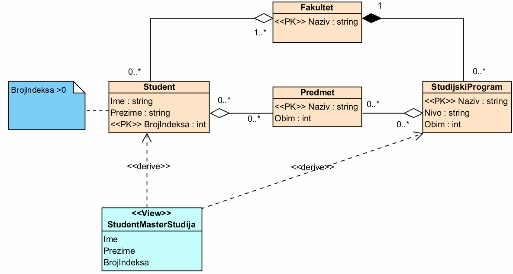

### 70. Kako se u dijagramima klasa oznacavaju uslovi integriteta?

Uslovi integriteta mogu da se navode u okviru klasa u odeljku ponasanja ili kao povezane "klase" ili komentari

## 71. Navesti i objasniti po jednom recenicom korake pri pravljenju konceptualnog modela BP.

Osnovni koraci pri projektovanju baza podataka su:
- **Analiza zahteva** podrazumeva razumevanje aplikacije i razumevanje podataka i to strukture podataka, obima podataka i odnosa medju podacima.
- **Konceptualno modeliranje podataka** podrazumeva klasifikaciju skupa podataka i prepoznavanje odnosa
- **Integrisanje pogleda (lokalnih shema)** pravi se opsta (gloalna) shema koja se dobija integrisanjem lokalnih shema (pogleda). Potrebno je uporediti sheme i prepoznati konflikte, preurediti sheme i resiti konflikte.
- **Grupisanje entiteta** Nakon integrisanja pogleda moze da se dobije velika shema. Cilj je grupisanja entiteta je grupisanje delova modela radi predstavljanja jendog velikog modela pomocu vise manjih dijagrama.

## 72. Objasniti korak *Analiza zahteva* pri pravljenju konceptualnog modela BP.

Analiza zahteva podrazumeva pre svega razumevanje podataka, i to strukture
podataka, obima podataka i odnosa medju podacima. Analiza zahteva
podrazumeva i razumevanje aplikacija, i to potrebe aplikacije za podacima,
ucestalost upita i transakcija i performanse.

## 73. Navesti i objasniti ciljeve koraka *Analiza zahteva* pri pravljenju konceptualnog modela BP.

Osnovni ciljevi:
- Prevodjenje funkcionalnih zahteva u kontekst trajnih podataka
- Razumevanje i opisivanje skupova potrebnih podataka i njihovih odnosa, strukture potrebnih podataka, svih transakcija koje se izvrsavaju nad podacima
- Definisanje svih nefunkcionalnih zahtea (integritet, preformanse, bezbednost)
- Odredjivanje i oblikovanje uslova implementacije (tehnologije, hardverske i softverske pretpostavke, aplikativni i korisnicki interfejs)
- Izrada iscrpne dokumentacije za svenavedeno

## 74. Objasniti ukratko korak *Konceptualno modeliranje podataka* pri pravljenju konceptualnog modela BP.

Cilj je klasifikovati skup podataka i prepoznati odnose. Neke smernice:
- Entiteti treba da sadrze opisne informacije
- Ako nesto ima visestruku vrednostili slozenu vrednost (a ne skalarnu) onda je verovatno entitet
- Atributi bi trebalo da pripadaju onim entitetima koje najneposrednije opusuju

## 75. Koje poslove obuhvata konceptualno modeliranje podataka?

Podrazumeva:
- Klasifikovanje skupova podataka (prepoznavanje entiteta/klasa i atributa)
- Prepoznavanje odnosa (generalizacija/specijalizacija i hijerarhije, asocijacije i slozeni odnosi)

## 76. Sta obuhvata klasifikacija skupa podataka?

Podrazumeva prepoznavanje entiteta/klasa i atributa.

## 77. Kako se ustanovljava da li bi nesto trebalo da bude atribut ili entitet?

Entiteti sadrze opisne informacije.
	- ako imamo opisne informacije o nekom podatku onda bi to trebalo da bude entitet
	- ako neki podatak ima samo indetifikator onda bi to trbalo da bude atribut

Ako nesto moze da ima vise vredosti ili slozenu vrednost onda je to entitet (to nekad ne mora da bude neophodno, ali je jednostavnije za analizu i razmatranje)

Atributi se dodeljuju onim entitetima koje najosrednije opijsuju (ponekad nije ocigledno, moze da se ustanovi iz funkcionalnih zahteva. Ponekad odgovarajuca zavisnost postoji samo u domenu, a ne i u podacima

## 78. Koji elementi odnosa moraju da se ustanove pri modeliranju odnosa?

Za svaki odnos je potrebno prepoznati:
- ucesnike (i red odnosa tj. broj ucesnika)
- kardinalnost (i opcionost / obaveznost)
- dodatne atribute koji opisuju odnos
- jasan naziv i semantiku uloge odnosa

## 79. Objasniti problem redudantnih odnosa. Kako se sprecavaju(uocavaju) redudantni odnosi?

Redudantni odnosi imaju za rezultat tesko otklonjivu redudantnost u modelu, ometaju normalizaciju.
Potrebno je eliminisati redudante odnose. Redudantnost odnosa zavisi od semantike

## 80. Kako se postupa sa odnosima sa vise od dva ucesnika?

Treba prvo pokusati da se odnosi modeliraju pomocu vise binarnih odnosa. Ako se ispostavi da je to nemoguce tek onda modelirati odnos viseg reda.

## 81. Objasniti razliku izmedju lokalnih i globalnih shema pri modeliranju BP. Zasto su obicno neophodni lokalni pogledi?

Konceptualno modeliranje se cesto odvija po delovima:
- odvojeno za razlicite aplikacije
- ili za delove aplikacija

Tako je jednostavnije i razumljivije. Ovaj nacin modeliranja direktno uslovljava koriscenje lokalnih pogleda.

Svaki pojedinacni model se naziva **pogledom** ili **lokalnom shemom**.

**Opsta(globalna) shema** se dobija integrisanjem lokalnih shema(pogleda).

Iako je nekada jednostavno, moze biti izuzetno slozeno stoga se **integrisanje pogleda** cesto opisuje kao poseban korak.

## 82. Objasniti ukratko korak Integrisanje pogleda pri pravljenju konceptualnog modela BP i navesti osnovne postupke.

Prvo modeliramo pojedinacno **lokalne sheme**, a potom ih integrisemo u jedinstvenu **globalnu shemu**.

Osnovni koraci integrisanja pogleda:
- Poredjenje shema i prepoznavanje konflikata
- Preuredjivanja shema i razresavanje konflikata
- Spajanje i restrukturiranje shema

## 83. Koji su osnovni problemi pri integrisanju pogleda?
TODO (Jedino boldovano pitanje od svih 90 pitanja, a ja ne znam ni sta hoce ovde da mu kazem vohoo)

## 84. Navesti i objasniti vrste konflikata koji mogu da nastanu pri integrisanju pogleda.
Vrste konflikata:
- **konflikti imena** mogu biti prouzrokovani neujednacenim imenovanjem entiteta i odnosa, koriscenjem sinonima (razliciti nazivi za iste koncepte), koriscenjem homonimima (isti naziv za razlicite koncepte).
- **strukturni konflikti** se desava kada upotrebljavamo razlicite strukturne elemente za modeliranje istih koncepata. Da bi pogledi mogli da se spoje, odgovarajuci koncepti moraju da imaju identicne strukture.
- **konflikti kljuceva** predstavljaju situacije kada su istom entitetu u razlicitim pogledima dodeljeni razliciti kljucevi. Neophodno je da se kljucevi ujednace.
- **konflikti zavisnosti**:
    (nasao na netu valjda je to to TODO: baciti pogled jel ima nesto bolje)
    Dva semanticki slicna atributa mogu biti ogranicena uslovima koji mogu biti nekonzistentni jedan sa drugim. Na primer atribut brGodina u jednom pogledu moze imati uslov brGodina<=18, a u drugom brGodina>21.

## 85. Objasniti detaljno konfikte imena pri integrisanju pogleda.
Konflikti imena prestavljaju neujednaceno imenovanje entiteta i odnosa. Da bi model bio validan recnici entiteta i odnosa moraju biti ujednaceni.

Dva atributa koji su konceptualno isti ali imaju razlicita imena nazivaju se **sinonimi**, ovo je prvi i najlakse resiv problem.

Dva atributa koji imaju isto ime ali se koriste za razlicite koncepte nazivaju se **homonimi**. Ovo moze biti veliki problem ako je razlicito tumacena specifikacija zahteva. Teze se resava nego slucaj sinonima i iz tog razloga ima prioritet pri resavanju.

## 86. Kako se razresavaju konflikti pri integrisanju pogleda?

Ukljucuje projektante svih konfliktnih pogleda. Potencijalno moze zahtevati dodatnu ili ponovljenu analizu zahteva, u nekim slucajevima moze da zahteva ozbiljno modifikovanje pogleda. Tehnike razresavanja konflikta su iste kao i za pravljenje konceptualnog modela.

## 87. Kojim principima se rukovodi pri spajanju i restrukturiranju lokalnih shema? Objasniti ih.
Ovaj korak nastupa nakon usaglasavanja konflikata.

Rukovodi se principima:
- potpunosti - svi koncepti iz lokalnih shema moraju u potpunosti ocuvani da se prenesu u globalnu shemu
- minimalnosti - svi redundantni koncepti ( i entiteti i odnosi) moraju da se uklone iz globalne sheme
- razumljivosti - globalna shema mora da bude razumljiva svim korisnicima

Nakon razresavanja konflikata najpre spajamo sve odgovarajuce koncepte i ostvarujemo **potpunost**. Zatim prepoznajemo redundantne koncepte i pokusavamo da ih razresimo uvodjenjem generalizacije i uklanjanjem redundantnih odnosa cime dolazimo do **minimalnosti**. Nakon toga po potrebi dodatno uredjujemo model da bi bio **razumljiviji**.

## 88. Sta je grupisanje entiteta pri pravljenju konceptualnog modela BP i navesti osnovne postupke? Zasto je vazno?

Nakon integrisanja pogleda, moze da se dobije velika shema, koja je slabo pregledna zbog velicine. Cilj grupisanja entiteta je grupisanje delova modela radi prestavljanja jednog velikog modela pomocu vise manjih dijagrama.

Tehnike grupisanja:
- Detalji predstavljanja entiteta se obrisu i entitet se zaokruzi dvostrukom linijom
- Grupa entiteta se zamenjuje simbolom grupe sa podebljanim okvirom

## 89. Navesti i objasniti principe grupisanje entiteta pri pravljenju konceptualnog modela BP.

Principi grupisanja:
- **Grupisanje prema dominantnosti** - Dominantni entitet ucestvuju u vecem broju odnosa i posredno povezuju vece delove dijagrama. Jedan dominantni entitet se grupise sa svim pripadajucim nedominantnim entitetima, slabi entiteti se pridruzuju jakom. Delovi dijagrama koji opisuju odnose viseg reda se grupisu. Ako postoji agregacija, delovi se pridruzuju celini.
- **Grupisanje prema apstraktnosti** - Vrsi se ako postoje hijerarhije. Hijerarhija se predstavlja jednim baznim entitetom. Ako postoje bitni specificni odnosi nekih elemenata hijerarhije, onda se cela hijerarhija deli na vise grupa.
- **Grupisanje prema uslovima** - Ako postoje neki slozeni uslovi koji moraju da vaze u nekim odnosima, odgovarajuci entiteti se gupisu. Cilj je sklanjanje slozenih uslova iz velikog dijagrama radi povecanja citljivosti. Ako ti slozeni uslovi imaju visok znacaj za celinu dijagrama, onda ovakvo grupisanje nije pozeljno.
- **Grupisanje prema odnosima** - Odnosi viseg reda i odgovarajuci entiteti mogu da se grupisu. Ovakva grupa predstavlja odnos kao jednu celinu.

Primenjuju se iterativno i/ili rekurzivno.

## 90. Objasniti postupak grupisanja entiteta pri pravljenju konceptualnog modela BP.

1. Prvo treba prepoznati elemente koji se grupisu u okviru funkcionalnih oblasti. Funkcionalne oblasti su poslovne jedinice ili grupe podataka koje se najcesce koriste zajedno.
2. Potom grupisemo entitete. Svaka grupa mora da u potpunosti pripada jednoj funkcionalnoj oblasti a ako postoje konflikti izmedju vise alternativnih grupisanja ne treba praviti takve grupe.
3. Napraviti grupe viseg reda rekurzivnom primenom postupka.
4. Proveriti ispravnost dijagrama - svi interfejsi izmedju entiteta/objekata i drugih delova/nivoa dijagrama moraju biti konzistentni.

## 91. Šta je logički model baze podataka?
Logički model uzima u obzir dodatne nefunkcionalne zahteve koji su u fazi konceptualnog projektovanja možda mogli da ostanu zanemareni.

Vodi se računa o:
* Fleksibilnosti
* Proširivosti

Logički model tačno određuje koji se podaci čuvaju i kako se njima rukuje.

## 92. U čemu je osnovna razlika između konceptualnog i logičkog modelirana?
Konceptualni model je fokusiran na semantiku i odnose a logički silazi bliže izabranom implementacionom modelu.

Apstraktni koncepti konceptualnog modela se prevode u konkretne logičke modele:

  * Npr. hijerarhije klasa se zamenjuju odgovarajućim skupovima relacija

## 93. Šta je očekivani rezultat logičkog modeliranja?
Ulaz:
  * Konceptualni model
Izlaz:
  * Detaljan (npr. relacioni) model

    * Logička shema trajnih objekata - relacija
    * Specifikacija svih uslova i ograničenja - constraints
    * Poznati su svi ključevi i odgovarajući surogat-atributi
    * Poznaz je način implementacije svih odnosa

## 94. Zašto nije dobro preskočti logički model i praviti fizički model na osnovu konceptualnog?
Mogu se izgubiti neke poželjne karakteristike baze podataka:
  * kompletnost
  * integritet
  * fleksibilnost
  * efikasnost
  * upotrebljivost

pri čemu se najpre gube kompletnost i integritet.

Dobar konceptualni model je važan za dostizanje ovih karakteristika ali nije dovoljan.

## 95. Kako teče postupak pravljenja logičkog modela?
Pravi se iterativno:
* Prva iteracija se pravi na osnovu konceptualnog modela
* Svaka naredna se pravi menjanjem (flexing) prethodne

## 96. Na osnovu kojih kriterijuma se pristupa menjaju logičkog modela?
Kriterijumi za menjanje su željene karakteristike:
* Da li model ispunjava funkcionalne zahteve?
* Da li model ispunjava nefunkcionalne zahteve?
* Da li je model kompletan?
* Da li model garantuje integritet podataka?
* Da li model pruža potrebnu fleksibilnost?
* Da li model omogućava efikasan rad?
* Da li je model upotrebljiv?

## 97. Kako se konceptualni model prevodi u logički?
Oba modela mogu da se predstave na ER-u ili UML-u, pa se prevođenje često svodi na *transformisanje* ili *dopunjavanje i nadograđivanje*

1. Entiteti postaju relacije
2. Prosti atributi postaju atributi relacija
3. Složeni atributi se prevode u relacije sa stranim ključem prema roditelju
4. Odnosi 1-\* i 1-1 moraju da se povežu parovima stranih i primarnih ključeva
5. Odnosi \*-\* se prevode u vezne relacije koje imaju dva odnosa 1-\* prema polaznim relacijama
6. Odnosi sa više od 2 učesnika se prevode u vezne relacije koje imaju odgovarajuče odnose prema svim polaznim relacijama
7. Hijerarhija na ranije opisan način (cela u jednu relaciju, svaki entitet u posebnu, svaki entitet-list u posebnu..)
8. Na kraju obavezno prečistiti shemu - normalizacija.

## 98. Kakva je izražajnost logičkog modela u odnosu na konceptualni? Šta može da se vidi u konceptualnom ali obično ne može u logičkom?

Ne znam, dopuniću kasnije :c

Možda nešto oko semantike ili odnosa

## 99. Kako se u logičkom modelu modeliraju odnosi 0..1 - 0..\*, 1 - 0..\*, 0..1 - 1, 0..1 - 0..1?
* 0..1 - 0..\*: odnos celina - deo, ako celina **može** da bude bez delova i ako deo **može** da bude bez celine. ***Relacija koja je deo dobija strani ključ prema relaciji koja je celina i strani ključ može biti nedefinisan***

  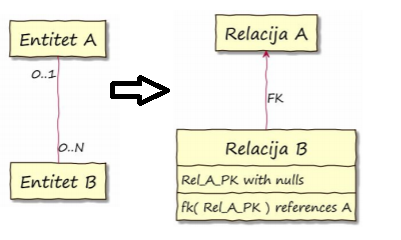

* 1 - 0..\*: odnos celina - deo, ako celina **može** da bude bez delova a deo **ne može** da bude bez celine. ***Relacija koja je deo dobija strani ključ prema relaciji koja je celina i on ne sme biti nedefinisan***

  

* 0..1 - 1: odnosi celina - opcioni deo. ***Relacija koja je opcioni deo dobija strani ključ prema relaciji koja je celina, ne sme da bude nedefinisan i vrednost mora biti jedinstvena***

  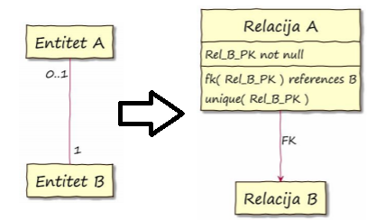

* 0..1 - 0..1: dvosmerni opcioni odnosi. ***Pravi se nova vezna relacija koja sadrži strane ključeve prema obe vezane relacije, oni ne smeju biti nedefinisani, njihove vrednosti moraju biti jedinstvene i zajedno čine primarni ključ***

  

## 100. Kako se u logičkom modelu modeliraju odnosi 0..1 - 1..\*, 1 - 1..\*, 1-1?
* 0..1 - 1..\*: odnosi agregacije sa obaveznim delovima. ***Relacija koja je deo dobija strani ključ prema celini. Može da bude nedefinisan, dodaje se uslov bazi da za svaki A mora postojati bar jedan B***

  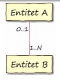 -> 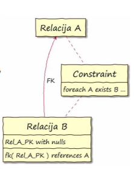

* 1 - 1..\*: odnosi kompozicije sa obaveznim delovima. ***Relacija koja je deo dobija strani ključ prema celini. On ne sme biti nedefinisan, dodaje se uslov bazi da za svaki A mora postojati bar jedan B***

  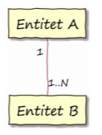 -> 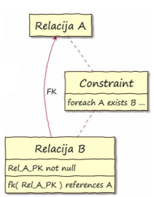

* 1-1: odnosi obostranog ekskluzivnog pridruživanja. ***Jednoj od relacija se dodaje strani ključ prema drugoj, ne sme biti nedefinisan, vrednost mora biti jedinstvena i dodaje se uslov bazi da za svaki B mora postojati bar jedan A*** ILI ***U svakoj od relacija se dodaje strani ključ prema drugoj, ne smeju biti nedefinisani, dodaje se uslov za proveru uzajamnosti veze***

  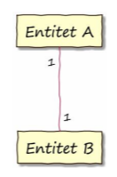 -> 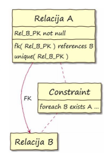 ILI 

## 101. Kako se u logičkom modelu modeliraju odnosi 0..\* - 0..\*, 0..\* - 1..\*, 1..\* - 1..\*?
* 0..\* - 0..\*: odnosi asocijacije bez posebnih ograničenja. ***Pravi se vezna relacija, sadrži samo strane ključeve prema obe vezane relacije, ne smeju biti nedefinisani, zajedno čine primarni ključ***

  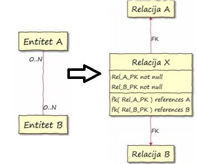

* 0..\* - 1..\*: odnosi slabih i jakih entiteta. ***Pravi se vezna relacija, sadrži samo strane ključeve prema obe vezane relacije, ne smeju biti nedefinisani, zajedno čine primarni ključ i dodaje se uslov bazi da za svaki A mora postojati bar jedan B***

  

* 1..\* - 1..\*: odnosi gde celina ne može da postoji bez delova i deo ne može bez celine. ***Pravi se vezna relacija, sadrži samo strane ključeve prema obe vezane relacije, ne smeju biti nedefinisani, zajedno čine primarni ključ i dodaje se uslov bazi da za svaki A mora postojati bar jedan B i obrnuto***

  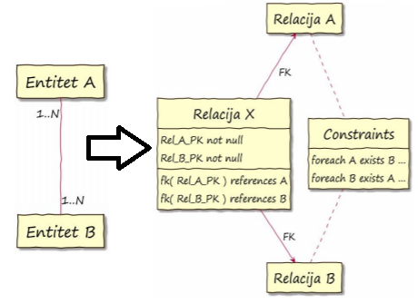

## 102. Kako se u logičkom modelu modeliraju binarni ciklični odnosi?

* 1 - 1: Predstavljaju se dodatnim atributima stranog ključa. Ako je odnost opcioni, sme da bude NULL

  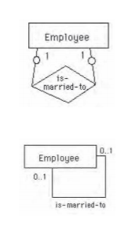

* 1 - \*: Strani ključ se uvodi na strani \*.

  

* \* - \*: Predstavlja se novom relacijom. Kao i obični \* - \* odnosi.

  

## 103. Kako se u logičkom modelu modeliraju odnosi sa više učesnika?
* 1 - 1 - 1: Nova relacija sa stranim ključevima. Zavisnosti se uređuju dopuštanjem NULL i jedinstvenim ključevima.

  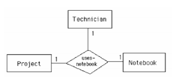

* 1 - 1 - \*: Nova relacija sa stranim ključevima. Zavisnosti se uređuju dopuštanjem NULL i jedinstvenim ključevima.

  

* 1 - \* - \*: Nova relacija sa stranim ključevima. Zavisnosti se uređuju izborom primarnog ključa.

  

* \* - \* - \*: Nova relacija sa stranim ključevima. Svi zajedno čine primarni ključ te relacije.

  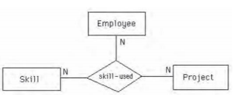

## 104. Na koje se sve načine u logičkom modelu može predstaviti hijerarhijski odnos (generalizacija, specijalizacija, ...)? ##

### Generalizacija ###

Hijerarhijski odnos se u logičkom modelu može predstaviti na više načina:

- Cela hijerarhija u jednu relaciju
- Svaki entitet u posebnu relaciju, tj. kao da se radi o "običnom" odnosu entiteta
- Svaki entitet-list u posebnu relaciju, ali tako da uključi sve nasleđene atribute

Primer - Osoba može da bude službenik ili mušterija

## 105. Šta je fizički model baze podataka? ##

- Fizički model baze podataka je najniži model
- Opisuje konkretnu implementaciju
- Uzima u obzir mnoge aspekte implementacije
	- U drugom planu su aspekti važni za konceptualni i logički model
	- Potrebna su drugačija znanja i veštine - više tehnička nego poslovna
- Često se naziva i "modeliranje podataka" (*data modeling*)

## 106. Šta čini fizički model baze podataka? ##

Elementi fizičkog modela:

-  Strukture podataka
	- Uobičajeno je da se na fizičkom nivou govori o tabelama i kolonama, a ne relacijama i atributima
- Interna (fizička) organizacija podataka
	- Prostori za tabele, kontejneri, stranice, baferi, ...
- Pomoćne komponente
	- Indeksi

## 107. Kako se procenjuje opterećenje baze podataka? Koji podaci su potrebni? ##

Da bismo mogli da procenimo opterećenje i preformanse, moramo da imamo:

- Model obrade podataka (process model)
- Nestrukturne zahteve
- Matricu entiteta i procesa (PČMB)
- Zahtevane performanse
- Prepoznate ciljne implementacije SUBP
- Prepoznata eventualna ograničenja prostora
- Prepoznati eventualni razvojni problemi

## 108. Šta obuhvata model obrade podataka, koji se koristi radi procene opterećenja pri pravljenju fizičkog modela? ##

- Okolnosti dodavanja novih redova
	- Koliko redova u proseku (npr. dnevno)
	- Koliko redova pri najvećem opterećenju (npr. u sekundi)
	- Da li su primarni ključevi slični i da li zavise od vremena
- Okolnosti ažuriranja postojećih redova
	- Koliko redova u proseku (npr. dnevno)
	- Koliko redova pri najvećem opterećenju (npr. u sekundi)
	- Kolika je verovatnoća da se redovi sa sličnim primarnim ključem istovremeno koriste (zbog zaključavanja)
- Okolnosti brisanja redova
	- Koliko redova u proseku (npr. dnevno)
	- Koliko redova pri najvećem opterećenju (npr. u sekundi)
	- Da li se brišu pojedinačno ili u grupama
- Okolnosti čitanja redova
	- Učestalost čitanja
	- Koliko redova se čita jednim upitom
	- Koje kolone se koriste za odabir redova
	- Koje druge tabele se često koriste zajedno sa posmatranom

## 109. Koji nestrukturni zahtevi se razmatraju pri pravljenju fizičkog modela baze podataka? ##

- Trajanje podataka
	- Koliko se dugo podaci zadržavaju u tabeli pre brisanja ili arhiviranja
- Obim podataka
	- Koliko će redova biti u tabeli prilikom puštanja u rad i koliko će se broj redova menjati tokom vremana
- Raspoloživost podataka
	- Da li su podaci potrebni stalno ili povremeno, koliko često i dugo podaci mogu da budu nedostupni korisnicima
- Ažurnost podataka
	- Koliko ažurni moraju da budu podaci koji se koriste
	- Da li mogu da se razvoje kopije za menjanje i čitanje
- Bezbedonosni zahtevi

## 110. Koji su osnovni metodi optimizacije baze podataka? Objasniti ukratko. ##

- Optimizacija na nivou interne organizacije podataka
	- Ne utiče se na logički model podataka, ne menja se skup tabela i kolona
	- Ostvaruje se kroz upravljanje internom organizacijom podataka, pomoćnim komponentama i resursima:
		- Fizička organizacija podataka (prostori za tabele, stranice, baferi stranica)
		- Upravljanje resursima (pre svega upravljanje memorijom)
		- Pomoćne komponente (indeksi)
- Optimizacija na nivou upita
	- Vrši se optimizacija upita na način koji omogućava njihovo efikasnije izvršavanje
	- Ne menja se logički model
- Optimizacija na nivou strukture podataka
	- Fizička struktura podataka se menja u odnosu na logički model

## 111. Koji su osnovni elementi fizičke organizacije podataka (na primeru SUBP DB2)? ##

- Logička organizacija kao osnovno mesto čuvanja podataka vidi relaciju, tj. tabelu
- Fizička organizacija ide i dalje od toga
- Ozbiljni sistemi omogućavaju veoma precizno upravljanje elementima fizičke organizacije podataka
- Osnovni elementi fizičke organizacije:
	- Prostori za tabele
	- Stranice
	- Baferi stranica
- Drugi važni koncepti fizičke organizacije:
	- Particionisane tabele
	- Kompresija podataka
	- Katanci
	- Različiti drugi koncepti, često specifični za implementacije

## 112. Šta je prostor za tabele? Čemu služi? ##

- Osnovni skladišni prostor se obično naziva prostor za tabele (table space)
- Jedan prostor za tabele može da sadrži više tabela
- U nekim sistemima jedna tabela može da bude i u više prostora za tabele
- Na nivou prostora za tabele definišu se:
	- Veličina fizičke stranice
	- Način i uslovi baferisanja stranica
	- Fizički uređaji (diskovi, particije, direktorijumi, fajlovi) koji čine taj prostor za tabele (tzv. kontejneri)

## 113. Šta je stranica baze podataka? Čemu služi? ##

- Stranica je osnovni element fizičkog zapisa tabele
- Svaka tabela, kao i svaki indeks, sastoji se od stranica
- Veličina stranice je određena prostorom za tabele
- Ako su stranice velike
	- mogu da sadrže više redova
	- manje se traži po disku
	- manja je dubina indeksa
	- redovi tabele mogu da budu veći (obično jedan red mora da stane u stranicu)
- Ako su stranice male
	- veća je iskorišćenost prostora na disku
	- manje je nepotrebnog čitanja sa diska

## 114. Šta je bafer za stranice? Čemu služi? ##

- Bafer za stranice je memorijski prostor (*buffer pool*) predviđen za čuvanje kopije dela stranica jednog prostora za tabele, radi omogućavanja bržeg pristupa podacima
- Što je bafer stranice veći, to je broj pristupa disku manji
	- U idealnom slučaju cela baza podataka je u memoriji
	- Ako to nije moguće, teži se da bar indeksi budu u memoriji (ili bar prvih nekoliko nivoa indeksa) i manje tabele (šifarnici)
- Zato što nije potrebno sve delove baze podataka jednako baferisati, tabele i indeksi se dele u više prostora za tabele, čak i kada fizički cela baza staje na jedan fizički disk
- Dobro konfigurisanje prostora za tabele i bafera stranica može da bude od presudnog uticaja na performanse

## 115. Šta su katanci? Kako se i kada koriste? Šta je eskalacija katanaca? ##

- Mehanizam katanaca je uobičajen način ostvarivanja izolovanosti transakcija
- Svaki katanac ima:
	- objekat koji se zaključava
	- trajanje
	- vrstu katanca
- Objekat može biti
	- vrednost (atribut)
	- red tabele
	- stranica tabele
	- cela tabela
	- prostor za tabele
	- indeks
- Veličina katanca
	- Katanac može da zaključava jedan red ili više redova, jednu stranicu ili više stranica
- Veliki broj katanaca može značajno da uspori rad
	- Zato je broj katanaca ograničen (bilo brojem bilo količinom memorije koja je rezervisana za katance)
- Kada se prevaziđe dopušten broj katanaca, dolazi do **eskalacije katanaca**
	- Više manjih katanaca se zamenjuje jednim većim
	- Npr. više katanaca na redovima se zamenjuje samo jednim katancem na stranici
	- Ili, više katanaca na stranicama se zamenjuje jednim katancem na tabeli

## 116. Šta su indeksi? Kada se i kako koriste? ##

- Indeksi su pomoćne strukture podataka koje omogućavaju brže pristupanje podacima, tj. brže pretraživanje po unapred izabranom ključu
- Svaka tabela može da ima više indeksa sa različitim ključevima
- Definicija indeksa obuhvata:
	- kolone koje čine uslov uređivanja, tj. ključ pristupanja
	- da li je jedinstven ili nije
	- da li je uređujući (grupišući) ili ne
	- vrstu (strukturu indeksa)

## 117. Navesti poznate vrste indeksa i ukratko objasniti?
- *Jedinstveni* - Ne dozvoljavanju ponavljanje istog ključa.
- *Grupišući (klasterovani)* - Podrazumevaju da su redovi u tabeli poredjani u nekom poretku (stoga može postojati samo jedan takav po tabeli).
- *Indeksi sa strukturom B-stabla* - Podaci se čuvaju u balansiranom stablu.
- *Bit-mapirani* - Indeks je organizovan kao niz vrednosti ključa. Uz svaku vrednost ključa sledi niz bitova, po jedan za svaki red tabele.
- *Heš indeksi* - Heš tabela gde se  vrednosti heš funkcije računaju na osnovu ključnih atributa.

## 118. Šta su grupišući indeksi? Implementacija? Karakteristike? Prednosti i slabosti u osnovu na ne-grupišuće indekse?
Podrazumevaju da su redovi u tabeli poredjani u nekom poretku (stoga može postojati samo jedan takav po tabeli).

Značajno ubrzavaju izdvajanje podsekvence redova u datom poretku.

Prednosti:
- višestruko ubrzano čitanje nizova redova po uslovu

Slabosti:
- usporeno održavanje
- ne ubrzava pristup pojedinačnim redovima

## 119. Šta su indeksi sa strukturom B-stabla? Implementacija? Karakteristike? Prednosti i slabosti?
Podaci se čuvaju u balansiranom stablu.
- svaki podatak je sadržan u listu jednake dubine
- čvorovi i listovi sadrže po više podataka
- veličina čvorova odgovara stranici diska

Danas podrazumevani indeksi, ako se ne navede drugačije.

Prednosti:
- jednostavni i efikasni algoritmi za održavanje

Slabosti:
- ne radi dobro ako je mnogo redova a malo različitih vrednosti ključa (tj. ako ima puno ponavljanja ključa)

## 120. Šta su bit-mapirani indeksi? Implementacija? Karakteristike? Prednosti i slabosti?
Indeks se sastoji od niza vrednosti ključa. Iza svake vrednosti ključa se nalazi niz bitova, za svaki red tabele po jedan. Odgovarajući bit je jedan ako taj red ima baš tu vrednost ključa.

Prednosti:
- ako ima malo različitih vrednosti ključa, onda je ova struktura efikasnija od B-stabla

Slabosti:
- u slučajevima sa puno različitih vrednosti ključa indeks postaje veliki a samim tim i manje efikasan

## 121. Šta su heš-indeksi? Implementacija? Karakteristike? Prednosti i slabosti?
Alternativa klasičnim indeksima. Računaju se heš vrednosti na osnovu ključnih atributa a onda se pomoću dobijene vrednosti neposredno pristupa podacima.

Alternativa je da se indeksira po heš-vrednostima.

Prednosti:
- efikasni za pristupanje pojedinačnim redovima sa tačno zadatim ključem

Slabosti:
- nisu dobri za pristum većem broju redova, ili kad operator poredjenja nije jednakost

## 122. Kada pravimo indekse, zašto i koliko ih pravimo? Da li uvek moramo da imamo indekse?
Prednosti:
- omogućavaju brži pristup konkretnim redovima tabele
- ako čitanje zahteva samo kolone sadržane u indeksu, onda tabeli ne mora ni da se pristupa

Slabosti:
- moraju da se održavaju (npr. posle svake INSERT, UPDATE, DELETE) akcije
- zauzimaju prostor
- mogu da povećaju granularnost ili broj zaključavanja katanaca

Da li neki indeks više koristi ili šteti zavisi od:
- da li se indeks uopšte koristi u upitima
- koliko upotreba indeksa doprinosi preformansama upita u kojima se koristi
- koliko su česti upiti gde se taj indeks koristi

Idealan broj i brsta indeksa zavisi od vrste, namene i strukture tabele i baze podataka, kao i od načina upotrebe. Obično se preporučuje 3-5 indeksa za transakcione tabele dok za analitičke nema ograničenja.

## 123. Šta je prečišćavanje sheme? Kako se odvija?
- Analiziranje logičkog modela
- Doslovna primena pravila integriteta
- Osnovno sredstvo primene su funkcionalne zavisnosti

## 124. Objasniti probleme koji nastaju usled redundantnih podataka.
- Redundantno čuvanje podataka - neki podaci se ponovljeno čuvaju
- Anomalije ažuriranja - ako se ažurira jedna kopija ponovljenog podatka, onda se moraju ažurirati sve kopije kako bi baza bila u konzistentnom stanju
- Anomalije dodavanja - zapisivanje podataka može biti nemoguće ako se ne zapišu i još neki podaci
- Anomalije brisanje - brisanje nekih podataka može biti nemoguće bez brisanja nekih drugih podataka

## 125. Uloga nedefinisanih vrednosti u rešavanju problema redundantnosti.
Nedefinisane vrednosti mogu da pomognu u rešavanju anomalija dodavanja i brisanja.

Ako moramo da dodamo podatak a ne znamo dodatne potrebne podatke, možemo da stavimo nedefinisane vrednosti.

Ako hoćemo da obrišemo neke podatke a da ne brišemo cele redove, možemo da navedemo nedefinisane vrednosti.

## 126. Objasniti postupak dekompozicije kao alat za rešavanje problema redundantnosti.
Redundantnost se pojavljuje na mestima na kojima ne postoje prirodne veze izmedju atributa.

Uobičajeno sredstvo za rešavanje rešavanje problema redundantnosti je dekompozicija.

Dekompozicija je zamenjivanje jedne relacije dvema ili više relacija sa po manje atributa tako da zajedno sadrže sve atribute polazne relacije.

Dekompozicija je potpuna ako se na osnovu dobijenih relacija može dobiti polazna.

Dekompozicija čuva funkcionalne zavisnosti ako se iz dobijenih relacija mogu rekonstruisati sve funkcionalne zavisnosti polazne relacije.

## 127. Objasniti funkcionalne zavisnosti?
Neka je R relacija a X i Y neprazni skupovi atributa te relacije.

Kažemo da skup torki r relacije R zadovoljava funkcionalnu zavisnost X → Y ako za svaki par torki t1 i t2 važi: 
``t1.X = t2.X  i  t1.Y = t2.Y``
(uopštenje koncepta ključa)

Armstrongove aksiome:
- *refleksivnost* : ``X ⊇ Y ⇒ X → Y``
- *proširivost* : ``X → Y ⇒ (∀Z) XZ → YZ ``
- *tranzitivnost* : ``X → Y ⋀ Y → Z ⇒ X → Z``

Izvedena pravila:
- *unija* : ``X → Y ⋀ X → Z ⇒ X → YZ``
- *dekompozicija* : ``X → YZ ⇒ X → Y ⇒ X → Z``

## 128. Šta su normalne forme? Objasniti suštinu i navesti najvažnije normalne forme.
Normalne forme su specifični oblici relacija koji zadovoljavaju odredjena pravila u vezi funkcionalnih zavisnosti i koji garantuju da neće biti redundantnosti odredjenog tipa.

Najbitnije normalne forme (svaka sledeća zahteva prethodnu):
- *prva* - svaki atribut ima samo atomične vrednosti
- *druga* - ne postoje parcijalne zavisnosti neključnog atributa od ključa
- *treća* - ne postoje tranzitivne zavisnosti neključnog atributa od ključa
- *BCNF* - ne postoje tranzitivne zavisnosti ključnog atributa od ključa

## 129. Šta je normalizacija? Kada se primenjuje? Zašto? Kako?
Normalizacija predstavlja svodjenje relacije na skup relacija koje su u odredjenoj normalnoj formi.

Efektivan algoritam:
- Neka je R relacija koja nije u BCNF (npr.) i neka je X pravi podskup njenih atributa i A jedan atribut koji zavisi od X i tako narušava BCNF. Dekompozicijom delimo relaciju R na relacije R\\A i XA
- Ako dobijene relacije nisu u BCNF, rekurzivno primeniti algoritam

U nekim slučajevima ne postoji dekompozicija u BCNF koja čuva zavisnosti.

## 130. Šta su distribuirane baze podataka i distribuirani SUBP?

DBP - Distribuirana baza podataka je skup više logički međuzavisnih baza podataka koje su distribuirane na računarskoj mreži

DSUBP - Distribuirani sistem za upravljanje bazama podataka (DDBMS – distributed DBMS) je softverski sistem koji omogućava upravljanje DBP tako da je distribuiranost transparentna za korisnika

## 131. Šta su osnovni doprinosi DSUBP?

Transparentno upravljanje distribuiranim i
repliciranim podacima

Pouzdanost distribuiranih transakcija

Unapređenje performansi

Lakše proširivanje sistema

## 133. Objasniti šta znači transparentno upravljanje distribuiranim i repliciranim podacima?

Transparentnost podrazumeva razdvajanje semantike visokog nivoa od problema koji nastaju pri implementaciji na niskom nivou.
Nezavisno od toga gde se i na koji nacin cuvaju podaci, njima se mora pristupati na isti univerzalan nacin.

## 134. Objasniti šta znači transparentno upravljanje distribuiranim i repliciranim podacima?

(isto)

## 135. Koji su aspekti transparentnosti upravljanja distribuiranim i repliciranim podacima?

Nezavisnost podataka
Mrežna transparentnost
Transparentnost replikacije
Transparentnost fragmentacije

## 136. Objasniti nezavisnost podataka u kontekstu transparentnosti upravljanja distribuiranim i repliciranim podacima.

Logicka i fizicka nezavisnost podataka

logicka:
    Otpornost aplikacije na promene logicke strukture podataka
    Aplikacija dobro podnosi dodavanje novih elemenata strukturi BP

fizicka:
    Potpuno skrivanje fizicke strukture podataka
    Za upite i korisnika nije bitno gde se nalaze podaci i na koji nacin su zapisani

## 137. Objasniti mrežnu transparentnost u kontekstu transparentnosti upravljanja distribuiranim i repliciranim podacima.

Korisniku nije potrebno da zna kako se upravlja podacima (centralizovani sistem)
Korisniku nije bitno da zna GDE SU PODACI (distribuiran sistem)

U distribuiranim sistemima mrezna struktura treba da bude sklonjena od ociju korisnika i transparentno upravljiva

Baziva se i distributivna transprarentnost

## 138. Objasniti transparentnost replikacije u kontekstu transparentnosti upravljanja distribuiranim i repliciranim podacima.

Replikacija je cuvanje istih podataka na vise lokacija
Radi se zbog performansi, raspolozivosti i pouzdanosti
Korisnik ne mora da zna nista o tome (pristup na isti nacin)

## 139. Objasniti transparentnost fragmentacije u kontekstu transparentnosti upravljanja distribuiranim i repliciranim podacima.

Fragmentacija je cuvanje razlicitih delova iste kolekcije na vise lokacija
Radi se zbog performansi, raspolozivosti i pouzdanosti
Korisnik ne mora da zna nista o tome (pristup na isti nacin)

## 140. Šta i kako može biti nosilac transparentnosti upravljanja distribuiranim i repliciranim podacima?

Upitni jezik:
Svaki put se automatski prevodi na odredjen nacin, u zavisnosti od stvarne organizacije i distribuiranosti podataka

OS:
Moze da prepoznaje i povezuje razlicite module bez obzira na njihovu fizicku lokaciju

DSUBP:
Na nivou SUBP-a (uobicajen pristup)

# 141. U čemu se ogleda unapređenje performansi usled distribuiranja?

Fragmentisanje:
Ravnomerno rasporedjeno opterecenje na vise servera sa razlicitim lokacijama.
Kraci prenos podataka

Globalni upiti se paralelizuju:
Globalni upiti se dele na manje koji se odnose na lokalne podatke

## 142. Koji su osnovni otežavajući faktori pri implementaciji DBP? Objasniti.

Slozenost:
Sistem mora da resi sve probleme kao i centralni, ali i mnoge druge (recenica sa slajdova)

Cena:
Dodatni hardver (komunikacioni)
Skuplji je softver
Odrzavanje na vise lokacija

Distribuirana kontrola:
Otezani su sinhronizacija i koordinacija komponenti

Bezbednost:
Dodatni aspekt bezbednosti racunarskih mreza

## 143. Navesti najvažnije probleme i teme istraživanja u oblasti DSUBP.

- Projektovanje distribuiranih baza podataka
- Distribuirano izvršavanje upita
- Distribuirano upravljanje metapodacima
- Distribuirana kontrola konkurentnosti
- Distribuirano upravljanje mrtvim petljama
- Pouzdanost distribuiranih SUBP
- Podrška u operativnim sistemima
- Heterogene baze podataka

## 144. Šta su heterogene baze podataka ?

Heterogene baze podataka su DBP koje nastaju spajanjem više postojećih rešenja.
Tada je obično narušena:
  - **homogenost softvera** - jer različite baze rade pod različitim SUBP
  - **homogenost strukture** - jer struktura različitih baza podataka nije usaglašena

I potrebno je rešiti sledeće probleme:
  - **distribuirano izvršavanje upita**
  - **upravljanje metapodacima**
  - **upravljanje konkurentnošću**

## 145. Navesti i ukratko objasniti najvažnije ciljeve pri pravljenju distribuiranih sistema?

- **Konzistentnost** - podrazumeva da sistem funkcioniše kao celina ili ne funkcioniše uopšte.
- **Raspoloživost** - predstavlja odziv sistema u nekim garantovanim granicama.
- **Prihvatanje razdvojenosti** - podrazumeva da sistem prihvata delimične otkaze komunikacije i nastavlja sa radom.

## 146. Objasniti ***konzistentnost*** kao jedan od osnovnih ciljeva pri pravljenju distribuiranih sistema.

Konzistentan sistem funkcioniše kao celina ili ne funkcioniše uopšte. Takodje sva čitanja, na svim čvorovima, moraju da daju isti rezultat. Rezultat operacije(čitanja) nikada ne zavisi od čvora na kome se izvršava.

## 147. Objasniti ***raspoloživost*** kao jedan od osnovnih ciljeva pri pravljenju distribuiranih sistema.

Raspoloživost se definiše kao odziv sistema u nekim garantovanim granicama. Sistem obično nije raspoloživ onda kad je potreban. U vreme kad je raspoloživost najpotrebnija, onda je i najteže ostvariva, zato što je tada sistem najviše opterećen. Ako je sistem raspoloživ kada nije potreban, to nema značaja.

## 148. Objasniti ***prihvatanje razdvojenosti*** kao jedan od osnovnih ciljeva pri pravljenju distribuiranih sistema.

Prihvatanje razdvojenosti podrazumeva da sistem mora da prihvata delimične otkaze komunikacije i da nastavi sa ispravnim radom. Povremeni prekidi komunikacije među čvorovima su neizbežni.

## 149. Navesti teoremu ***CAP*** i ukratko je objasniti.

***Nije moguće definisati sistem koji zadovoljava sve CAP uslove(konzistentnost, raspoloživost i prihvatanje razdvojenosti).***

Moguće je definisati sistem koji zadovoljava dva od ova tri uslova.

## 150. Koji vidovi kompromisa se prave radi prevazilaženja ograničenja koja proističu iz teoreme ***CAP***?

- Odbacivanje prihvatanja razdvojenosti
- Odbacivanje raspoloživosti
- Odbacivanje konzistentnosti
- Ublažavanje uslova
- Zasnivanje sistema na drugačijem skupu uslova
- Projektovanje zaobilaznih puteva

## 151. Objasniti ***odbacivanje prihvatanja razdvojenosti*** kao posledicu teoreme ***CAP***.

Ovo znači da prihvatamo da sistem ne radi u slučaju razdvojenosti.
Prevazilaženje ovog problema je da sve bude na jednoj mašini ili da se višestrukim umrežavanjem razdvojenost svede na minimum.
Mana - oba načina su skupa.

## 152. Objasniti ***odbacivanje raspoloživosti*** kao posledicu teoreme ***CAP***.

Ovo znači da se u slučaju razdvojenosti ne garantuje vreme odziva.
Ovaj problem se smanjuje uspostavljanjem niže sprege među čvorovima.

## 153. Objasniti ***odbacivanje konzistentnosti*** kao posledicu teoreme ***CAP***.

Ovo znači da dopuštamo da isti upit daje različite rezultate na različitim čvorovima.

## 154. Na čemu počivaju alternativni skupovi uslova za projektovanje distribuiranih sistema, koji se uvode radi prevazilaženja posledica teoreme ***CAP***.

Pojmovi iz teoreme počivaju na uobičajenim konceptima rada sa bazom podataka, tj. postoji zavisnost sa osobinama transakcija - ACID. Stoga se definiše drugačiji skup uslova, manje oštar - BASE.

## 155. Navesti i objasniti izmenjen skup uslova integriteta baze podataka - ***BASE***.

- _**B**asically **A**vailable_ - ako sistem nije u potpunosti raspoloživ, čvor može da pokuša da pruži manje pouzdan ili delimičan odgovor, uz odgovarajuću informaciju o tome.
- _**S**oft-state_ - sadržaj čvorova se menja i van odvijanja transakcija, u cilju postizanja konzistentnosti.
- _**E**ventually consistent_ - konzistentnost se ostvaruje, ali ne obavezno u okviru iste transakcije.

## 156. Objasniti specificnosti projektovanja baze podataka u odnosu na uslove BASE.
У основи се своди на две нове активности:
- *Funkcionalna dekompozicija podataka u fragmente* -
 Skup podataka se deli na fragmente.
Fragmenti predstavljaju najmanje moguce funkcionalne celine.
Unutar njih moraju da vaze ACID uslovi, a medju njima je dovoljno da vaze BASE uslovi.

- *Implementacija transakcija u BASE uslovima* - Ne menjaju se operacije nego vreme izvrsavanja i implementacija.
 Podela transakcija na sinhroni i asihroni deo. Svaka transakcija se locira u jednom maticnom fragmentu.
 Promene podataka u maticnom fragmentu - sinhrona implementacija
 Promene podataka u drugim fragmentima se u okviru transakcije samo evidentiraju - evidencija ispunjava ACID uslove.
 Evidentirane potrebne izmene se u drugim fragmentima sprovode asinhrono.
- Odredjivanje uslova replikacije -
 Pretpostavlja se da medju replikama vaze BASE uslovi. Sinhronizacija replika
 se odvija asinhrono, van transakcija.

Postoje i drugi pristupi, ali je ovaj medju jednostavnijim i najzastupljeniji

## 157. Objasniti pojam "konflikata" pri projektovanju baze podataka na osnovu uslova BASE i nacine njihovog razresavanja.
- Osnovni oblik - kod svih BASE implementacija.
Ako se dve replike istog podataka nezavisno menjaju, pitanje je koja verzija je "ispravna" i kako uspesno izvesti uskladjivanje.
- Slozeniji oblik - redundantan podatak, a ne replika.
Vise nacina razresavanja:
- Zabrana menjaja podataka u slucaju particionisanja - umanjena raspolozivost
- Definisanje hijerarhija medju redundantnim kopijama konkretnih vrsta podataka - definisanje primarnih i sekundarnih fragmenata za sve podatke.
Na primarnim se izvode transakcije, a na sekundarne se propagiraju odlozene izmene. Ne umanjuje upotrebljivost, ali komplikuje implementaciju.
- Visestruke verzije podataka (MVCC) - alternativa zaklucavanju. Za svaku kopiju vodi se verzija. Automatsko prepoznavanje konflikata, ali ne i otklanjaje.

## 158. Sta su "nerelacione baze podataka"?
U savremenom razvoju softvera termin nerelacione baze podataka se odnosi na sisteme za upravljanje kolekcijama podataka koje nemaju strogu staticku strukturu podataka, nemaju iscrpnu proveru uslova integriteta i ne koriste upitni jezik SQL.
Nema jedinstvene definicije, ali se moze reci:
NRBP je BP koja ne pociva na relacionom model podataka, lako se distribuira, horizontalno je skalabilna.
Ceste karakteristike: Bez staticke sheme, laka replikacija, jednostavan API, eventualna konzistentnost - BASE a ne ACID, pretpostavlja ogromne kolicine podataka.
Cesto se NRBP oznacavaju kao NoSQL BP. Odstupanje od SQL-a, kao simbola RBP - "no SQL". Danas mnoge teze da imaju jezik nalik na SQL - "not only SQL".

## 159. Објаснити мотивацију за развијање и коришћење нерелационих база података?
Isto kao i 160.
\+ Mnogo su bolje NRBP u slucajevima kada su ogromne kolicine podataka,
distribuirani sistem i kad je prihvatljivo zrtvovati odredjen nivo konzistentnosti i automatsku proveru integriteta.

## 160. Које основне слабости РБП покушавау да се превазиђу нерелационим базама података?
Relacione baze podataka imaju mnoge kvalitete ali ti kvaliteti imaju cenu:
- relativno visoka cena citanja zbog neredundantnosti i stroge strukture podataka, odnosno zbog cestog spajanja.
- otezano distrubiranje zbog "ultimativne" konzistentnosti podataka
- skupa promena strukture zbog povezanosti strukture sa upotrebom i optimizacijom
- pri distribuiranju ne rastu ni blizu linearno, a opterecenje eksponencijalno

## 161. Navesti osnovne vrste nerelacionih baza podataka i tipicne probleme koji se njima resavaju.
- parovi kljuceva i vrednosti
- skladista sirokih kolona,
- skladiste dokumenata
- grafovske BP
- objektne BP
- tabelarne BP
- skladiste torki
- XML BP

Tipicni problemi:
- Slozene strukture podataka u specificnim domenima - objektne BP
- Visok nivo distribuiranja - razne NRBP
- Slobodna ili fleksibilna struktura podataka - razne NRBP
- Neophodne izuzetno visoke preformanse - memorijeske BP
- Ogromne kolicine podataka niske slozenosti - razne vrste matricnih BP

## 162. Navesti najcesce modele podataka nerelacionih baza podataka.
- Baze parova kljuceva i vrednosti
- Baze sa prosirivim slogovima
- Baze dokumenata
- Grafovske baze podataka

## 163. Baze parova kljuceva i vrednosti - karakteristike, doprinosi, slabosti i primeri?
Eng. key-value databases. Neki posebno odvajaju baze torki - tupple store.
Struktura: svaka kolekcija podataka je jedna hes tabela. Podacima se pristupa iskljucivo na osnovu poznatog kljuca ili sekvencijalno.
Vrednosti su jednostavne ili vrlo nisko struktuirane.
Doprinosi:
- podrzavaju veoma velike skupove podataka
- vrlo brze
- automatsko repliciranje i horizontalno particionisanje kolekcija.

Slabosti:
- podrazumeva se visok nivo redundantnosti
- slozene strukture se implementiraju velikim brojem kolekcija
- neefikasno kad su podaci gusto povezani
- u osnovi nemaju mehanizme za ocuvanje integriteta
- ne mogu da se pretrazuju po podacima - uslov trazenja je iskljucivo fiksna vrednost kljuca ili raspon vrednosti kljuca.

Primeri: Redis, Memcached, Riak, Voldemort, Oracle NoSQL

## 164. Baze sa prosirivim slogovima - karakteristike, doprinosi, slabosti i primeri?
Engl. wide­column databases, extensible record stores.
Struktura: slicno kao baze parova kljuceva i vrednosti. Vrednost predstavlja kolekciju velikog broja parova imena i vrednosti.
Doprinosi:
- Podrzavaju i velike podatke i veliki broj podataka.
- Veoma su brze - osim nekad kad vrednosti imaju veoma slozene strukture.
- Vecina podrzava automatsko repliciranje i horizontalno particionisanje kolekcija.

Slabosti: (isto kao baze parova kljuceva i vrednosti)
- podrazumeva se visok nivo redundantnosti
- slozene strukture se implementiraju velikim brojem kolekcija
- neefikasno kad su podaci gusto povezani
- u osnovi nemaju mehanizme za ocuvanje integriteta
- ne mogu da se pretrazuju po podacima - uslov trazenja je iskljucivo fiksna vrednost kljuca ili raspon vrednosti kljuca.
Primeri: Cassandra, BigTable, Druid, HBase

## 165. Baze dokumenata - karakteristike, doprinosi, slabosti i primeri?
Engl. document databases.
Struktura:
- u osnovi lici na bazu parova kljuceva i vrednosti
- svaki dokument predstavlja vrednost kome se dodeljuje kljuc
- dokumenti se zapisuju u struktuiranim (XML, JSON,..) ili nestruktuiranim (npr.PDF) oblicima.
- svaki dokument ima metapodatke
- telo dokumenta i metapodaci se automatski interno struktuiraju

Doprinosi:
- jednostavan i efikasan rad
- podrzavaju bar poluautomatsko repliciranje i horizontalno particionisanje kolekcija

Slabosti:
- relativno ogranicen domen primene
- mnoge implementacije ne omogucuju ad-hok upite i menjanja podataka
- neke implementacije ne trpe veliku ucestalost menjanja podataka

Primeri: MongoDB, CouchDB, MarkLogic, RavenDB

## 166. Grafovske baze podataka - karakteristike, doprinosi, slabosti i primeri?
Engl. graph databases.

Struktura:
- bazu cine cvorovi i veze medju njima
- nema cvrste sheme, podaci imaju veoma slobodnu strukturu
- akcenat je na odnosima izmedju podataka, a ne strukturi podataka

Doprinosi:
- za razliku od ostalih NRBP, vrlo su efikasne pri uobicajenim operacijama sa grafovima
- neke podrzavaju transakcije i ACID rezim uslova
- obicno samo replikacija tipa glavni-podredjeni

Slabosti:
- relativno ogranicen domen primene
- nisu pogodne van svog domena

Primeri: OrientDB, Allegro, Virtuoso

## 167. Osnovne slabosti nerelacionih baza podataka?
(sa neta)
- Imaju ogranicenja, nisu prikladne za sve probleme
- Mnoge su nove, jos u razvoju i fale im kljucne mogucnosti
- slaba podrska za analiticku obradu
- puno truda za postavku i odrzavanje
- odsustvo standardizacije
- cesto nemaju ad-hok upite

## 168. Nerelaciona baza podataka Apache Cassandra - osnovne karakteristike.
Primarno namenjena za DBP. Dinamicka shema. Pociva na prosirenom modelu kataloga (parovi kljuc vrednost).
Inicijalno razvijano od strane Facebook-a. Open source. Medju najrasprostranjenijim NRSUBP.
Osnovni pojmovi (drukcije nego kod RBP):
- kolona - jedna vrednost pracena vremenom poslednje izmene
- superkolona - slozena vrednost, sadrzi vise kolona (odpr. kao slozen atribut)
- familija kolona - struktura koja sadrzi veci broj *redova*, slicno tabeli kod RBP. Preslikava kljuc u red.
- familija superkolona
- kljuc
- prostor kljuceva - struktura koja sadrzi vise familija kolona ili superkolona. Odgovara pojmu baze podataka/sheme kod RBP.

## 169. Objasniti "izolovanje neispravnosti" i "toleranciju neispravnosti".

- ***Izolovanje neispravnosti:***

  * Princip: obezbedjivanje da neispravnost jedne komponente ne utice na funkcionalnost drugih komponenti

  * Posledica: funkcija koju je obezbedjivala neispravna komponenta nije raspoloziva dok se problemi ne otklone i komponenta ne postane operativna

- ***Tolerancija neispravnosti:***

  * Princip: U slucaju neispravnosti neke od komponenti druge komponente preuzimaju njene funkcije

  * Posledice: Povecana fleksibilnost i pouzdanost sistema, slozenost i cena

## 170. Objasniti osnovne aspekte pouzdanosti sistema.

- ***Raspolozivost sistema:***

  * "sposobnost sistema da primi zahteve"
  * relativno kratko trajanje perioda kada sistem "ne radi"

- ***Odgovornost sistema:***

  * "sposobnost sistema da odgovori na zahteve"
  * sistem ili uopste nece imati neispravnosti tokom rada ili ce one biti prevazilazene u hodu bez prekida operativnosti
  * ili retko dolazi do neispravnosti ili je sistem u potpunosti sposoban da se dovoljno brzo oporavi da one ne ometaju rad.

## 171. Objasniti kako se mere osnovni aspekti pouzdanosti sistema?

- ***Mera odgovornosti:***

  * Sistem je potpuno odgovoran ako nikada ne trpi ostecenja prilikom obrade zahteva
  * Mera odgovornosti je verovatnoca da ce sistem odgovoriti na zahtev koji je primio

    * R(t) = 1 - F(t)
      * R(t) je odgovornost u intervalu vremena duzine t
      * F(t) je verovatnoca da dodje do greske u intervalu vremena duzine t

    * R(t) = 1 - integral(0,t) f(x)dx
      * f(x) gustina verovatnoce neuspeha

    Uobicajena mera je "srednje vreme do neuspeha" (MTTF), a koristi se i "srednje vreme izmedju neuspeha" (MTBF)

- ***Mera raspolozivosti:***

  * Sistem je potpuno raspoloziv ako je uvek u stanju da primi zahtev

  * Mera raspolozivosti A(t) je verovatnoca da ce sistem primiti zahtev u nekom trenutku t
    * sistem je ispravan u intervalu [0,t]
    * ili poslednji problem je otklonjen u trenutku x, 0 < x < t

  * ova mera se jos zove i trenutna raspolozivost

  * Uobicajena mera je i "srednje vreme popravke" (MTTR)

  * U praksi se cesto koristi i granicna raspolozivost:
    * lim (t->inf) A(t) = (MTTF)/(MTTF + MTTR)

## 172. Sta je replikacija podataka i koje su njene osnovne karakteristike?

Replikacija je svako udvajanje neke komponente racunarskog sistema koje dovodi do neke redudantnosti

Osnovni motivi za upotrebu replikacije:
  * ***performanse***
  * ***pouzdanost***

#### Podizanje performansi:
  - raspodela opterecenja na replike
  - efikasno pri citanju
  - pri pisanju moze cak biti i negativan uticaj

#### Podizanje pouzdanosti:
  - kroz maskiranje neispravnosti i rekonfigurisanje sistema
  - kroz "dupliranje" - najjednostavniji oblik replikacije

## 173. Objasniti vrste izvora replikacije.

Predmet replikacije mogu biti:
 - podaci
 - procesi
 - objekti
 - poruke

Za nas je vazna replikacija podataka (baza podataka, tabela, sistem datoteka, fragment tabele...)

## 174. Objasniti vrste replikacije.

Vrste replikacije su:
 - sinhrona
 - asinhrona

***detalji u narednim pitanjima***

## 175. Sta je sinhrona replikacija? Karakteristike.

Osvezavanje kopije se vrsi u trenutku nastajanja promene u osnovnim tabelama

## 176. Sta je asinhrona replikacija? Karakteristike.

Osvezavanje kopije se vrsi naknadno (nakon zavrsetka osnovne transakcije):
  - automatski, u odredjenom vremenskom trenutku ili intervalu
  - rucno, po eksplicitnom zahtevu administratora

## 177. Koji su osnovni ciljevi replikacije?

Povecanje raspolozivosti i pouzdanosti sistema

Poboljsanje performansi
  - skraceno vreme odgovora na upit

## 178. Koja su ogranicenja replikacije?

Osnovne cene replikacije:
  - dodatna cena prostora zbog redudantnog cuvanja podataka
  - povecana cena pisanja zbog menjanja podataka na vise mesta

Ogranicenje efikasnosti:
  - Ako je raspolozivost jedne kopije A, onda je raspolozivost repliciranog sistema najvise A^(1/2)

## 179. Koji su osnovni nacini implementacije replikacije podataka?

Osnovni princip je da se podaci odrzavaju na vise (distribuiranih) lokacija

Nacini replikacije:
  - citaj jedan pisi sve (ROWA)
  - Konsenzus kvoruma (KK) (glasanje)
  - Konsenzus kvoruma u uredjenim mrezama

## 180. Sta je protokol ROWA? Kako se u osnovi implementira?

ROWA je jedan od nacina replikacije.

***"Citaj jedan pisi sve"***

Osnovna ideja je da se cita samo primarna kopija, a da se sve kopije menjaju.

## 181. Sta je ROWA? Koje su osnovne varijante ovog protokola?

ROWA protokoli:
  - tolerisu otkaze lokacija kada je u pitanju citanje
  - ne tolerisu otkaze lokacija kada je u pitanju pisanje
  - ne tolerisu otkaze komunikacija

Varijante:
  - Osnovni protokol ROWA
  - ROWA-A, sa menjanjem raspolozivih kopija
  - ROWA sa primarnom kopijom
  - ROWA sa tokenima pravih kopija

## 182. Objasniti detaljno osnovin protokol ROWA.

Protokol ROWA(Read One Write All)

- prevodi svaku operaciju citanja u jednu operaciju čitanja, na jednoj od kopija
- prevodi svaku operaciju pisanja u N operacija pisanja, po jednu na svakoj kopiji

Kontroler konkurentnosti na svkoj lokaciji sinhronizuje pristup kopijama, svaka promena mora da uspe na svim lokacijama ili ni na jednoj

U slučaju otkazivanja neke lokacije

- čitanje je idalje moguće
- pisanje nije moguće do oporavka neispravne lokacije

## 183. Objasniti detaljno protokol ROWA-A.

(Read One Write All Available)
Sličan osnovnom ROWA protokolu, samo se pirsnje ne izvodi na "svim" nego na "svim raspoloživim" kopijama.
U slučaju otakazivanja neke lokacije:

-čitanje je idalje moguće
-pisanje je idalje moguće
-neispravne lokacije mogu da postanu raspoložive tek nakon oporavka uz puno prepisivanje svih izmena nastalih tokom neoperativnog perioda.

"Algoritam raspoloživih kopija" - sinhronizuje neuepehe i oporavke kontrolisanjem raspoloživosti kopija.

Operacije pisanja se šalju svim kopijama:

- ako neka lokacija nije operativna, od nje nema odziva u dopuštenim okvirima.(missing write)
- ako jeste, onda je operacija pisanja obrađena ili odbačena

Postoji mogućnost da je koordinator transakcije pogrešno proceni stanje nekih lokacija(postale su odjednom dostupne ili nedostupne), pa pre potvrđivanja transakcije koordinator započinje primenu dvofaznog protokola validacije:

**validacija propuštenih pisanja** - proverava da li su sve kopije koje su propustile neko pisanje(od nji je dobio missing write) još uvek neoperativne

- koordinator šalje poruku UNAVAIL svim kopijama od kojih još nije dobijen odgovor na zahtev za pisanje
- ako je neka postala aktivna, i pokrenula pisanje, ona će primiti ovaj zahtev i odgovoriti signalom za prekid transakcije
- ako nije nijedna postala aktivna, koordinator neće dobiti nikakv odgovor i nastavlja se sa sledećim korakom

**validacija pristupa** - proverava da li su sve kopije koje sa kojih se čitalo ili na koje se pisalo još uvek raspoložive

- koordinator takvim kopijama šalje poruku AVAIL
- svaka koja je aktivna prima poruku i potvrđuje da je aktivna
- ako neka nije aktivna, prekida se transakcija

## 184. Koje su prednosti protokala ROWA-A u odnosu na osnovni protokol ROWA? Ograničenja?

Problemi protokola ROWA-A, nije efikasan:

- Svakoj neispravnoj lokaciji se šalju bar dva zahteva(operacija pisanja, provera u toku validacije), gubi se vreme i smanjuje se odzivnost sistema
- iako bezbedan postupak dvofazne validacije nije efikasan. Poželjno je prepoznati postupak validacije u što kraćem intervalu. Ovaj postupak ignoriše oporavak u nekim slučajevima i odalže ga za kasnije, čime mu se potencijalno podiže cena.

Prednosti podiže raspoloživost sistema.

## 185-186 Malkov već postavio ova pitanja

## 187. Objasniti detaljno protokol ROWA sa primarnom kopijom.

Razlike u odnosu na osnovni protokol:

- jedna kopija se proglašava za *primarnu*, ostale su *rezervne*
- čitanje se izvodi samo sa primarne kopije
- pisanje se izvod na primarnoj i svim raspoloživim rezernim kopijama

Ako primarna kopija postane ne operativna, izbrana rezervna kopija(po unapred odredjenoj liniji preuzimanja) postaje nova primarna kopija. Da bi ovo bilo moguće potrebno je nedvosmisleno razlikovati neoperativnost primarne kopije od problema u komunikaciji. U suprotnom se može desiti da postoji više primarnih kopija, što je fatalno po konzistentnost.

Ako rezervna kopija postane neoperativna ona ne može postati primarna sve dok ne bude u potpunosti oporavljena. Može preuzeti neke uloge rezervne kopije i nakon delimičnog oporavka

## 188. Koje su prednosti protokola ROWA sa primarnom kopijom u odnosu na osnovni ROWA protokol?
Podiže pouzdanost sistema.

## 189. Objasniti detaljno protokol ROWA sa tokenima "pravih" kopija.

Razlika u odnosu na osnovni protokol:
- svaki podatak, u bilo kom trenutku vremena, ima ili jedan *ekskluzivni* token ili skup *deljivih* tokena
- operacija pisanja mora da doije ekskluzivan token
- operacija čitanja mora da dovije bar ddeljivi token

Konceptualnom clično distribuiranom zaključavanju. *Uzimanje* tokena obuhvata, po potrebi, i ažuriranje podataka

**Pri pisanju:**
Kad kopija mora da izvrši operaciju pisanja, ona locira i uzima ekskluzivni token. Ako on ne postoji, ona locira i proglašava za neispravne sve deljive tokene i pravi novi ekskluzivni umesto njih.

**Pri čitanju**
Kad kopija mora da izvrši operaciju čitanja, kopija locira deljivi token, kopira njegovu vrednost i pravi i čuva novi deljivi token. Ako ne postoji deljivi token, ona locira ekskluzivni token i konvertuje ga u deljivi

Token predstavlja mehanizam za prepoznavanje konflikta između više pisanja ili između pisanja i čitanja podataka.
U slučaju problema smo lokacije koje imaju token na nekom podatku mogu koristiti taj podatak. Ako su svi tokeni na podatku locirani na neoperativnoj lokaciji, taj podatak nije raspoloživ.

## 190. Koji se od protokola ROWA najčešće upotreljava u praksi? Zašto?
ROWA sa primarnom kopijom. Relativno jednostavan, garantuje visok nivo pouzdanosti.

## 191. Šta je koncenzus kvoruma? Po čemu se razlikuje od protokola ROWA?

Koncenzus kvoruma je jedan od načina replikacije podataka.
Za razliku od metoda ROWA:

- dopušta pisanje na podskupu(kvorum pisanja) operativnih lokacija
- čitanja se izvode sa podskupa(kvorum čitanja) lokacija koji mora da ima neprazan presek sa kvorumom pisanja

## 192. Opisati opšte karakteristike koncenzusa kvoruma.

- Pravilo *presek kvoruma* obezbeđuje da će svako čitanje moći da se odvija sa najsvežijim podacima
- Za lokaciju koja učestvuje u operaciji se kaže da je glasala za operaciju
- Kvorumi mogu biti:
	* statički - određeni glasanjem pri podizanju sistema
	* dinamički - ako lokacije mogu da se rekonfigurišu

## 193. Koje su vrste koncenzusa kvoruma? U čemu je osnovna razlika među vratama?

Vrste koncenzusa kvoruma:

- KK sa uniformnom većinom
- KK sa težinskom većinom
- KK sa težinskom većinom za direktorijume
- Uopšteni KK za apstraktne tipove podataka
- Hibrid ROWA/KK

## 194. Objasniti detaljno koncenzus kvoruma sa uniformnom većinom.

Operacija čitanja ili pisanja uspeva akko većina lokacija odobri izvršavanje.

Ne moraju sve lokacije koje su glasale i da ivrše operaciju na svojim kopijama podataka
- Čitanje je dovoljno da se izrši na jednoj kopiji(iako se priprema i provera konkuretnosti izvršavaju na svim kopijama koje su glasale)
- Pisanje se mora izvršiti na većini kopija

Postiže se opornost na neispravnost na lokacijama i u komunikaciji

Cena je relativno visoka i pri čitanju i pri pisanju, bar polovina + 1 lokacija mora da učestvuje u svakoj operaciji kroz glasanje

## 195. Opisati opšte karakteristike konsenzusa kvoruma.

Predstavlja uopstenje algoritma KK sa uniformnom većinom:

Svaka kopija podatka d dobija ne-negativnu težinu tako da je suma svih težina na tom podatku u.
Podatak d dobija prag čitanja r i prag pisanja w, tako da važe sledeći uslovi
- r + w > u
    na ovaj način obezbeđujemo neprazan presek kvoruma za čitanje i pisanje
- w > u/2
    na ovaj način garantujemo da je u kvorumu većina pri pisanju

Kvorum čitanja (pisanja) podatka d je svaki skup kopija čija je težina var r (w).

Za ustanovljavanje aktuelnosti kopija se obično koristi mehanizam verzije podataka.
Algoritam je fleksibilan, menjanjem parametara r i w i dodeljivanjem težina kopijama podataka se može upravljati pravljenjem kvoruma, i prilagođavati različitim pouzdanostima komponenti.

## 196. Objasniti razlike između konsenzusa kvoruma sa uniformnom većinom i konsenzusa kvoruma sa težinskom većinom.

KK sa težinskom većinom je uopstenje algoritma KK sa uniformnom većinom. KK sa težinskom većinom nam daje mogućnost da definišemo šta u nekom konkretnom slučaju smatramo pod većinom i to menjanjem parametara za prag čitanja r i prag pisanja w. Ako bi ove vrednosti bile ujednačene algoritam se svodi na KK sa uniformnom većinom.

## 197. Koje su specifičnosti konsenzusa kvoruma za direktorijume i apstraktne tipove podataka.

KK sa težinskom većinom za konvencionalne podatke se proširuju tako da omogućavaju korišćenje direktorijuma. Direktorijum je apstraktan tip podataka koji predstavlja preslikavanje prostora ključeva u prostor vrednosti.
Problem:
    Imamo ogroman direktorijum i želimo da promenimo samo jednu vrednost u njemu. Ako bismo ceo direktorijum gledali kao podatak, morali bismo da ga saljemo celog sa svaku malu promenu.
Rešenje:
    Svakom ključu u direktorijumu dodajemo broj verzije, ovim smo omogućili da pri ažuriranju malog broja vrednosti, moramo da šaljemo samo njih i time ubrzavamo operacije pisanja.

Na ovaj način menjamo granularnost operacija tako da se ne izvršavaju nad celim direktorijumom, već na njegovim delovima.

## 198. Objasniti detaljno hibridni protokol ROWA/konsenzus kvoruma. Objasniti motivaciju za njegovu primenu.

Osnovna slabost metoda KK je neopravdano visoka cena u slučaju retkih otkazivanja komunikacija.

Hibridni pristup redukuje cenu kroz primenu metoda ROWA tokom pouzdanih operativnih perioda (normalni režim) i primenu metoda KK u uslovima potojanja otkaza lokacija ili komunikacija (režim otkaza).

Postojanje otkaza se prepoznaje kroz poropuštena pisanja. Ako transakcija prepozna da je bilo izostajanja pisanja neke kopije podataka koju je već čitala, ona mora da bude prekinuta. Ako transakcija prepozna da je bilo izostajanja pisanja neke kopije pre čitanja sa te kopije, onda mora da pređe u režim KK i da čita sa kopija koje nisu propustile pisanje.

Ako transakcija T uputi zahtev za pisanje i dođe do izostajanja pisanja na nekoj kopiji, T to uočava i menja režim.

## 199. Šta je konsenzus kvoruma u uređenim mrežama? Motivacija?

Savremeni algoritmi replikacije pored tolerisanja neispravnosti stavljaju u prvi plan i optimizaciju troškova. Pokušava se postizanje smanjivanja broja lokacija koje odlučuju u glasanju uvođenjem logičke strukture u skup lokacija.

## 200. Koji su osnovni algoritmi koji se upotrebljavaju u konsenzusu kvoruma u uređenim mrežama?

Vrse algoritma:
- Algoritam sqrt(n)
- Protokol matrice (GRID)
- Asimptotska visoka raspoloživost
- Drvo kvoruma
- KK sa hijerarhijskom težinskom većinom
- KK sa višedimenzionalnom težinskom većinom

## 201. Objasniti algoritam sqrt(n). Koje su mu osnovne karakteristike? Zašto se tako zove?

- Uvodi se pretpostavka da neće biti otkazivanja komunikacije
- Svakoj lokaciji se dodeljuje jedan kvorum koji ima neprazan presek sa svim kvorumima koji su dodeljeni drugim lokacijama. Svaka dva kvoruma imaju neprazan presek.
- Transakcija mora da obezbedi kosenzus svih lokacija u kvorumu dodeljenom njegovoj matičnoj lokaciji.
- Kada lokacija Si zatraži međusobno isključivanje, protokol traži konsenzus od kvoruma lokacija Qi tako da važi:
    - za svaka dva kvoruma mora postojati bar jedna zajednička lokacija, koja služi kao arbitar kada se neki članovi dvaju kvoruma ne slažu
    - lokacija koja postavlja zahtev to čini u odnosu na sebe, bez posebnih poruka
    - svaka lokacija šalje i prima isti broj poruka
    - svaka lokacija je arbitar za isti broj lokacija

- Prethodni uslovi impliciraju n = K * ( K-1 ) + 1
    - Sa K razmena poruka se može dogovoriti n lokacija.

- Algoritam postiže uzajamno isključivanje sa c * sqrt(n) poruka ( 3 <= c <= 5), odakle algoritam i dobija svoje ime.
## 202. Objasniti protokol GRID. Koje su mu osnovne karakteristike?

Skupovi lokacija se uređuju u obliku matrice sa N kolona i M vrsta, tako da je M * N <= n.

Jedan kvorum čitanja obuhvata lokacije sa po tačno jednom lokacijom iz svake kolone. Kvorum pisanja se sastoji od svih lokacija jednog kvoruma čitanja i jedne kolone.

Cilj je ravnomerno raspoređivanje opterećenja. Skup lokacija G je C - pokrivanje ako svaka kolona ima neprazan presek sa G.

Operacija čitanja bira proizvoljnu petmutaciju Pr koja se sastoji od M lokacija u proizvoljnom redu r.
- Pr određuje redosled komuniciranja radi postavljanja katanaca za čitanje na C pokrivaču što obezbeđuje ravnomerno opterećenje.
- Ako uspe, garantuje se da jedna od kopija ima najsvežiju vrednost, pošto se pri pisanje upisuje u svaku lokaciju neke kolone.
- Ako ne uspe, pokušava se slično na narednoj vrsti dok se ne dobije katanac.
- Ako ne uspe ni na jednoj vrsti, operacija se prekida i katanci se oslobađaju.

Operacija pisanja:
- Najpre se zaključava C pokrivač koristeći protokol čitanja.
- Zatim se zaključavaju sve lokacije proizvoljne kolone K u redosledu određenom permutacijom Pc.
- Da bi neka dva pisanja radila konkurentno svako od njih mora da zaključa po C pokrivač i jednu kolonu, pa se mora prepoznati konflikt, slično i za konflikt čitanja i pisanja.

## 203. Šta je plan izvšavanja upita? Na osnovu čega se pravi?

Da bi se neki upit izvršio nad bazom podataka, najpre se pravi "plan izvršavanja upita" (execution plan)

Obuhvata:
- redosled koraka
- operacije koje se izvšavaju u pojedinim koracima
- strukture podataka koje se upotrebljavaju
- način svakog pojedinačnog pristupanja podacima
- procenjenu cenu svakog od koraka i celog posla

## 204. Šta je optimizacija upita? Automatska i manuelna optimizacija?

Optimizacija upita je manuelno ili automatsko odabiranje najpovoljnijeg plana izvršavanja upita radi postizanja boljih performansi. Većina savremenih SUBP raspolaže solidnim optimizatorima upita. Manuelna optimizacija upita je ranije bila mnogo potrebnija nego danas. Danas uloga manuelne optimizacije upita se koristi najviše u fazi pravljenja fizičkog modela, a ne u eksploataciji.

## 205. Koje faktori utiču na rezultat optimizacije upita?

Pri pronalaženju najboljeg plana izvršavanja uzimaju se u obzir raspoloživi podaci o bazi podataka:
- struktura tabela i ključeva
- struktura upita
- postojeći indeksi
- statistički podaci o sadržaju tabela i atributa
- podaci o brzini fizičkih uređaja
- veličina bafera stranica

## 206. Postupak optimizacije upita?

[INFO: Ovog nema na slajdovima, tako da bacih par odgovora, jedan je iz GPL, drugi je drugarski tumačenje optimizacije, treći je iz neke profi knjižice sa malkovljevih slajdova]

I ODGOVOR:
Sistematski pristup optimizaciji:
- Upit se prevodi u internu reprezentaciju koja ga čini neosetljivim na detalje sintakse.
- Upit se prevodi u kanoničku formu i time anuliramo razlike između semantički ekvivalentnih a sintaksno različitih formulacija upita.
- Biraju se kandidati za procedure niskog nivoa kojima se mogu realizovati pojedine operacije sadržane u upitu.
- Generišu se planovi izvršavanja kompletnih upita i bira se najjeftiniji.

II ODGOVOR:
Upiti se parsiraju i prosleđuju optimizatoru upita, koji potom generiše alternativne planove izvršavanja i bira najjeftiniji plan.

III ODGOVOR:
A relational query optimizer uses relational algebra equivalences to identify
many equivalent expressions for a given query. For each such equivalent version
of the query, all available implementation techniques are considered for the
relational operators involved, thereby generating several alternative queryevaluation
plans. The optimizer estimates the cost of each such plan and chooses
the one with the lowest estimated cost.

## 207. Na kojim nivoima se izvodi optimizacija baze podataka?

- Optimizacija na nivou interne organizacije podataka
- Optimizacija na nivou upita
- Optimizacija na nivou strukture podataka

## 208. Objasniti optimizaciju baze podataka na nivou strukture podataka

- Ako imamo **uzorak upita** i njihove **planove izvršavanja**, onda možemo da sprovedemo optimizaciju strukture baze podataka u cilju **povećavanja performansi** uzorka upita.
- Optimizacija **fizičkog dizajna** menjanjem fizičke strukture baze
podataka
- **Uzorak upita** je skup tipičnih upita (i promena baze podataka) za koje se zna da će činiti najčešći oblik **pristupanja** bazi podataka
- **Dobar uzorak** se sastoji od
    - skupa upita i promena baze podataka
    - za svaki upit i promenu postoji procenjena učestalost izvršavanja i          posebno vršno opterećenje
    - formulisanih ciljnih performansi
- Na osnovu uzorka
    - za upite prepoznaje se
        - koje se **relacije** (tabele, indeksi) koriste
        - koji **atributi** se **izdvajaju**
        - koji **atributi** učestvuju u **uslovima spajanja** i **restrikcije**
    - za promene baze, pored toga
        - **vrsta promene**
        - **atributi** koji se **menjaju** (za ažuriranje)
- **Cilj** strukturne optimizacije je
    - **prepoznavanje indeksa** koje moramo da napravimo
    - prepoznavanje potrebnih **promena** u **fizičkoj shemi**
        - **alternativna normalizacija**
        - **denormalizacija**
        - **uvođenje pogleda** da bi se sakrile načinjene promene

## 209. Šta je „alternativna normalizacija“? Kada se i zašto koristi?
- Pri normalizovanju **ne postoji samo jedno** moguće **rešenje**
    - normalizacija do **3NF ili BKNF**
    - normalizacija do **3NF** različitim putevima
- Ako jedno rešenje ne daje zadovoljavajuće rezultate, možda drugo daje

Primer:
- Relacija P opisuje projekte:
    - P(BrProjekta, Grad, Naziv)
- Imamo sledeće f. zavisnosti:
    - fd1: BrProjekta -> Grad
    - fd2: BrProjekta -> Naziv
- Ako u jednom gradu postoji najviše jedan projekat i svi projekti imaju različite nazive, onda možemo da smatramo da postoji i:
    - fd3: Grad -> Naziv
    - fd4: Naziv -> Grad
    - fd5: Naziv -> BrProjekta
- Odatle sledi da imamo i alternativne normalizacije:
    - Normalizacija 1:
        - P(BrProjekta, Grad)
        - PN(Grad, Naziv)
    - Normalizacija 2:
        - P(BrProjekta, Naziv)
        - PG(Naziv, Grad)
    - Noramlizaciju 3:
        - P(BrProjekta, Grad)
        - PN(BrProjekta, Naziv)

## 210. Uloga denormalizacije u optimizaciji baze podataka?
- Obično se radi o vidu denormalizacije
- **Denormalizacija** je postupak poboljšanja performansi baze podataka dodavanjem redundantnih podataka, uz narušavanje normalnih formi.
- Neke **tehnike**
    - **podela tabele** (dekompozicija)
    - **spajanje tabela** (kompozicija)
    - **dupliranje podataka**
- Svi vidovi denormalizacije imaju za posledicu uvođenje **redundantnosti** i svega što iz toga sledi
- Uvrežen je stav da je normalizovana baza podataka neefikasna, međutim to važi samo za specifične okolonosti i nije opšte pravilo.
- Na primer, baza podataka (ili njen deo) može da bude neefikasna ako je :
    - normalizovana
    - veoma velika
    - češći upiti nego transkacije
    - upiti zahtevaju velika spajanja nad velikim skupom podataka
- Denormarlizacija **vrlo često** doprinosi efikasnosti ili **sasvim malo** ili **nimalo** i predstavlja samo jedan od mogućih koraka.

## 211. Dekompozicija tabela u optimizaciji baze podataka?
- Ako imamo tabelu sa mnogo redova i kolona - koja se često menja, onda to
može da bude neefikasno
    - indeksi postaju duboki i često se čita sa diska
    - upiti koji ne koriste indekse su tim pre neefikasni
- Jedan način da se rad ubrza je da se **tabela podeli** na dve ili više
- Imamo dve vrste podele, horizontalnu i vertikalnu
- **Horizontalna** podela:
    - redovi tabele se podele u dve tabele sa istom strukturom
        - obično jedna sadrži nove ili aktivne redove, a druga tzv. stare ili arhivske podatke
    - **dobre strane**:
        - ubrzavaju se neke operacije (pre svega dodavanje i menjanje
novih podataka)
    - **loše strane**:
        - dodatno se komplikuju neke operacije, pre svega analitički
upiti nad svim podacima
- **Vertikalna** podela:
    - ako se većina kolona ne koristi u svim upitima, već samo
relativno retko, onda se česte operacije mogu ubrzati
vertikalnom podelom
    - prave se dve ili više tabela
        - svaka sadrži kolone primarnog ključa
        - sve ostale kolone se grupišu prema upotrebi
    - **dobre strane**:
        - ubrzavaju se neke česte operacije
    - **loše strane**:
        - dodatno se komplikuju neke operacije, pre svega analitički
upiti nad svim podacima

## 212. Spajanje tabela u optimizaciji baze podataka?
- Tabele koje se često spajaju u upitima, može da bude korisno spojiti u
jednu tabelu
    - **Dobre strane**:
        - spajanje je jako **skupa** operacija i ovakva promena može da ima
značajne efekte
    - **Loše strane**:
        - dobijena tabela obično **narušava normalne forme** i sadrži neke
**redundantnosti**
        - to dodatno otežava održavanje podataka i staranje o integritetu
        - može da se značajno poveća broj redova i ukupno zauzeće prostora

## 213. Optimizacija hijerarhija entiteta?
- Pri pravljenju logičkog modela, hijerarhija može da se prevede u
relacije na bar tri osnovna načina:
    1) jedna **integralna tabela**
    2) za **svaki tip zasebna tabela** koja ima samo kolone ključa i kolone
novih atributa
    3) za **svaki neapstraktan tip zasebna tabela** koja ima sve potrebne
kolone
    4) različite **kombinacije**
- Čest je **problem** sa hijerarhijama
    - pri pravljenju **logičkog modela** se razmatraju kriterijumi
**logičkih veza** među podacima
    - pri pravljenju **fizičkog modela** zbog efikasnosti može da bude
bolje da se primeni drugo rešenje
- **Stabilno rešenje** za hijerarhije
    - da se sve **operacije čitanja odvijaju kroz poglede** koji zaokružuju
sve potrebne podatke o elementima hijerarhije
    - da se **zabrane direktne operacije menjanja podataka** u tabelama
koje pripadaju hijerarhiji
    - da se **sva pisanja izvode kroz okidače nad pogledima ili
predefinisane procedure**

## 214. Šta su sistemi za podršku odlučivanju?
- Sistemi koji služe za **pružanje informacija od strateškog značaja**
    - Još se zovu i:
        - podrška odlučivanju (engl. „decision support“)
        - podrška planiranju (engl. „planning support“)
        - poslovno obaveštavanje (engl. „business intelligence“)
        - poslovna inteligencija
- Obuhvataju **tri velike celine**
    - **Skladišta podataka**
    - **Onlajn analitička obrada**
    - **Istraživanje podataka**
- Imaju sledeće specifičnosti:
    - Pravljenje složenih izveštaja
    - Istraživanje podataka
    - Složena obrada zahteva da podaci budu na jednom mestu
        - relativno retko se koriste distribuirane baze
        - obično se prave skladišta podataka

## 215. Šta su skladišta podataka? Po čemu se razlikuju od uobičajenih baza podataka za obradu transakcija?
- **Skladište podataka** je veliki prostor za
prikupljanje (odlaganje) istorijskih podataka, koji se integrisano
upotrebljavaju radi pružanja podrške odlučivanju.
- Skladišta podataka su:
    - Specifične baze podataka
    - Osnovna namena je **analitička obrada** podataka tzv „oflajn
    analitička obrada“
    - Obično se **podaci** prikupljaju iz **različitih izvora**
    - Projektuju se u skladu sa specifičnostima
- Produkcioni sistemi sadrže i koriste podatke koji su neophodni za
svakodnevni rad i u obliku koji je za to pogodan.
- Razlike u odnosu na uobičajene baze podataka za obradu transakcija:

| OLTP baze podataka        | Skladišta podataka           |
| :-------------: |:-------------:|
| transakciono orijentisane     | orijentisane prema temi |
| hiljade korisnika      | nekolicina korisnika      |
| male (do nekoliko GB) | velike (od nekoliko GB do na stotine TB)     |
| tekući podaci |  istorijski podaci |
| normalizovani podaci (više tabela sa po malo kolona) | denormalizovani (malo tabela sa po malo kolona) |
| neprekidno pojedinačno ažuriranje |  periodično paketno ažuriranje |
| jednostavni i složeni upiti |  veoma složeni upiti |  |

## 216.  Navesti i objasniti specifične zahteve pri projektovanju skladišta podataka.
- Podaci se **organizuju tematski**
    - Teme odgovaraju grupama i vrstama podataka prema funkcijama
IS (npr. prodaja, vođenje projekata, kadrovi i sl.)
    - Obično su **međusobno nezavisne u odnosu na transakcije** (tj. retko
se jednom transakcijom menjaju podaci u više oblasti )
    - Svaka tematska oblast ima svoju **posebnu konceptualnu shemu** u
produkcionoj BP
    - Svaka tematska oblast se **posebno projektuje i implementira** u SP
(mada mogu da imaju preseke)
- Mogućnosti **integrisanja podataka**
    - Iako se svaka tematska celina projektuje i implementira
nezavisno, korisno je da postoji mogućnost integrisanja
    - Ili su sve celine u jednoj BP koja sadrži SP, ili se za
integrisanje primenjuju tehnike federativnih baza podataka
- **Podaci su nepromenljivi** (tokom obrade)
    - Podaci se ažuriraju periodično i masovno
        - u velikim paketima
        - između dva paketa ažuriranja su nepromenljivi
- **Ažuriranje** se odvija u **masovnim paketima**
    - Ažuriranje se obično svodi na dodavanje novih pripremljenih
podataka
        - podaci se prečišćavaju da bi se izbacili nepouzdani i
nerelevantni podaci
        - transformišu se da bi se čuvali u odgovarajućem obliku,
lakom za efikasno pretraživanje i analiziranje
        - SP se puni tako pripremljenim podacima
        - mehanizmi za osvežavanje prate izmene i po potrebi (na
osnovu predefinisanih kriterijuma) iniciraju novi ciklus
ažuriranja
- **Podaci** su često potrebni na **različitim nivoima granularnosti**
    - Analize podataka se vrše na različitim nivoima granularnosti
    - Analize su efikasnije ako podaci već postoje pripremljeni na
svim tim različitim nivoima
        - npr. odvojeno se vode numerički podaci koji opisuju tačno
vreme, sat u danu, deo dana, dan u nedelji, mesec i sl.
         - ili podaci o lokaciji, tako da se redundantno za svaki
događaj osim tačne adrese vode i oznake mesne zajednice,
opštine, grada, regiona i sl.
    - Svi viši nivoi se mogu izvesti iz nižih, ali to zahteva vreme,
pa je ovako efikasnije
- **Fleksibilnost** u odnosu na zahteve i ciljeve
    - Poslovno okruženje je veoma dinamično
    - SP mora da bude dovoljno fleksibilno
        - da omogući dovoljno jednostavno proširivanje skupa
posmatranih podataka
        - dodavanje novih kolona u tabele činjenica dodavanje
novih dimenzionih tabela
        - dodavanje novih tipova podataka i operacija za rad sa
njima
- Mogućnost **menjanja istorije** i **buduće istorije** radi analiza tipa
**šta ako**
    - Veoma često su potrebne analize tipa **šta ako?**
    - Takve analize zahtevaju **menjanje istorije** i **buduće istorije**
    - Za te namene može da se koristi horizontalno particionisanje
(na primer, **dopisivanje**, **odbacivanje** ili **zamenjivanje**
velikog broja redova može da se ostvari relativno jednostavno,
zamenjivanjem aktivnih particija )
- **Specifične korisničke aplikacije** sa odgovarajućim korisničkim
interfejsom

## 217. Objasniti osnovnu arhitekturu skladišta podataka.

## 218 Opisati i objasniti životni ciklus skladišta podataka.
- **Prikupljanje i analiza zahteva**
    - Analiza krajnjih zahteva i ciljeva
    - Pravljenje specifikacija zahteva
    - Definisanje arhitekture i okvirno planiranje kapaciteta,
uređaja i alata
- **Logičko projektovanje**
    - Projektovanje tabela i pogleda skladišta podataka
    - Često se kao osnova koristi „dimenziono modeliranje“ (
zvezdasta shema ili shema pahiljice )
- **Fizičko projektovanje**
    - Projektovanje indeksa
        - indeksi spajanja za efikasno povezivanje tabele
činjenica i dimenzionih tabela
        - bit-mapirani indeksi za efikasno pretraživanje tabele
činjenica
        - često se prave tabele sa mnogo indeksa
    - Materijalizovani pogledi
        - nakon prvog izračunavanja rezultati se čuvaju sve dok se
podaci ne promene
    - Projektovanje particija
        - horizontalno, po grupama redova
    -    vertikalno, po grupama kolona
- **Distribuiranje podataka**
    - Obično se teži da SP budu centralizovana ( ali ako je neophodno
onda se distribuiraju )
    - Projektuju se particionisanje, replikacija i raspoređivanje
podataka
- **Implementacija, praćenje i menjanje**
    - Pravljenje tabela, pogleda, skriptova i drugih metapodataka
    - Procedure i skriptovi za ažuriranje podataka:
        - izdvajanje podataka
        - prečišćavanje podataka
        - transformisanje podataka
        - punjenje podataka
        - osvežavanje indeksa
        - razvoj korisničkih aplikacija
- Praćenje i unapređivanje rada performanse sadržaj i kvalitet
izveštaja

## 219. Šta je zvezdasta shema? Kada se, zašto i kako koristi?
- Jedna **velika tabela činjenica** (podataka, stavki,…)
    - sadrži **denormalizovane** osnovne posmatrane podatke:
        - ključeve u odnosu na dimenzione tabele
        - podatke koji se obično upoređuju
    - obrada se uglavnom odvija nad tabelom činjenica
- **Više dimenzionih tabela**
    - veći broj manjih tabela
    - sadrže uglavnom opisne atribute
    - povezuje se sa tabelom činjenica radi pravljenja „čitljivih“
izveštaja
    - nisu normalizovane

## 220. Šta je shema pahuljice? Kada se, zašto i kako koristi?
- Slično kao zvezdasta shema
- Dimenzione tabele su normalizovane

## 221. Objasniti specifičnosti fizičkog modeliranja skladišta podataka.

-  **Projektovanje indeksa**
       - Indeksi spajanja - Za efikasno povezivanje tabele činjenica i dimenzionih tabela.
       - Bit-mapirani indeksi - Za efikasno pretraživanje tabela činjenica.
       - Često se prave tabele sa mnogo indeksa
         - Ubrzavaju se upiti.
         - Ne postoje transakcije kojima bi to smetalo.
         - Paketno ažuriranje se obično izvodi sa odloženim/naknadnim osvežavanjem indeksa.
- **Materijalizovani pogledi** - Nakon prvog izračunavanje rezultati se čuvaju dok se podaci ne promene.
- **Projektovanje particija**
       - **horizontalno** - po grupama redova. Obično po lokacijama ili vremenskim periodima.
       - **vertikalno** - po grupama kolona. Obično po različitim karakteristikama. Slično kao da se pravi tabela činjenica, ali 1-1.

## 222. Šta je onlajn analitička obrada? Objasniti specifičnosti.
- **Online analytical processing - OLAP**
- Alternativa skladištima podataka.
- Izvođenje analitičke obrade nad 'živim' podacima.
- Domeni primene onlajn analitičke obrade podataka i skladišta podataka se delimično preklapaju. Razlika je u neophodnosti da se koriste **'živi podaci'**. Skladišta podataka ne doprinose obradi koja zahteva sveže informacije.
- Često se radi o ad-hok obradama.

## 223. Šta su 'automatske zbirne tabele'? Objasniti namenu i način funkcionisanja.
Automatske zbirne tabele su **karakteristika OLAP sistema**.

Koriste se za **ubzavanje izračunavanja često upotrebljavanih statistika**. Svaki put kada nastupaju promene podataka, AZT se označava kao neažurna, a pri prvoj narednoj upotrebi se ažurira. Ažuriraju se samo podaci koji se odnose na menjane podatke.

Obično se implementiraju kao **materijalizovani pogledi**, a često se nazivaju samo pogledi.

## 224. Objasniti eksploziju broja pogleda kod OLAP sistema.
Agregirani materijalizovani pogledi grade **hijerarhije** u odnosu na dimenzije i nivoe granularnosti.

Primer.

- Ako je T vremenska dimenzija:
       - Tabela činjenica ima u odnosu na T nivo agregacije 0
       - Prvi pogled, koji agregira po satima, ima nivo agregacije 1
       - Sledeći, koji agregira po danima, ima nivo agregacije 2
       - itd.

- Ako neka dimenzija ima samo jedan nivo agregiranja, onda osnovni nivo podataka predstavlja nivo 0, a agregacija po svim vrednostima dimenzije je nivo 1.
- Ako dve dimenzije imaju m i n nivoa, onda postoji **m x n** pogleda koji pokrivaju sve kombinacije za ove dimenzije.

 Ukupan broj mogućih pogleda u tom slučaju je:

 **N = \prod\limits_{n=1}^{d}h_i**

 gde je:
       - **d ** broj dimenzija,
       - **hi** brojevi nivoa po dimenzijama.

Ako je **g** geometrijska sredina broja nivoa po dimenzijama, onda je ukupan broj mogućih pogleda:
**N = g^d**

Nemoguće je napraviti i održavati sve ove poglede. Jedan od najvažnijih koraka pri projektovanju je odabir onih pogleda koji će biti napravljeni i održavani.

## 225.  Algoritam HRU odabira materijalizovanih pogleda?
**Algoritam HRU** (Harinarayan, 1996) je **iterativni algoritam praćenja lokalnih minimuma**.

Ne garantuje globalni optimum ali u prksi daje dobre rezultate za malo dimenzija.
Veliki je porast složenosti u slučaju mnogo dimenzija reda **O(k * 2 ^ (2d))**, gde je k broj pogleda koji se biraju, a **d** broj dimenzija.

Koraci:

- Pravi se struktura rešetke **hiperkocke**.
       - Ekstremni suprotni čvorovi su:
          - tabela činjenica (sve dimenzije)
          - puna agregacija (jedan red, bez dimenzija)
       - Unutrašnji čvorovi su svi različiti pogledi po dimenzijama. Povezuju se čvorovi koji se razlikuju za po jednu agregaciju.
       - Uprošćenji pogled je bez hijerarhije, ali je slično i sa njima.

- Svaki čvor se označava procenjenim brojem redova.

- Polazi se od tabele činjenica. Traži se put koji najviše smanjuje broj redova koji se obrađuju. U obzir se uzima taj čvor, ali i svi koji su 'ispod' njega.

Primer:

## 226. Algoritam PGA odabira materijalizovanih pogleda?
**PGA (Polynomial Greedy Algorithm)** (Nadeau, Teorey, 2002)

Kao i HRU algoritam, bira jedan pogled u koraku, ali uz manje računanja.

Deli svaki korak na:

- **fazu nominacije** - Traži 'dobre kandidate': Nominuje najmanji pogled (ili jedan od njih) koji je jedan nivo ispod tabele činjenica. Zatim najmanji koji je jedan nivo ispod nominovanog; i tako do pune agregacije.
- **fazu izbora** - Izračunava dobit samo za dobre kandidate. Odabira se onaj koji daje najveću dobit.

U narednom ciklusu se ponavlja postupak, ali se nominuju samo kandidati koji nisu prethodno bili nominovani.

Primer:

## 227. Šta je istraživanje podataka?

Istraživanje podataka (Data Mining) je proces automatskog otkrivanja korisnih informacija u velikom skladištu podataka.

Zbog količine i prostorno-vremenske prirode podataka tradicionalne metode za analizu nisu pogodne za
upotrebu.

Primenom nekih od metoda istraživanja podataka, veliki deo podataka nikada i ne stiže do analize, pogotovo ako su u pitanju tzv. sirovi podaci (engl. raw data).
